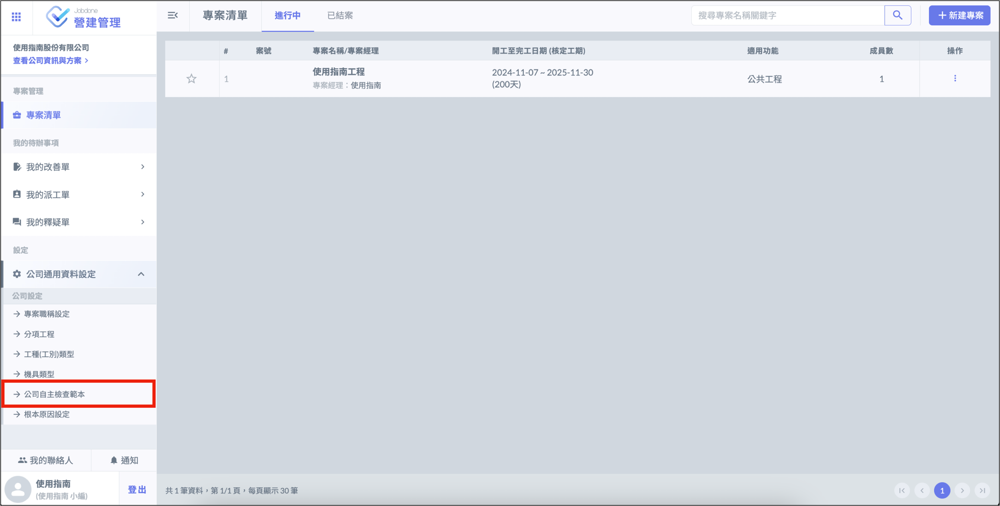
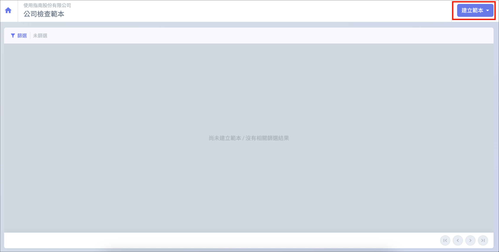
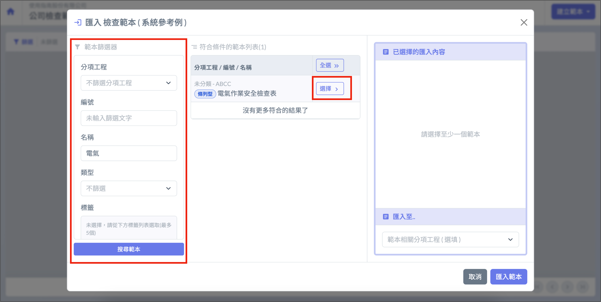
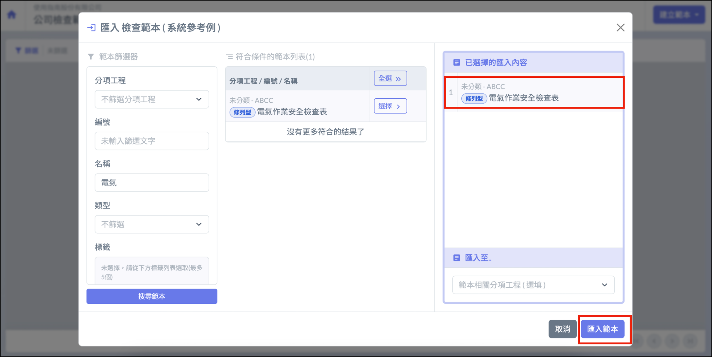
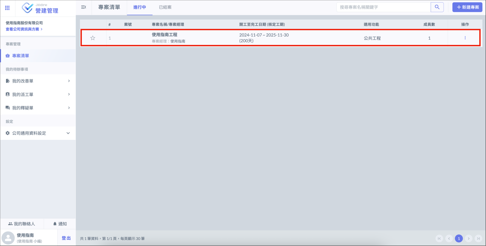
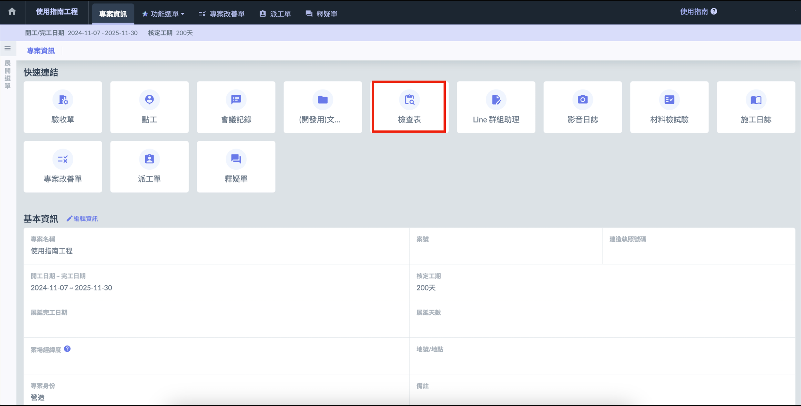
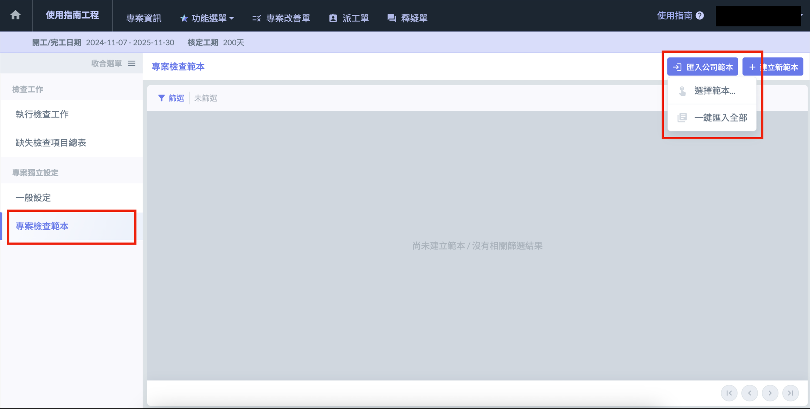
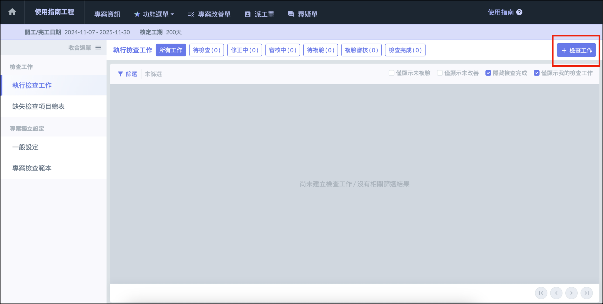
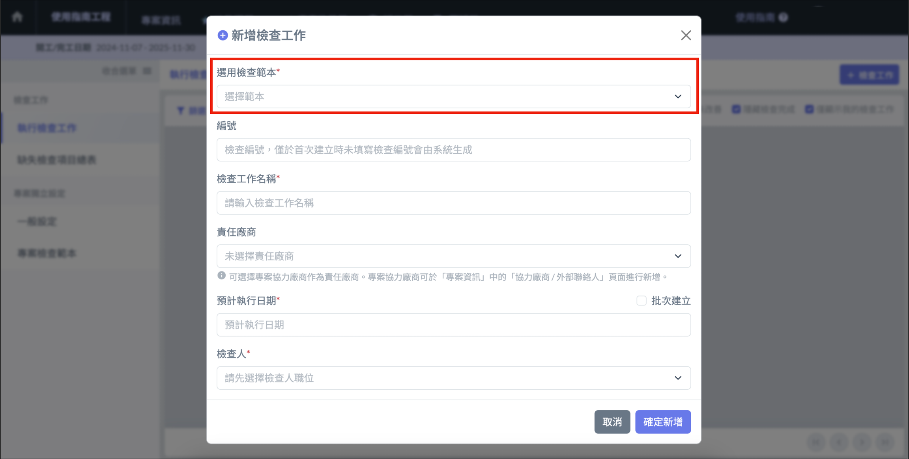

# 建立公司自主檢查範本

1. 登入帳號後，在 「 公司通用設定內 」 左側選單中選擇 「 公司自主檢查範本 」。
2. 進入公司自主檢查範本介面後，點選右上角 「 建立範本 」
3. 用篩選器搜尋適合的範本後，點選 「 匯入範本 」

# 建立專案檢查範本

1. 選擇要建立檢查表的專案，點選 「 檢查表 」 進入專案檢查表介面。
2. 選擇左側選單中的 「 專案檢查範本 」，然後點選右上角 「 匯入公司範本 」 中的 「 選擇範本 」。
3. 使用篩選器找到需要的範本後，點選 「 匯入範本 」。

# 執行檢查工作

1. 進入專案檢查表介面後，在左側選單中選擇 「 執行檢查工作 」，點選右上角 「 ＋檢查工作 」
2. 點選 「 選用檢查範本 」，用篩選器找到需要的範本後，點選 「 確定選擇 」。
3. 依序填入預計執行日期、檢查人等必填資訊後，選擇 「 確定新增 」。

