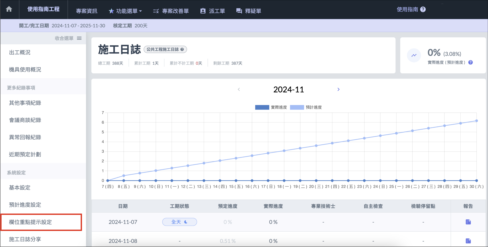
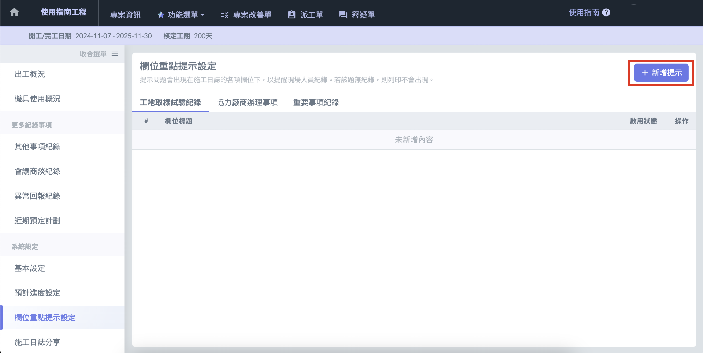
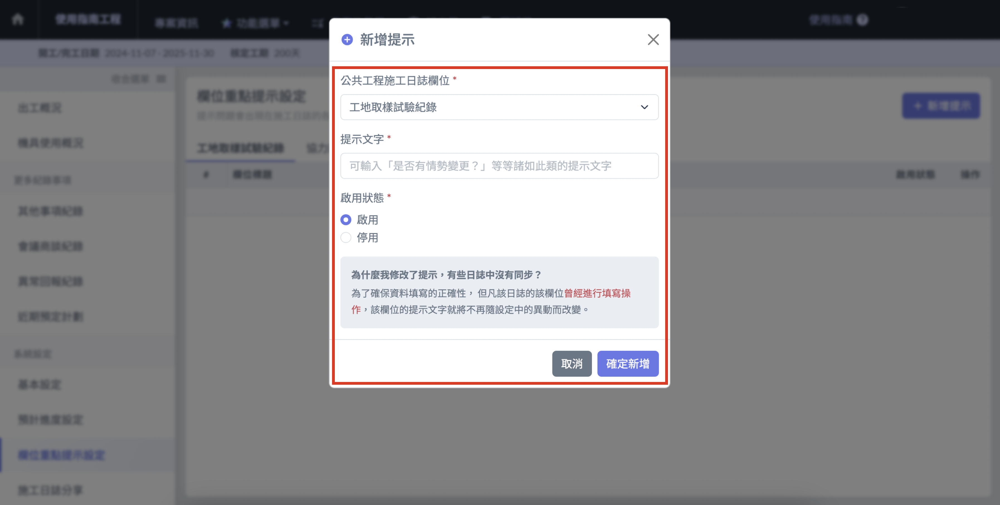
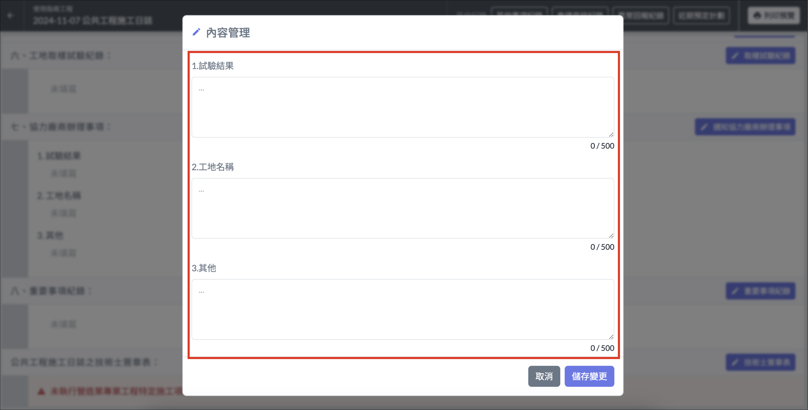

# 欄位重點提示設定

## 欄位重點提示

[**欄位重點提示**](lan-wei-zhong-dian-ti-shi-she-ding)功能可針對工地取樣試驗紀錄、協力廠商辦理事項、重要事項紀錄的 「 內容填寫 」 改為指定的欄位標題。

1. 進入施工日誌介面，點選左側選單中的 「 欄位重點提示設定 」
2. 點選右上角 「＋新增提示 」
3. 選擇要新增提示的區塊 ( 工地取樣試驗紀錄、協力廠商辦理事項、重要事項紀錄 ) 後，輸入欄位標題提示文字後勾選 「 啟用 」，點選 「 確定新增 」 儲存設定即可。

!!! warning
    為了確保資料填寫的正確性，若該日誌的欄位****曾經****進行填寫操作 ，提示文字就將****不再隨設定中的異動而改變****。

