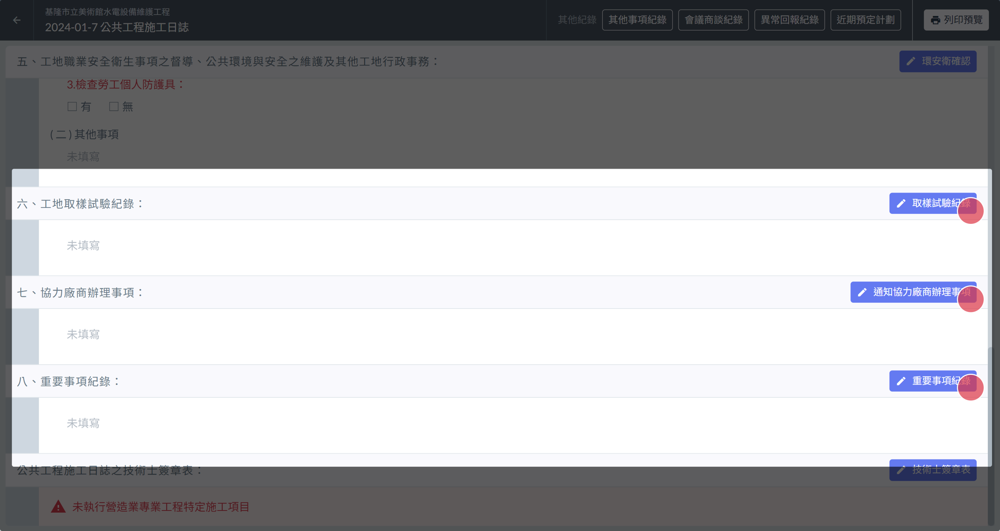
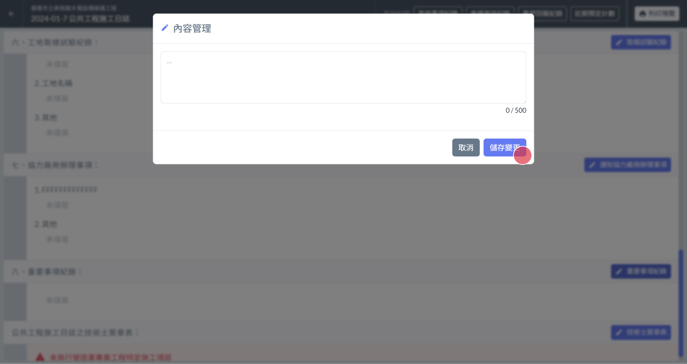
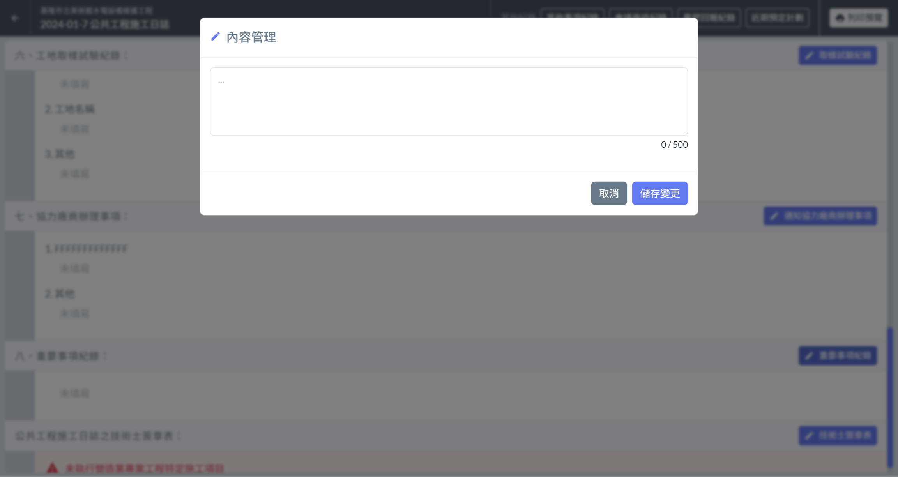
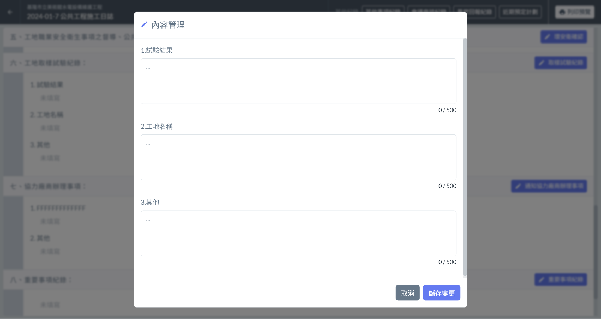

# 日誌 / 工地取樣試驗紀錄、協力廠商辦理事項、重要事項紀錄

提供相關填寫欄位，並提供 欄位重點提示 的功能，用以提醒填寫人填寫指定內容。

!!! info
    填寫日誌其他內容之前，必須先填寫[基本資訊]()。

# 編輯內容

1. 點選區塊旁的編輯按鈕，即可進入內容管理。
2. 編輯內容完成後，點選 「 儲存變更 」，即可完成編輯。

# 欄位重點提示

[欄位重點提示]()功能可針對工地取樣試驗紀錄、協力廠商辦理事項、重要事項紀錄的 「 內容填寫 」 改為指定的欄位標題。

1. 進入施工日誌介面，點選左側選單中的 「 欄位重點提示設定 」
2. 點選右上角 「＋新增提示 」
3. 選擇要新增提示的區塊 ( 工地取樣試驗紀錄、協力廠商辦理事項、重要事項紀錄 ) 後，輸入欄位標題提示文字後勾選 「 啟用 」，點選 「 確定新增 」 儲存設定即可。

!!! warning
    為了確保資料填寫的正確性，若該日誌的欄位**曾經**進行填寫操作 ，提示文字就將**不再隨設定中的異動而改變**。

