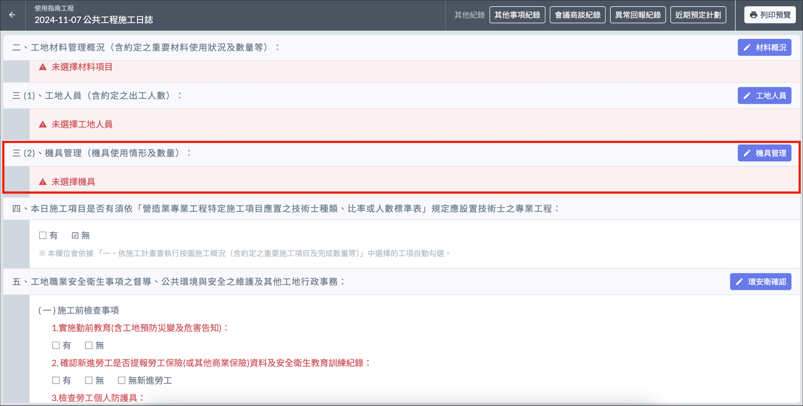

# 日誌 / 機具管理

紀錄當日工地各類型機具使用數量。

!!! warning
    填寫日誌其他內容之前，必須先填寫[基本資訊]()。

# 編輯工地人員

1. 進入施工日誌詳情後，點選 「 機具管理 」。
2. 選擇分類後，用篩選器根據條件選擇機具類型名稱（條件設定後要按一下放大鏡按鈕！）
3. 填寫 「 本日使用數量 」 欄位及備註，即可儲存變更。

!!! info
    若尚未設定機具，請先至公司通用資料設定[機具類型]()。

