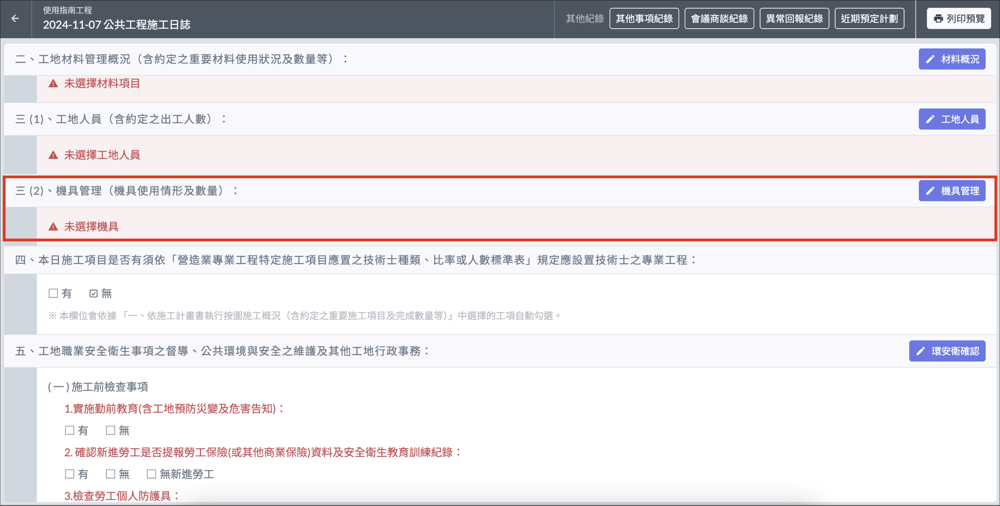
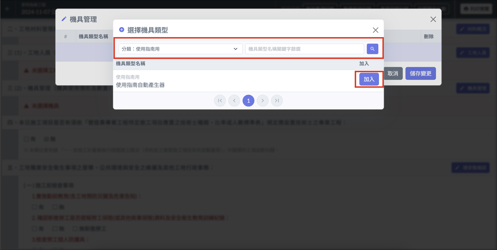
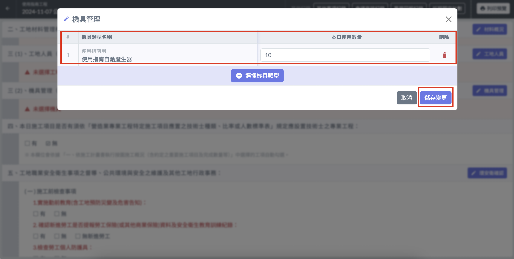

# 日誌 / 機具管理

!!! warning
    填寫日誌其他內容之前，必須先填寫[**基本資訊**](ri-zhi-ji-ben-zi-xun)。

## 編輯工地人員

1. 進入施工日誌詳情後，點選 「 機具管理 」。
2. 選擇分類後，用篩選器根據條件選擇機具類型名稱（條件設定後要按一下放大鏡按鈕！）
3. 填寫 「 本日使用數量 」 欄位及備註，即可儲存變更。

!!! info
    若尚未設定機具，請先至公司通用資料設定[**機具類型**](../../../company_level/commonsetting/xin-zeng-ji-ju-lei-xing)。

