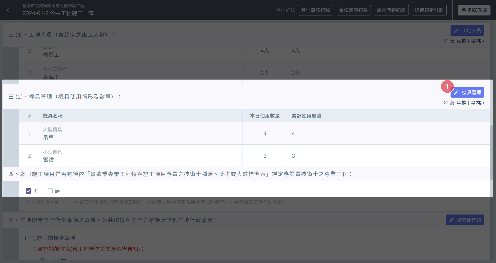
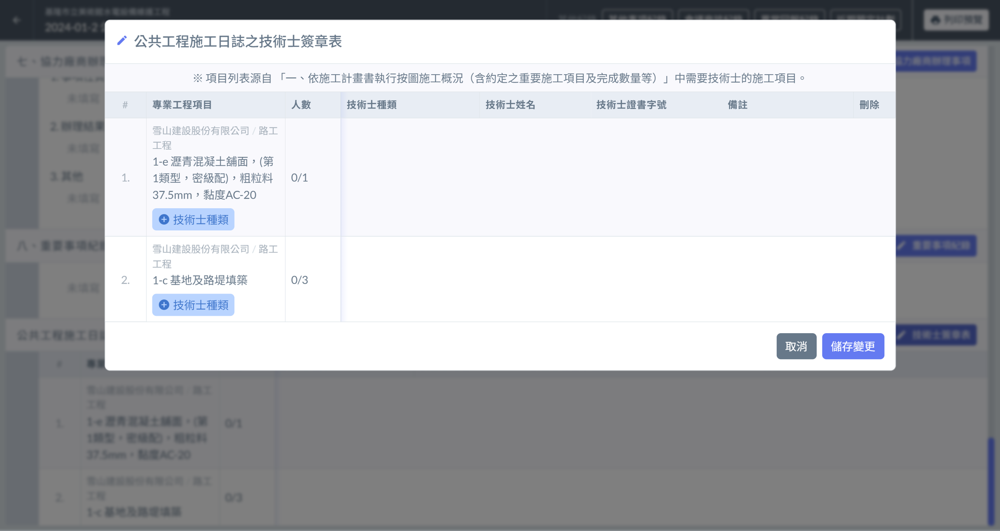

# 日誌 / 技術士簽章表

管理日誌中的技術士簽章表

!!! info
    填寫日誌其他內容之前，必須先填寫[基本資訊]()。

本欄位會依據[施工概況]()中選擇的專業工程項目，由系統自動添加技術士簽章表。

# 編輯技術士簽章表

1. 點選右側 「 技術士簽章表 」 進入編輯頁面。
2. 使用 「＋技術士種類 」 及下拉選單，選擇需要的技術士種類。
3. 點選右側 「 增加人員 」 ，輸入技術士姓名 ( 必填 )、技術士證書字號、備註等資訊，輸入完畢後點選 「 儲存變更 」。

!!! danger
    如果沒有點選 「 儲存變更 」，編輯的內容資料會被還原成編輯前的狀態。

