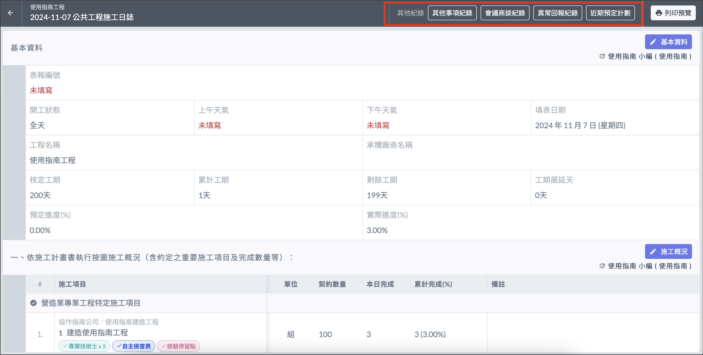
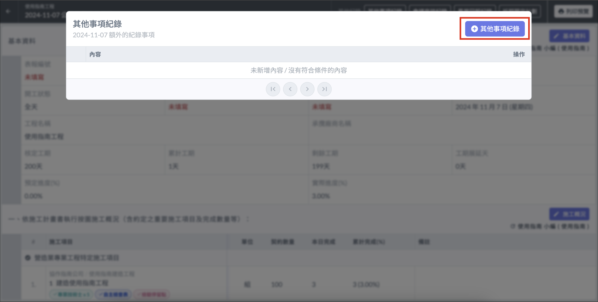
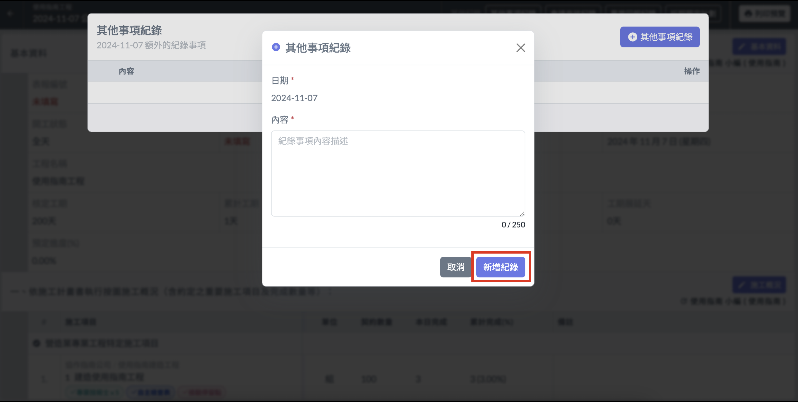
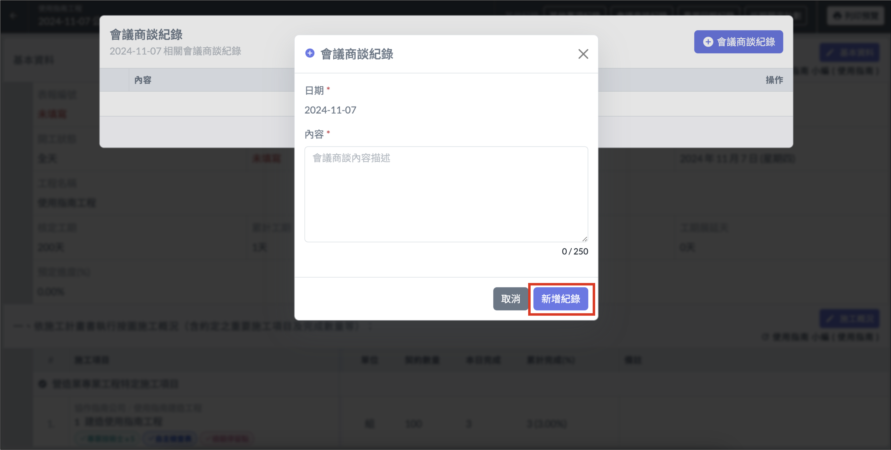
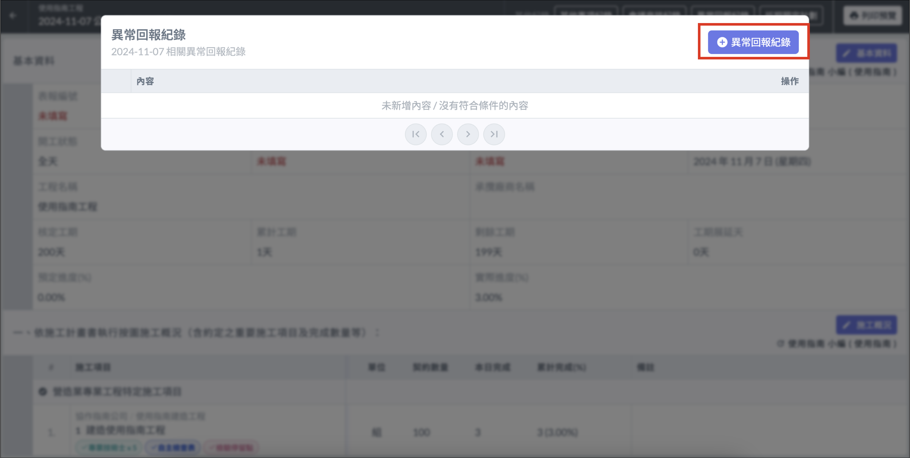
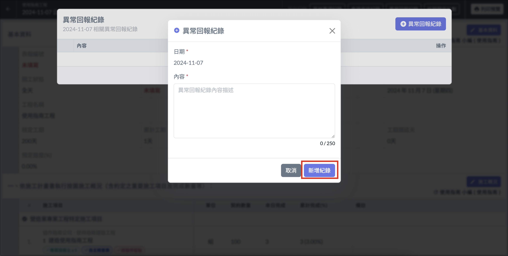
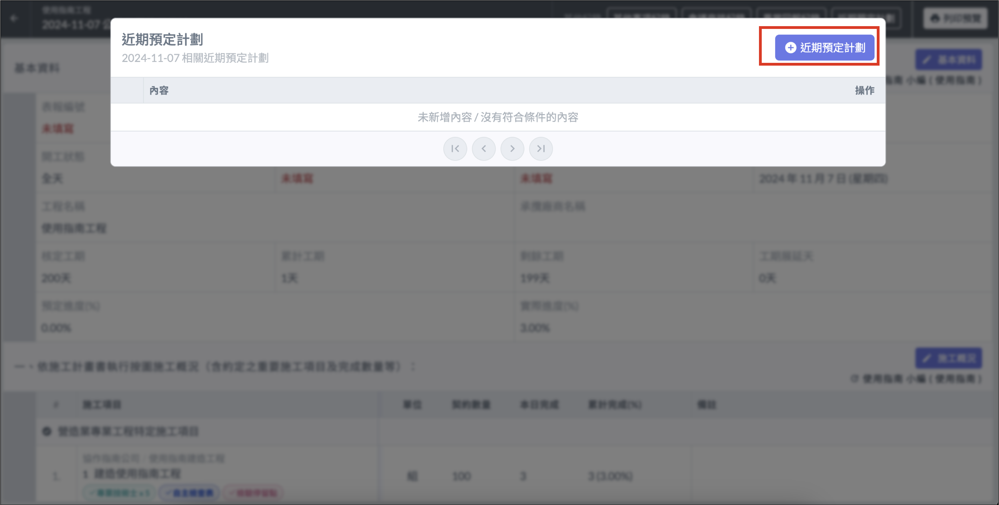
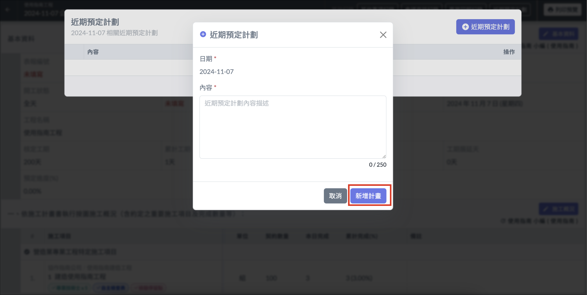

# 日誌 / 其他紀錄

在當日的日誌右上角處，提供各式其他紀錄事項進行填寫。

## 填寫其他事項紀錄

點選 「 ＋其他事項紀錄 」，填寫內容後選擇 「 新增紀錄 」，即可完成。

!!! info
    若要新增其他日期的紀錄，或是跨日期檢視其他紀錄，可從[**其他事項紀錄總表**](../ri-zhi-geng-duo-ji-lu-shi-xiang)進行操作。

## 填寫會議商談紀錄

點選 「 ＋會議商談紀錄 」，填寫內容後選擇 「 新增紀錄 」，即可完成。

!!! info
    若要新增其他日期的紀錄，或是跨日期檢視其他紀錄，可從[**會議商談紀錄總表**](../../ri-zhi-geng-duo-ji-lu-shi-xiang#hui-yi-shang-tan-ji-lu-zong-biao)進行操作。

## 填寫異常回報紀錄

點選 「 ＋異常回報紀錄 」，填寫內容後選擇 「 新增紀錄 」，即可完成。

!!! info
    若要新增其他日期的紀錄，或是跨日期檢視其他紀錄，可從[**異常回報紀錄總表**](../../ri-zhi-geng-duo-ji-lu-shi-xiang#yi-chang-hui-bao-ji-lu-zong-biao)進行操作。

## 填寫近期預定計劃

點選 「 ＋近期預定計劃 」，填寫內容後選擇 「 新增計畫 」，即可完成。

!!! info
    若要新增其他日期的紀錄，或是跨日期檢視其他紀錄，可從[**近期預定計劃總表**](../../ri-zhi-geng-duo-ji-lu-shi-xiang#jin-qi-yu-ding-ji-hua-zong-biao)進行操作。

