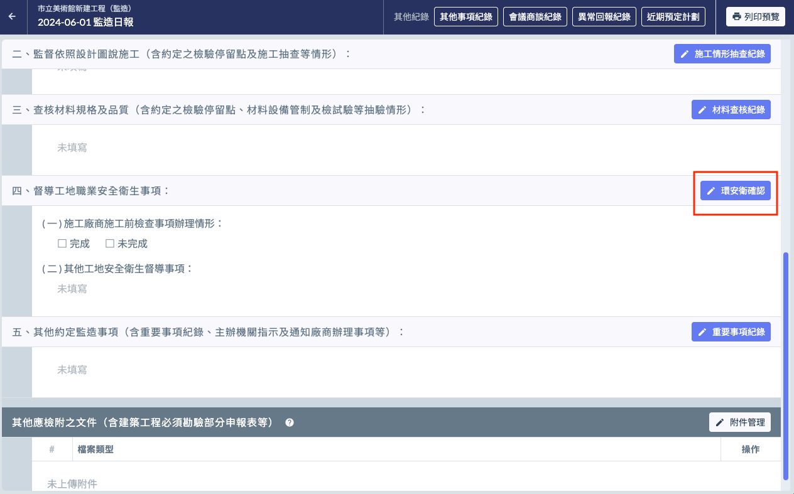
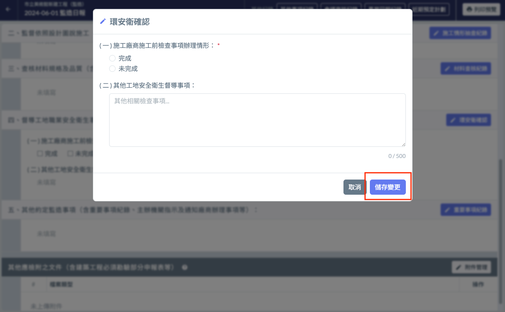

# 監造日報

!!! info
    填寫監造日報前，建議先與營造單位的專案進行[關聯]()，以增加填寫效率。

# 相關設定

填寫施工日誌時，可能會使用到[施工項目]()、材料管理、[工種 ( 工別 )]()、[施工項目總表]()** **等設定。
會需要您先於[專案資料設定]()頁面中進行設定。

# 啟用功能

建立專案時，施工日誌功能預設會是啟用狀態，專案經理可在[專案基本資料]()開啟或關閉功能。

!!! info
    監造日報目前僅能使用網頁版。

# 日報資訊一覽

## 專案工期資訊

**「 總工期 」 **可在[專案設定](https://docs.jobdone.cc/user_guide/project_level/info#ji-ben-zi-xun)中設定。「 **累計工期 」**、「 **累計不計工期 」**、「 **剩餘工期 」 **由系統根據監造日報填寫的內容進行自動計算。

## 實際進度

依據日報中填寫的工項施工數量，為您計算您施工的總進度。

!!! info
    施工總進度的計算方式為：**完成的工項金額總額 ÷ 總工項金額 = 實際進度**

## 預計進度

預計進度由系統自動計算生成，百分比取至小數點後兩位。如希望自定進度計畫，可以前往[預計進度設定](https://docs.jobdone.cc/user_guide/pc/pc_diary/ri-zhi-xi-tong-she-ding/yu-ji-jin-du-she-ding)進行設定。

# 監造月報

監造月報可迅速瀏覽每天的填寫概況，也可以點選日期查看指定日期的日報。

