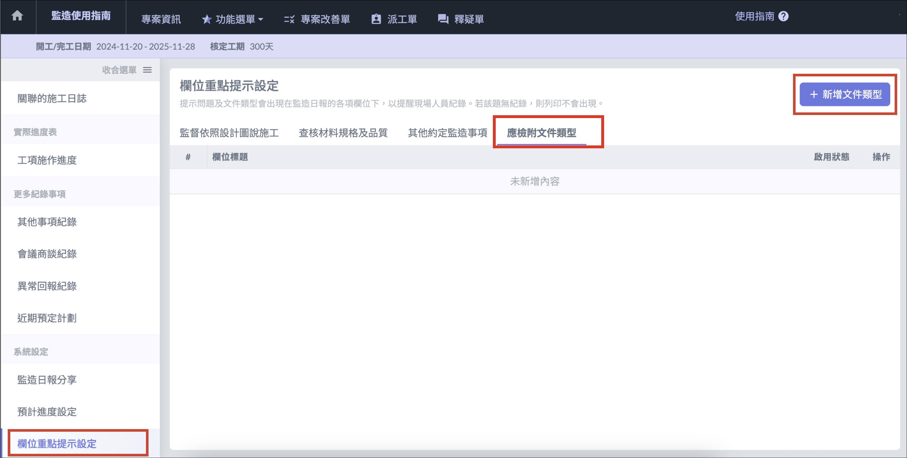
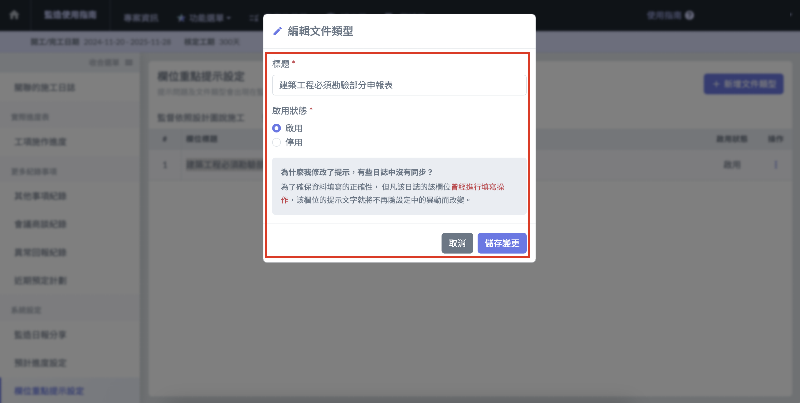
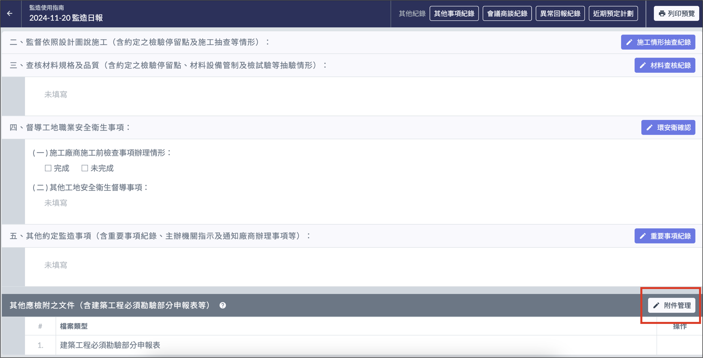
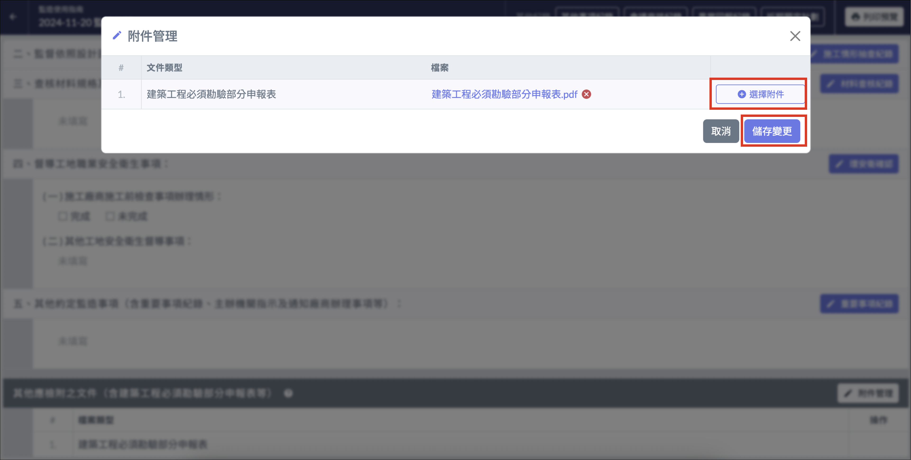

# 日報 / 其他應檢附之文件

!!! warning
    在[**列印監造日報**](lie-yin-ri-bao)時，**不會**將其他應檢附文件印出。

## 新增附件類別

1. 在監造日報主介面進入左側選單的 「 欄位重點提示設定 」 頁面，選擇 「 應檢附文件類型 」 ，點選 「＋新增文件類型 」。
2. 輸入想要設定的附件類別的標題後，點選 「 儲存變更 」

## 上傳應檢附之文件

1. 點選區塊右側的 「 附件管理 」 按鈕
2. 點選 「＋選擇附件 」，將檔案上傳完畢以後點選 「 儲存變更 」 即可完成。

