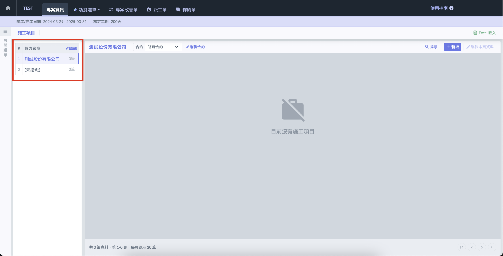
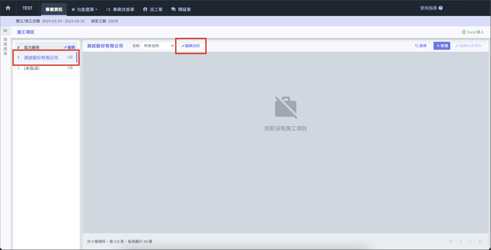
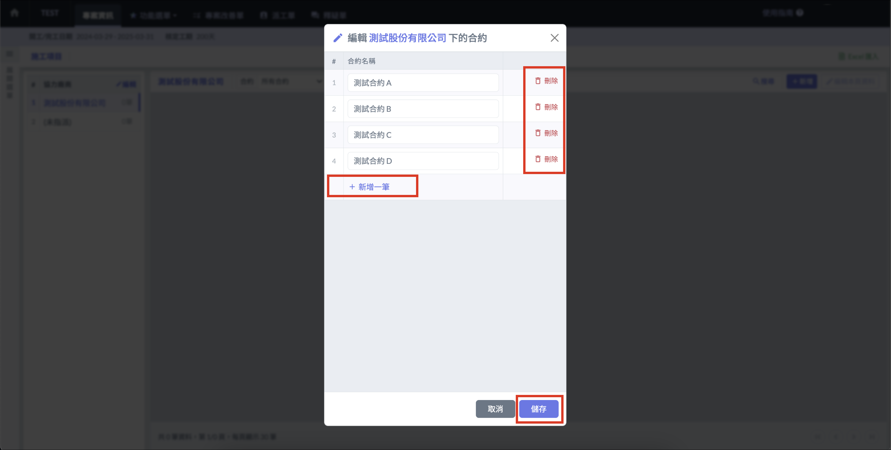
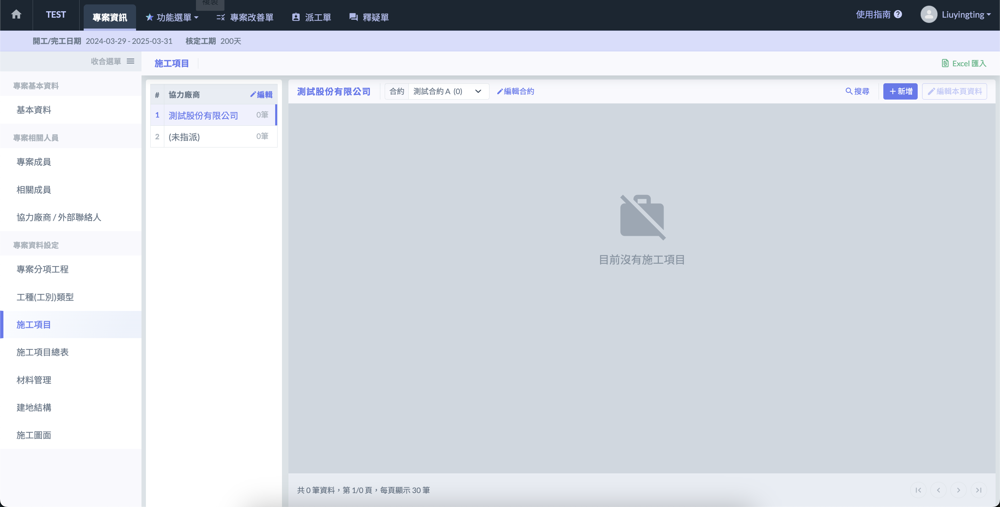
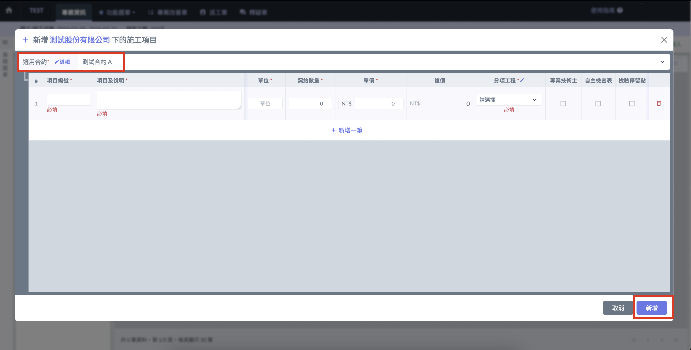
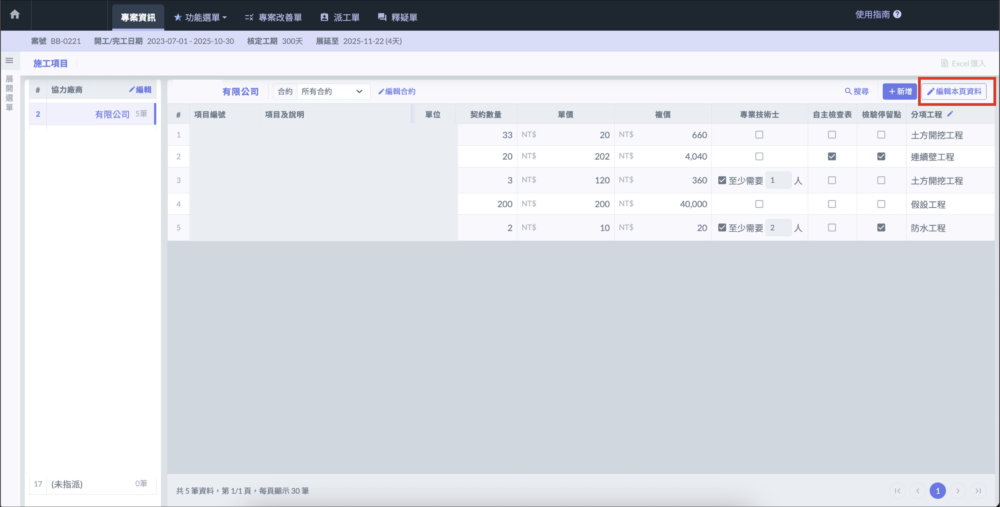

# 廠商 > 合約格式

## 協力廠商 

!!! info
    若尚未設定協力廠商，請參閱[協力廠商設定](../../contractor#xin-zeng-xie-li-chang-shang)。

若選擇廠商 > 合約格式，系統會自動顯示協力廠商列表，可點選列表中的廠商編輯合約或施工項目。

若施工項目**尚未**指派或發包給協力廠商，可將施工項目建立於 **「 (未指派) 」** 分類中。

!!! warning
    若施工項目已指派廠商，就無法變更為其它的廠商。

## 合約 

點選協力廠商後會顯示合約清單，點選右上角 「編輯合約 」 ，即可新增或刪除合約。

## 施工項目 

### 新增施工項目 

點選右上角 「 新增 」 ，先選擇施工項目所屬的合約，即可開始填寫施工項目表單，完成後點選 「 新增 」。

!!! info
    若未選擇合約，施工項目將歸類到 「 沒有合約 」 分類中。

### 編輯 / 移動 / 刪除施工項目 

點選 「 編輯本頁資料 」 按鈕即可**編輯**施工項目內容，也可以點選 「 **⋮** 」 將施工項目**刪除**或**移動至其它合約**，編輯完成後點選 「 儲存 」 。

## 從檔案匯入 

施工項目可使用指定格式的 Excel 批次匯入，點擊 「 Excel 匯入 」 按鈕開啟檔案匯入功能。

!!! warning
    檔案匯入功能僅可以在沒有任何合約及施工項目的情況下使用。

### 下載並匯入 Excel 模板 

點選右上角的 「 Excel匯入 」，下載 「 施工項目 Excel 模版 」，並使用模板填妥資料。上傳檔案後點選 「 匯入 」 即可批次匯入施工項目資料。

