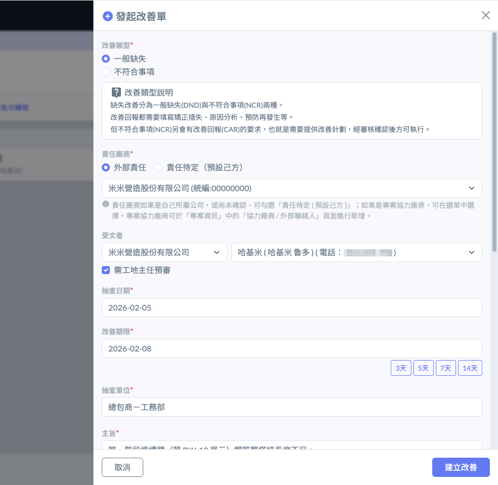
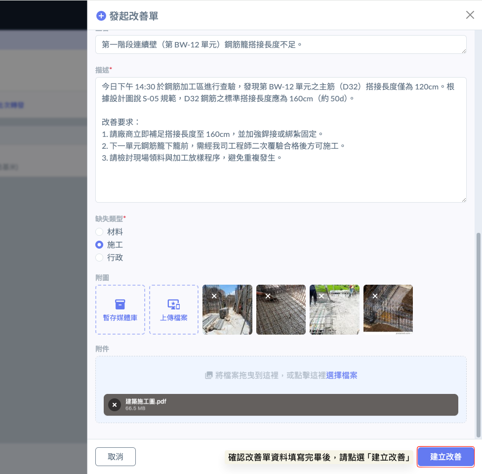
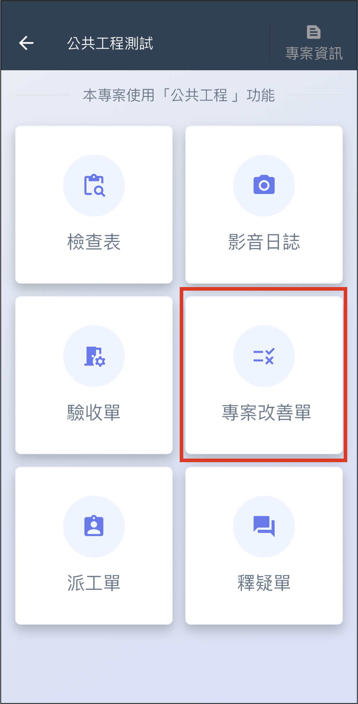

# 發起改善單

Corrective Action

改善單可以視需求直接發起，或是透過其他功能間接發起。

# 網頁版

## 直接發起改善單

進入專案改善單後，點選右側 「 + 發起改善單 」 按鈕，即可發起改善單。

!!! warning
    若此介面未選擇受文者，可以至專案改善單清單再挑選受文者，並可指定受文者完成改善後需交由指定人員進行改善單審核。也可以選擇 「 免審核 」。

## 透過功能發起改善單

- 以**檢查**表為例

進入結案的自主檢查後，在不合格紀錄右方點選 「 建立改善單 」，即可填寫改善單類型及發起改善單。

!!! warning
    若此介面未選擇受文者，可以至專案改善單清單再挑選受文者，並可指定受文者完成改善後需交由指定人員進行改善單審核。也可以選擇 「 免審核 」。

# APP

## 直接發起改善單

進入 APP 後，點選 「 我的專案」，選擇 「 專案改善單 」，即可點選右上角 「 + 新增 」 直接發起改善單。

!!! warning
    若此介面未選擇受文者，可以至專案改善單清單再挑選受文者，並可指定受文者完成改善後需交由指定人員進行改善單審核。也可以選擇 「 免審核 」。

## 透過功能發起改善單

- 以**檢查**表為例

進入檢查表後，選擇 「 缺失項目總表 」 分頁，點選缺失項目的 「 待發改善 」 即可開始填寫改善單類型及發起改善單。若須修改發出的改善單，或改派給其它人，還可以選擇 「 重發改善 」。

!!! warning
    若此介面未選擇受文者，可以至專案改善單清單再挑選受文者，並可指定受文者完成改善後需交由指定人員進行改善單審核。也可以選擇 「 免審核 」。

