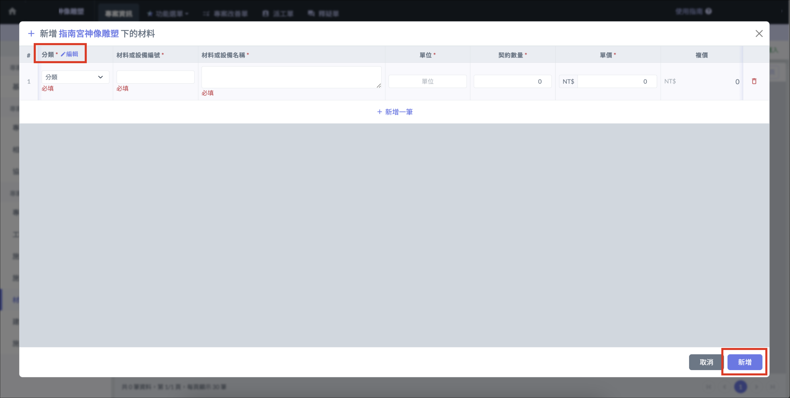
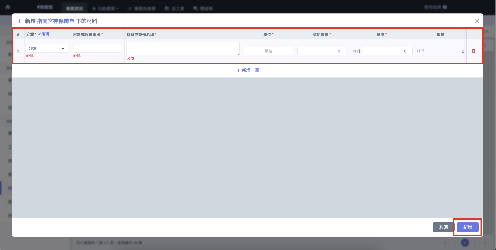
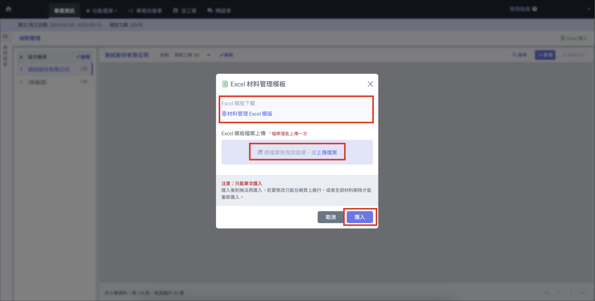

# 非廠商 > 合約格式

## 材料項目 

### 設定材料分類 

點選右上角 「 新增 」 ，先選擇分類側邊的 「 編輯 」 ，即可新增或刪除分類，完成後點選 「 新增 」 儲存。

### 新增材料項目 

點選右上角 「 新增 」 ，即可開始填寫材料項目內容，完成後點選 「 新增 」。

### 編輯 / 移動 / 刪除材料項目 

點選 「 編輯本頁 」 按鈕即可**編輯**材料項目內容，也可以點選 「 **⋮** 」 將材料項目**刪除**，編輯完成後儲存。

## 從檔案匯入 

材料項目可使用指定格式的 Excel 批次匯入，點擊 「 Excel 匯入 」 按鈕開啟檔案匯入功能。

!!! warning
    檔案匯入功能僅可以在沒有任何合約及施工項目的情況下使用。

### 下載並匯入 Excel 模板 

點選右上角的 「 Excel匯入 」，下載 「 材料管理 Excel 模版 」，並使用模板填妥資料。上傳檔案後點選 「 匯入 」 即可批次匯入施工項目資料。

