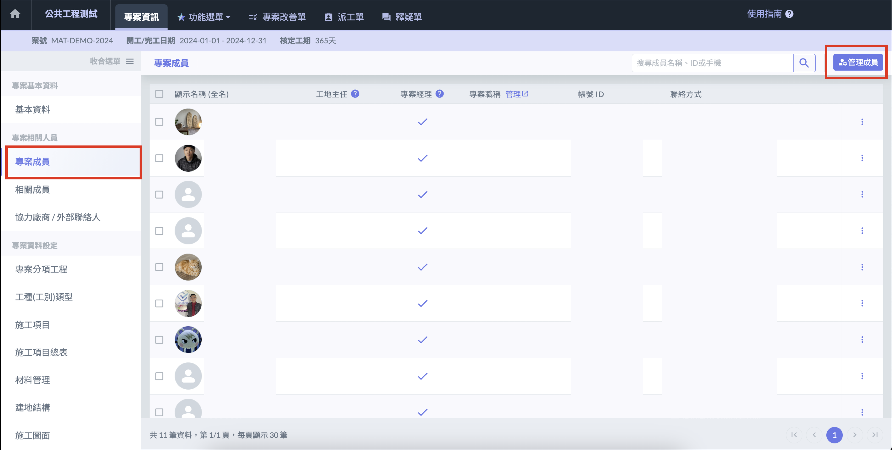
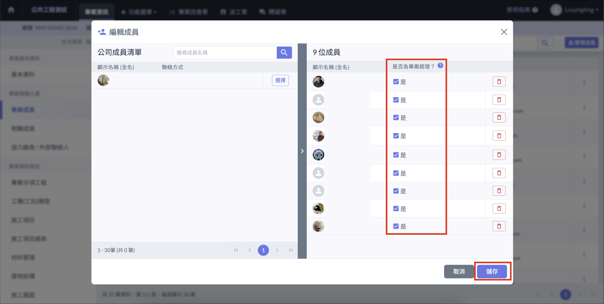
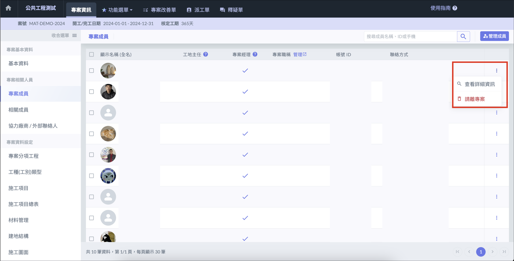
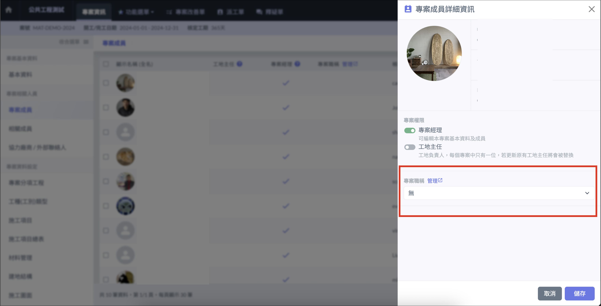

# 專案經理 / 專案成員

## 權限介紹

### 專案經理

* 可編輯專案的所有資訊
* 將成員加入專案
* 授予專案經理權限
* 將成員請離專案

### 專案成員

* 查看專案資料，但僅能變更部分資料
* 可使用專案所有功能

***

## 網頁版

### 將成員加入 / 請離專案

點選左側選單 「 專案成員 」 進入頁面後，點選右上角 「 管理成員 」，即可將指定公司成員加入或移出專案，並可授權是否為專案經理。

### 修改職稱

點選專案成員右方的 「 **⋮** 」 按鈕，選擇 「 查看詳細資訊 」，即可選擇設定好的[**專案職稱**](../company_level/commonsetting)。

***

## APP

!!! info
    APP 只能查看成員資訊，無法修改資料。

進入[專案資訊](../info#app)專案後，點選 「 專案成員 」，即可選擇查看指定成員的詳細資訊，也可以寫信或撥號聯絡該成員。 \
&#x20;        
