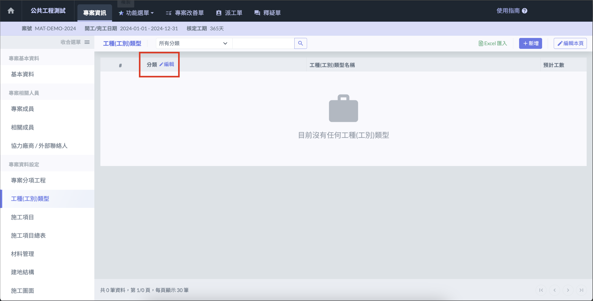
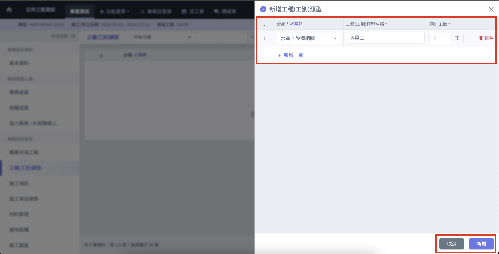
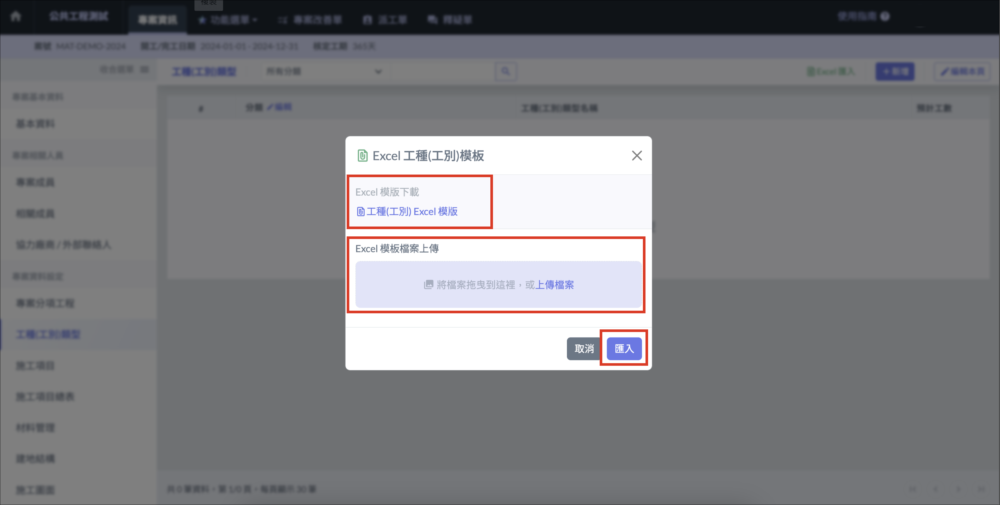
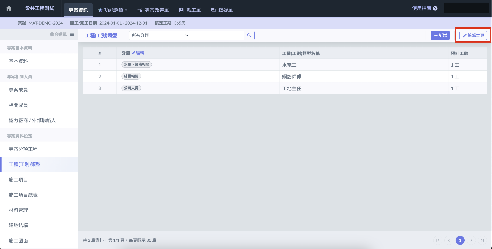

# 專案工種(工別)類型

專案工種 ( 工別 )類型，可以為各專案量身設定適合的工種 ( 工別 )類型，也可以套用於**施工日誌**或與**人員管制**等功能的選單內。

!!! info
    若在公司通用設定中已[**設定工種 ( 工別 )類型**](../company_level/commonsetting/xin-zeng-gong-zhong-gong-bie-lei-xing)，會自動帶入到專案工種 ( 工別 )類型中。

***

## 手動新增 

### 設定分類（須先完成） 

手動新增須先設定分類，用來管理工種 ( 工別 ) 類型，點選分類旁的 「 編輯 」 新增分類。

### 填寫**工種(工別)類型** 

點選右上角 「 新增 」 按鈕，點擊 「 新增一筆 」，選擇分類後即可填寫**工種 ( 工別 ) 類型名稱**及**預計工數**。

***

## **匯入Excel 檔案** 

工種 ( 工別 ) 類型可使用指定格式的 Excel 批次匯入，點選右上角 「 Excel 匯入 」 按鈕開啟檔案匯入功能。

!!! warning
    檔案匯入功能僅可以在沒有任何工種 ( 工別 ) 類型的情況下使用。

### 下載並匯入 Excel 模板 

點選下載 「 工種 ( 工別 ) Excel 模版 」，使用模板填妥資料，上傳檔案後點選 「 匯入 」 即可批次匯入工種 ( 工別 ) 類型資料。

***

## 批次編輯專案工種(工別)類型

專案工種(工別)類型建立後，可以透過 「 編輯本頁 」 批次編輯 / 刪除已建立的項目。

