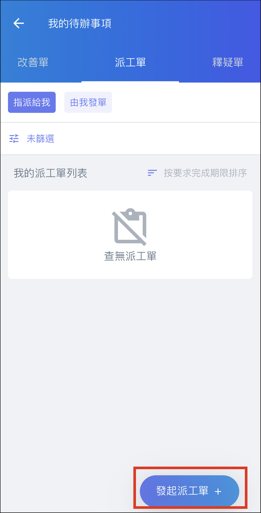
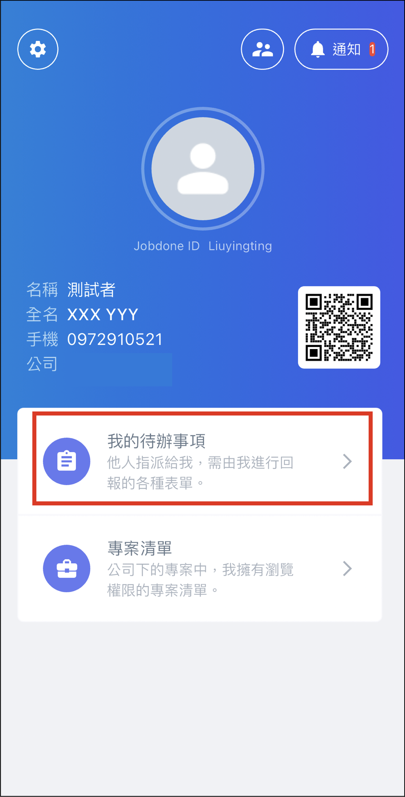

# 專案派工單

Work Order

派工單功能用於指派個人負責執行的工作，使用方式多元，可以跨公司或專案進行指派。

# 發起派工單

進入 APP 後，點選 「 我的待辦事項 」，選擇派工單分頁，即可點選右下角 「 發起派工單 + 」 直接發起派工單。

!!! info
    網頁版無法直接發起派工單，但可以透過會議紀錄等功能間接發起。

# 欄位說明

|  |
|  |

# 專案派工單管理

## 網頁版

選擇進入專案後，點選派工單後，即可查看此專案下的所有派工單及回報結果。

## APP

點選專案後，點選派工單，即可查看專案下的所有派工單，也可以使用 「 篩選 」 按鈕搜尋指定派工單。

