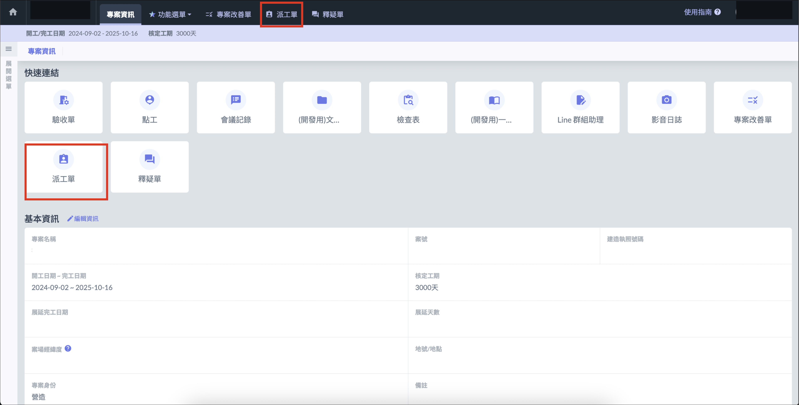
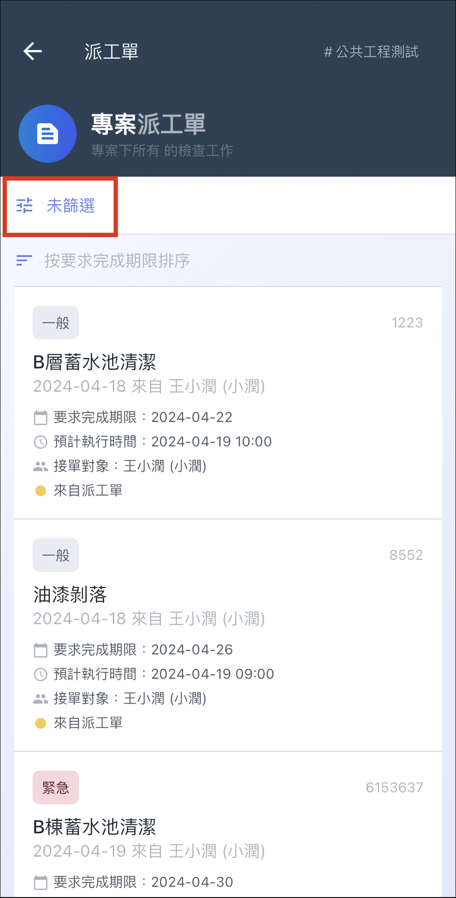

# 專案派工單

派工單功能用於指派個人負責執行的工作，使用方式多元，可以跨公司或專案進行指派。

## 發起派工單

進入 APP 後，點選 「 我的待辦事項 」，選擇派工單分頁，即可點選右下角 「 發起派工單 + 」 直接發起派工單。

!!! info
    網頁版無法直接發起派工單，但可以透過會議紀錄等功能間接發起。

 

## 欄位說明

<table><thead><tr><th width="186">欄位</th><th width="72" data-type="checkbox">必填</th><th>說明</th></tr></thead><tbody><tr><td>單號</td><td>false</td><td>可手填，或保留空白，後端會自動產生編號。</td></tr><tr><td>工單主旨</td><td>true</td><td>標題</td></tr><tr><td>工作內容描述</td><td>true</td><td>派工工作說明</td></tr><tr><td>派單對象</td><td>true</td><td>只能指派給一個人，從專案成員或協力廠商名單選取。</td></tr><tr><td>工作內容</td><td>false</td><td>應執行的工作項目列表，可作為工作指引或檢查列表。以條列的方式可增加多項。</td></tr><tr><td>優先程度</td><td>false</td><td>一般/緊急，兩種。</td></tr><tr><td>預計執行時間</td><td>false</td><td>即指定派工到場的時間，必須為日期-時間。接收派工的人可以將這個時間匯入手機行事曆，於時間到前提醒。（如同會議通知）</td></tr><tr><td>要求完成時間</td><td>false</td><td>要求在這個日期前完成。若未完成，可以在專案派工列表下，看到逾期的工作顯示。</td></tr><tr><td>客戶</td><td>false</td><td>若有，可以填入本欄位以告知執行人。</td></tr><tr><td>地點</td><td>false</td><td>若有，可以填入本欄位以告知執行人。</td></tr><tr><td>費用產生</td><td>true</td><td>預設為無。</td></tr></tbody></table>

## 專案派工單管理

### 網頁版

選擇進入專案後，點選派工單後，即可查看此專案下的所有派工單及回報結果。

### APP

點選專案後，點選派工單，即可查看專案下的所有派工單，也可以使用 「 篩選 」 按鈕搜尋指定派工單。

