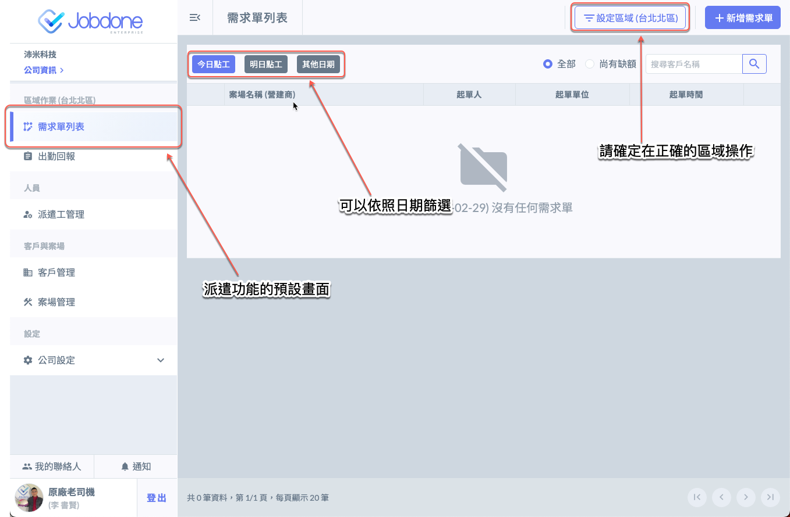
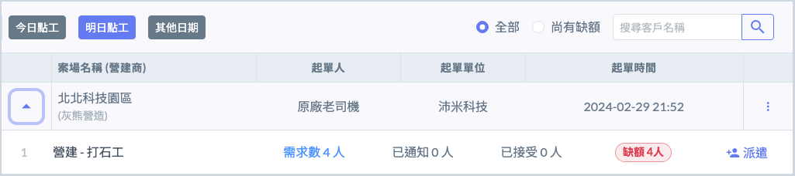
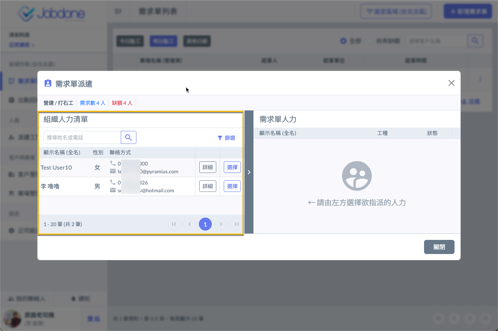
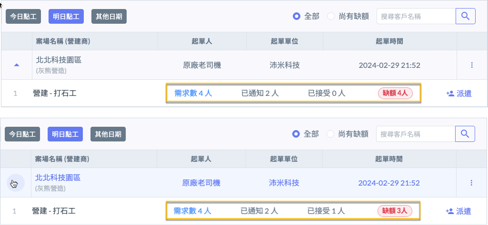

# 需求單與派遣

## 概述

【需求單】 是指客戶的某一個案場（工地）提出某個日期要求的工種與人數，所有的派遣必須基於客戶的需求以及數量才能進行。

【需求單】 有兩個來源：

> * 由派遣商接到工地從各種管道告知的人力需求後，幫客戶新增。（包含LINE、電話、email等系統外的方式告知）。
> * 由客戶案場的管理人員使用 【點工】 功能，自行開立 【需求單】 後，系統自動同步至使用Jobdone的派遣商的負責區域下。

## 建立需求單

由案場自行建立需求單的部份，請參閱 【點工】 功能。本章說明人力仲介如何使用派遣模組新增需求單。

* 在需求單列表下
* 可以用日期篩選
* 確定當前的區域

**選擇 【+新增需求單】。**

**選擇 【客戶】、【案場】、【進場日期】。**

**選擇合約下的 【工種】 及需求工數。**

**新增成功後，請到該日期下，就會看到出現這筆需求單，這時候就可進行派遣的動作。**

***

## 派遣

**點擊 【+派遣】。**

**在左側搜尋已加入的派遣工，選擇加入右側。**

**確定通知內容後發送，該員手機APP就會收到派遣通知。**

***

當臨時工回應後，只要更新網頁，該需求單的人數狀態就會立刻改變。

