# 出勤確認與資料填寫

請注意，不可於非當日派遣單操作。(以下皆為App操作說明)

***

## 01｜出勤確認

### 01 - 1｜功能說明

若臨時工已完成自行簽到及簽退，則會需營建商進行確認。

此功能讓您確認工班自行簽到簽退的時間是否與實際時間相符，從而有效管理員工的出勤狀況。

!!! warning
    請注意，點選出勤確認後資料將不可編輯，若需編輯資料依然可「取消出勤確認」。
    
    ( 儲存與出勤確認為截然不同之操作方式，請參閱以下說明 ）



**「出勤確認」**&#x50C5;在工已自行完成簽到及簽退時顯示，僅用於確認工班自行簽到簽退的時間是否與實際時間相符。

( 換句話說，如果營建商需要修改簽到/簽退時間、填寫加班時數、額外獎懲或備註訊息，則**不可**點選「出勤確認」，因為此操作不會儲存任何資料。)



如果營建商需要**修改簽到/簽退時間**、**填寫加班時數**、**額外獎懲**或**備註訊息**，請在完成填寫並確認無誤後，點&#x9078;**「儲存」**&#x4EE5;保留資料。&#x20;

( 請注意，點選「儲存」後，「出勤確認」按鈕將會消失。)



***

### 01 - 2｜操作範例

如下圖：

點&#x9078;**「查看」**&#x500B;別工單之工種(圖一) **➙** 於欲編輯之臨時工右側，點&#x9078;**「編輯」**&#x9032;入編輯資訊頁面(圖二) **➙** 僅確認該工簽到及簽退時間，則點&#x9078;**「出勤確認」**(圖三) **➙** 已確認後，若有需求可點&#x9078;**「取消出勤確認」**&#x5373;可回到編輯狀態。

!!! warning
    如上所述，若需編輯資料則**不可**點選「出勤確認」。

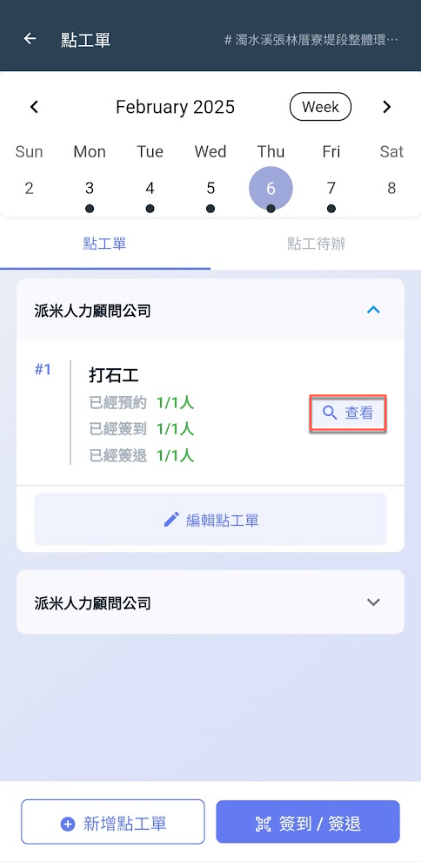 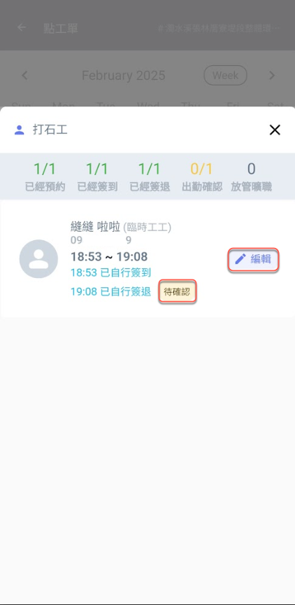 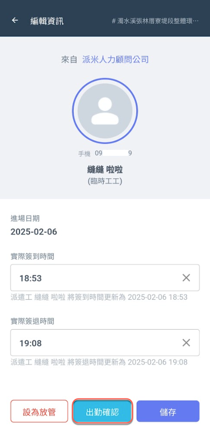 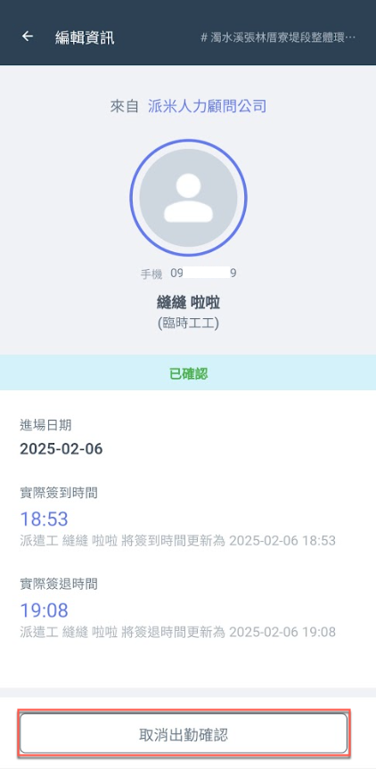

***

## 02｜資料填寫 (儲存)



### 實際簽到/簽退時間更改

點選圖一紅框圈選處，即可個別修改簽到/簽退時間，修改完畢後點&#x9078;**「儲存」**，畫面即如圖三。

(更新成功即會顯示「營建商將簽到/簽退時間更新為...」，且出勤確認按鈕已消失。)

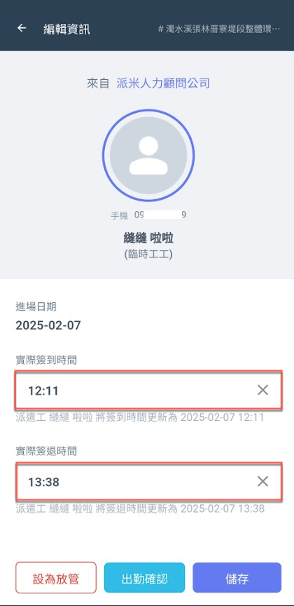 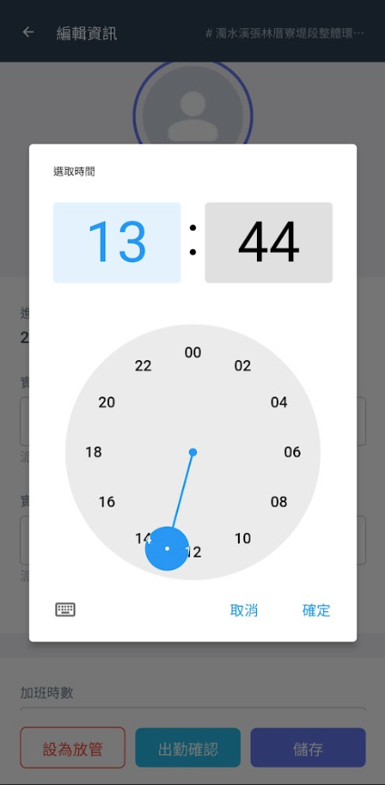 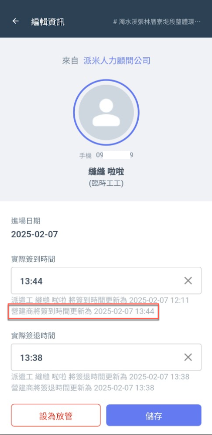




### 加班時數&額外獎懲填寫

如圖六，您可選擇扣薪(遲到/早退/違規)或加薪兩種獎懲，並填寫金額與原因。(可增添多筆，重複操作即可)

填寫完畢並確認無誤後，點&#x9078;**「新增」**&#x5373;如圖八畫面。(新增後還需點&#x9078;**「儲存」**&#x624D;會保存資料)

!!! info
    派遣商**無法**更動您填寫之加班時數，但填寫之額外獎懲僅為派遣商參考依據，最終結算之額外獎懲以派遣商填寫為依據。

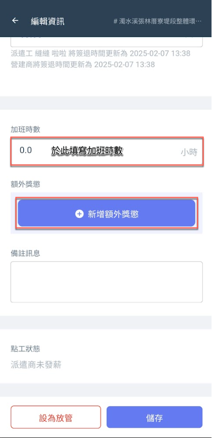 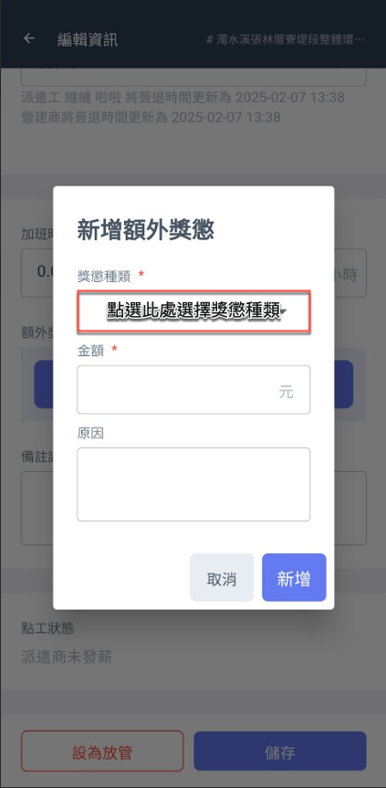 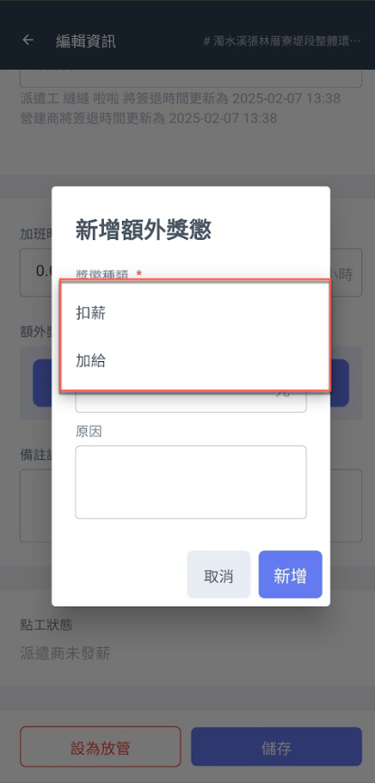 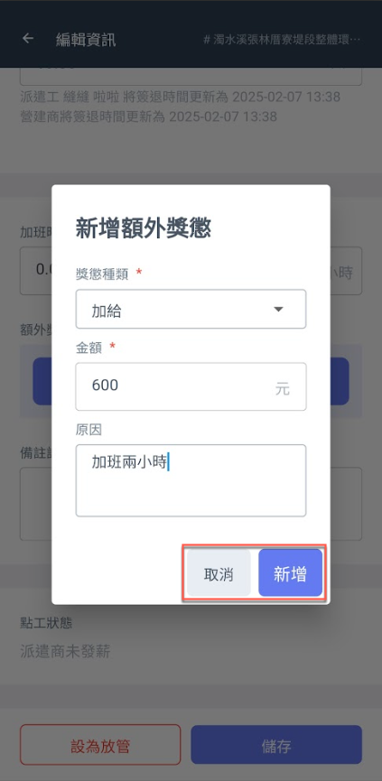




### 儲存記錄

將資料填寫完畢並確認無誤後，點&#x9078;**「儲存」**&#x5373;可保留此筆資料。如需再次更改重複上述操作即可。

!!! info
    所填寫的資料僅限派遣商查看。
    
    但若營建商更改臨時工的簽到/簽退時間，派遣工將能查看營建商所更新之打卡記錄。

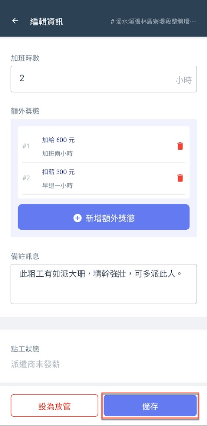


