# 簽到 / 簽退

系統提供兩種讓營建商紀錄臨時工之簽到/簽退時間，分別為：**QR code掃描**與**手動操作**。

**實際例子：**

> 臨時工到達工地後，現場工程師使用App掃描該工手機上的QR Code或紙本QR Code，完成報到流程。

!!! warning
    若臨時工已有自行簽到/簽退紀錄，營建商再次簽到/簽退即為資料更動。
    
    相關操作請參閱 **➙** [出勤確認與資料填寫](qian-dao-qian-tui/chu-qin-que-ren-yu-zi-liao-tian-xie)

***

## 01｜QR code 掃描

如圖一紅框圈選處，點選後即可掃描臨時工專屬個人QR code (需要請臨時工出示App畫面)。

!!! warning
    請注意，若您同時有多個案場，且各有不同之派遣工，請依照各專案分別進&#x5165;**「點工」**&#x529F;能操作。
    
    若該派遣工當日有工作，但於錯誤之專案內部掃描 (會找不到該工)，務必確認專案與工單對應。

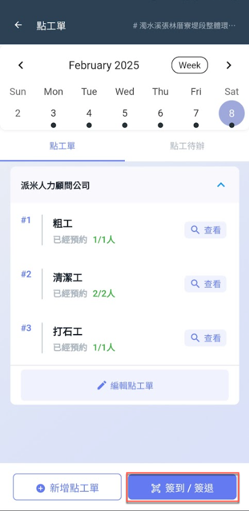 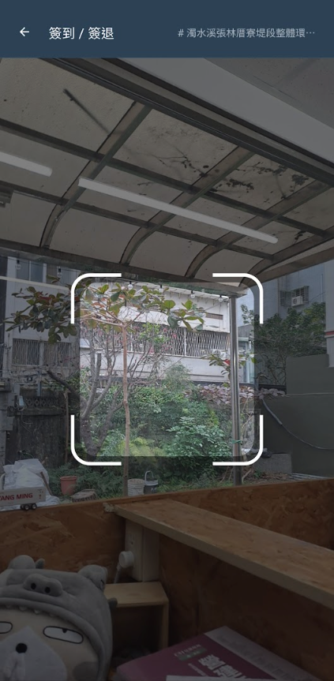

點選圖三紅框圈選處，即可自行更改簽到時間(預設為當前時間)，點&#x9078;**「簽到」**&#x4E26;確定資料無誤後，即簽到成功(圖五)。

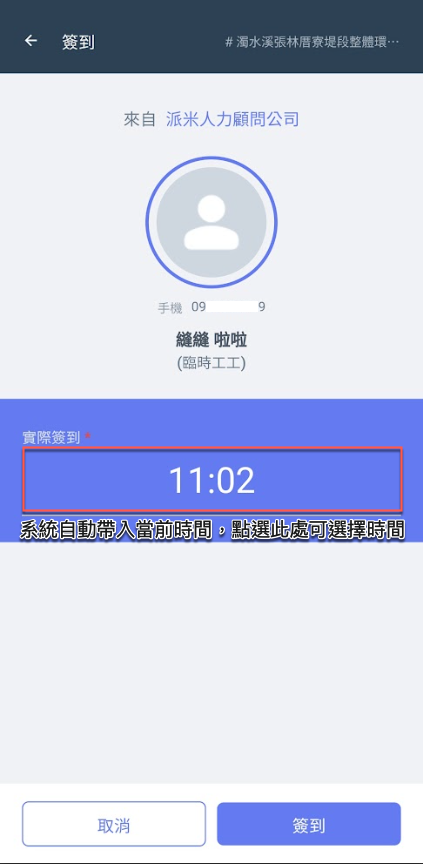 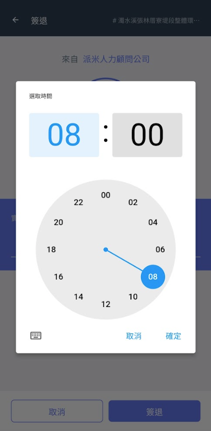 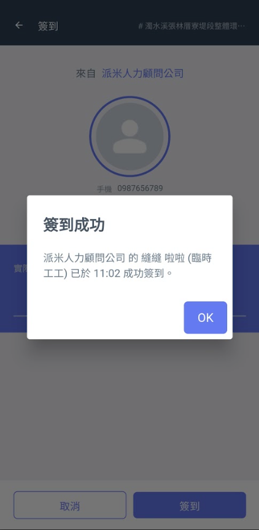

簽退流程如上相同，亦可自行選擇簽退時間(及修改簽到時間)。

!!! tip
    若簽退時間早於預計簽退時間，會如(圖七)提示是否要簽退。

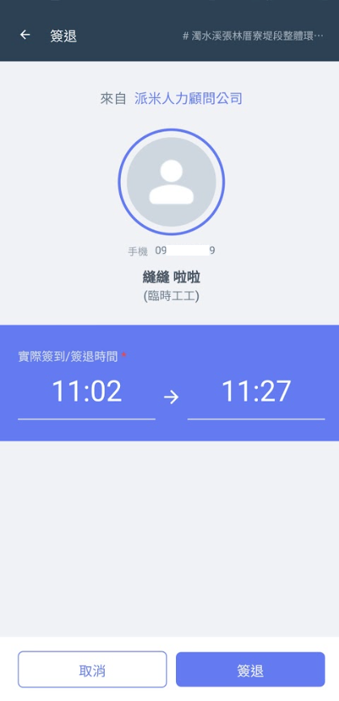 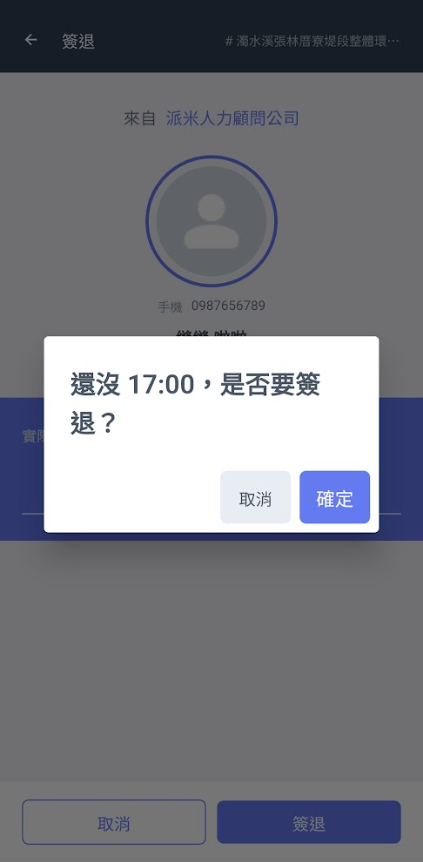

***

## 02｜手動簽到 / 簽退

如圖一紅框圈選處，於欲簽到/簽退之工種右側點&#x9078;**「查看」**。

進入圖二後，選擇點工並點&#x9078;**「編輯」**，即可如(圖三、圖四)填寫該工簽到時間。

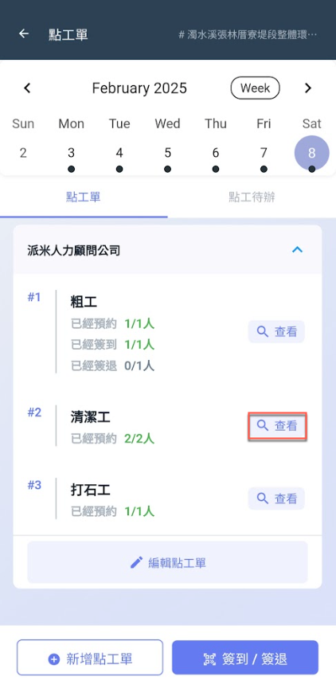 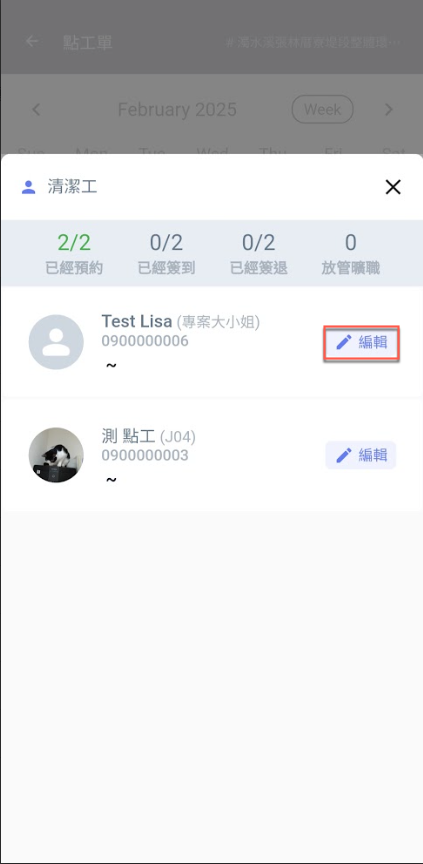 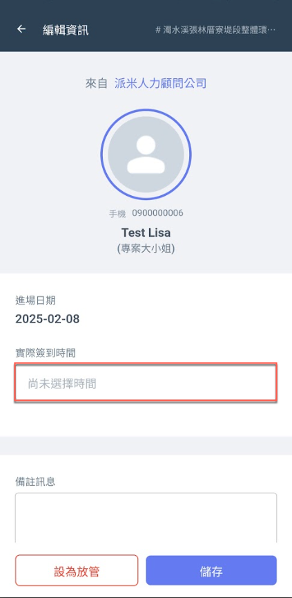 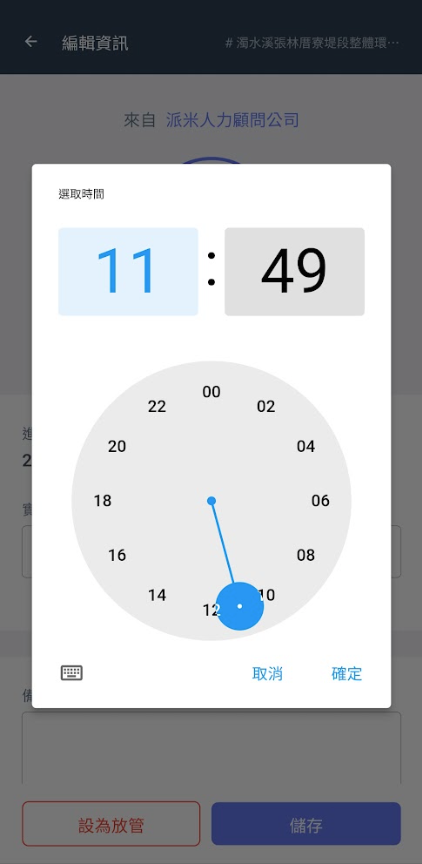

簽退操作如圖五 ～ 圖八。(此範例為營建商皆為首次簽到/簽退者)

如圖六、圖七，點選儲存並確定簽退後，依然可再更改簽到/簽退時間。

詳細說明請參閱 **➙** [出勤確認與資料填寫](qian-dao-qian-tui/chu-qin-que-ren-yu-zi-liao-tian-xie)

 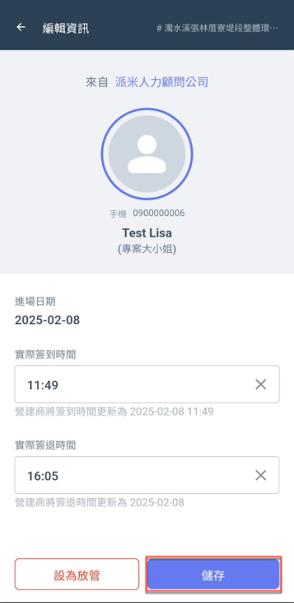 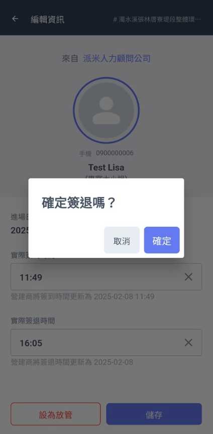 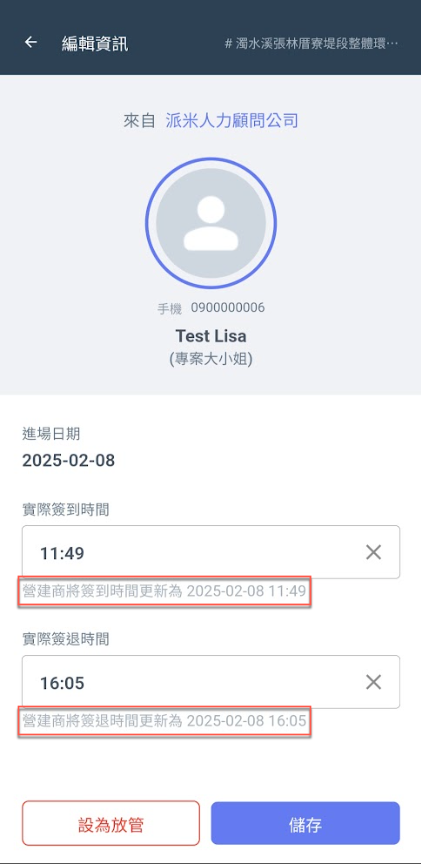

