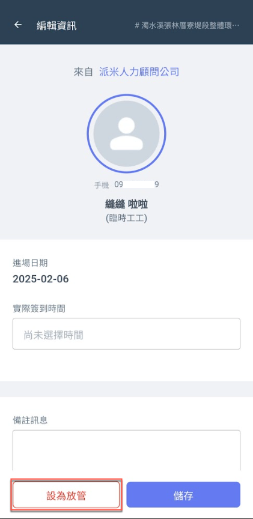
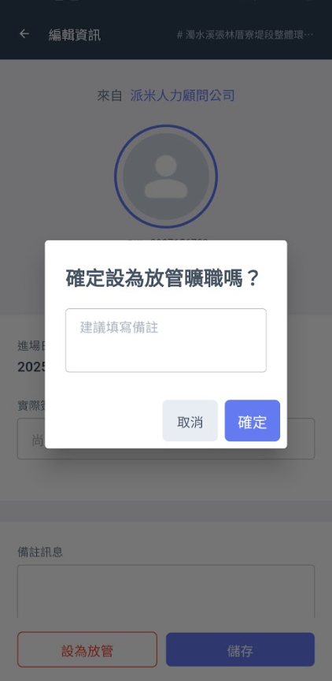
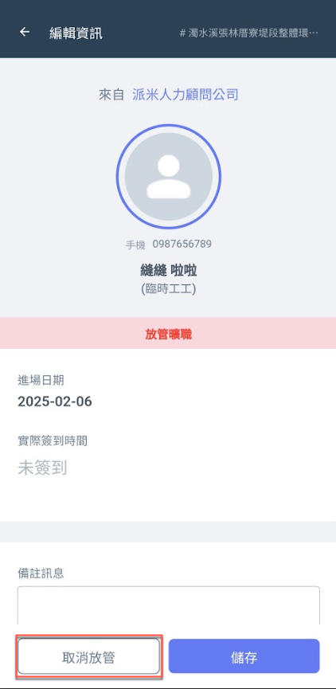

# 設為放管曠職

## 01｜設為放管曠職

填寫備註填寫備註，**「放管曠職」**&#x529F;能旨在協助雇主有效管理或監督員工曠職行為，當員工未按時上班或未事先請假時，雇主能夠及時發現並處理該情況。

!!! warning
    若營建商放管曠職，臨時工**無法**在進行任何操作，且派遣商亦無法取消放管，僅營建商可取消。(若營建商未設為放管，派遣商於結算時同樣可設為放管結案)

!!! tip
    若臨時工已簽到/簽退，營建商與派遣商仍可執行放管曠職，有效管理出工狀況。

  

