# 新增點工單

## 01｜詳細操作說明



### 進入點工單畫面

於App專案內部點&#x9078;**「點工」**&#x529F;能(圖一)，進入圖二畫面後點選下方&#x4E4B;**「新增點工單」**，即可見圖三畫面開始填寫資料。

!!! warning
    請注意，您發送的點工單並非直接給派遣工，乃為發送給派遣商點工申請，再由派遣商派遣人員。

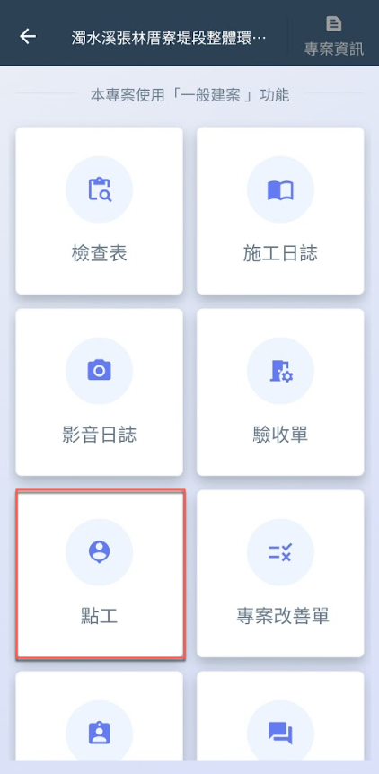  




### 選擇派遣商

如圖四紅框圈選處，點選派遣商欄位後，即可如(圖五)畫面開始選擇派遣商。

!!! warning
    該處選擇以前於網頁設立之資料為依據，務必確認您已和該專案欲合作之派遣商關聯。

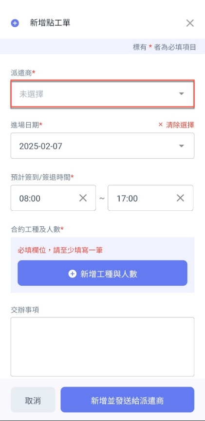 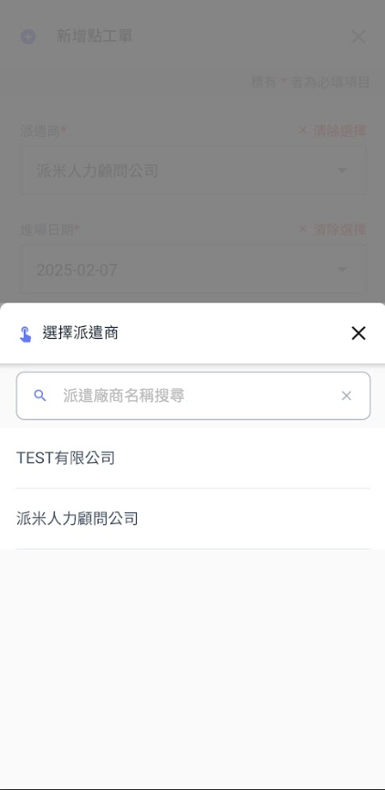




### 選擇進場日期&簽到/簽退時間

#### 選擇進場日期

如圖六畫面紅框圈選處，點選進場日期欄位，即可開啟圖七畫面選取進場日期。

!!! warning
    請注意，進場日期不可選擇當日以前之日期。

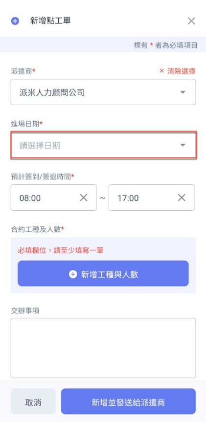 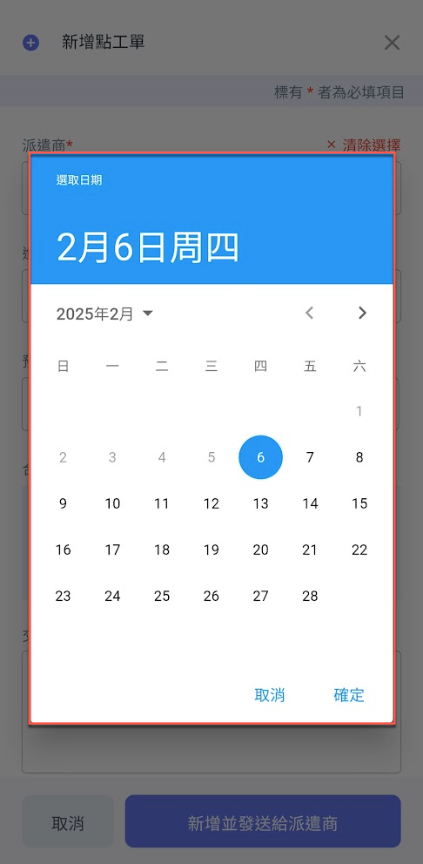

#### 填寫預計簽到/簽退時間

如圖八，分別點選簽到/簽退時間框，即可開啟圖九畫面選取時間。

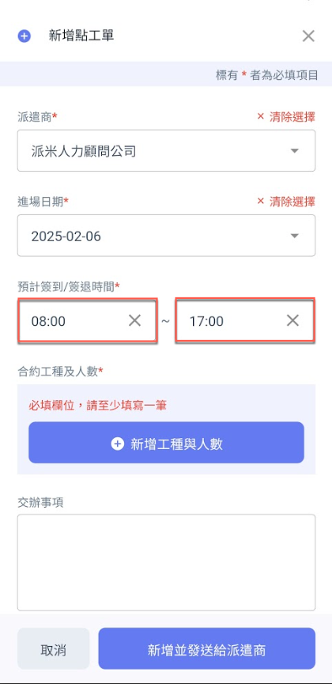 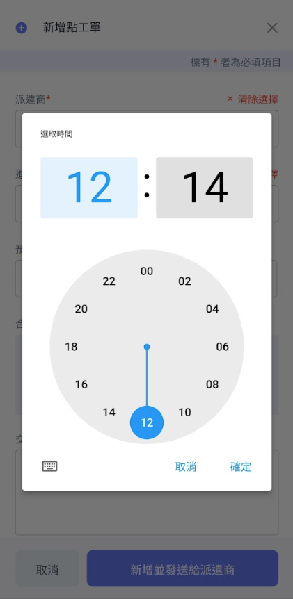




### 合約工種及人數

如圖十～圖十三，選取工種並填寫所需人數，如需新增多個工種，重複操作即可。

!!! warning
    此處選擇之合約工種與派遣商所設立之資料有關，務必確認派遣商已妥善填寫。

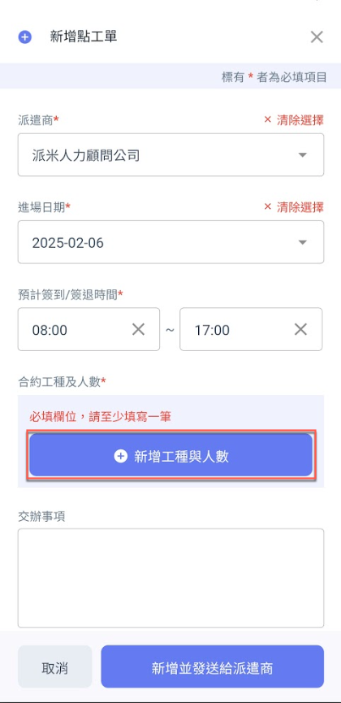 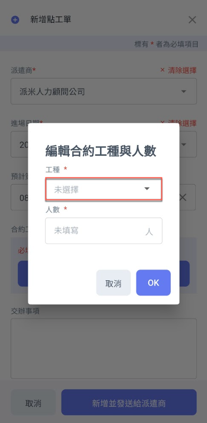 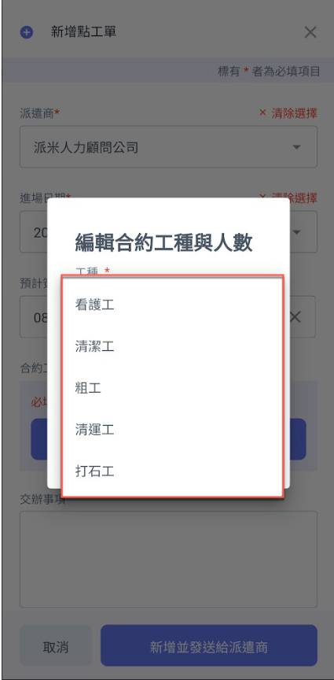 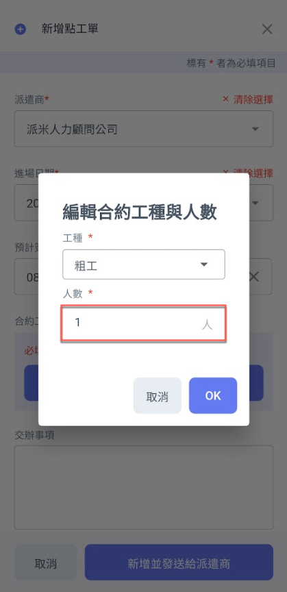




### 填寫交辦事項與現場圖片

將資料填寫完畢並確認無誤後，即可點&#x9078;**「新增並發送給派遣商」**，發送該點工申請給派遣商。

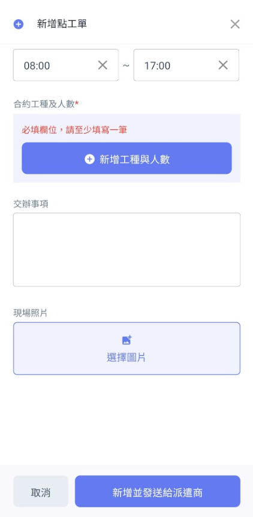 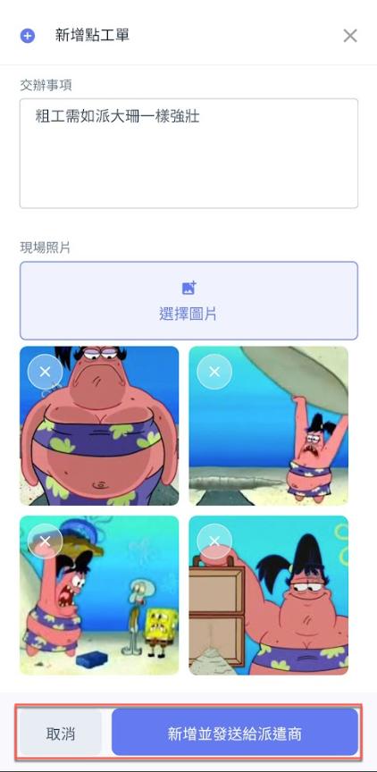




### 等待派遣商預約點工

請見下方示例一 ～ 示例三。



派遣商已發送派遣通知，並且已有臨時工**接受**工作請求。



派遣工已完成簽到 / 營建商為臨時工進行首次簽到。



派遣工已完成簽退 / 營建商為臨時工進行首次簽退。



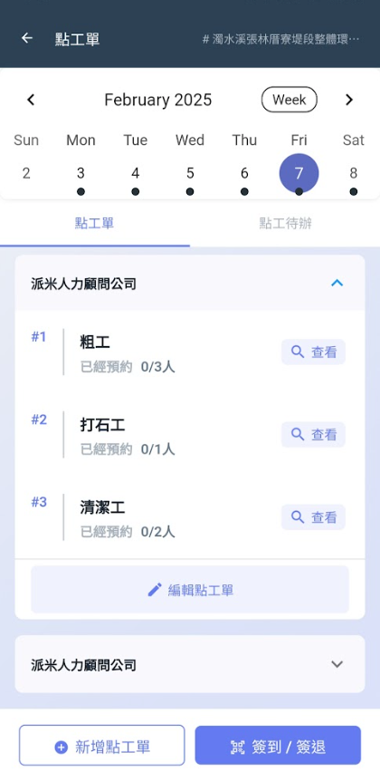 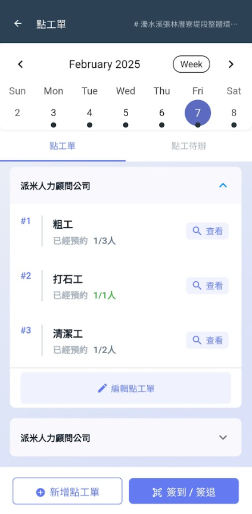 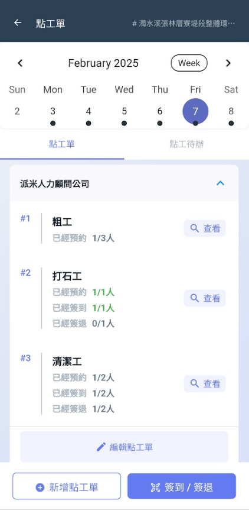



