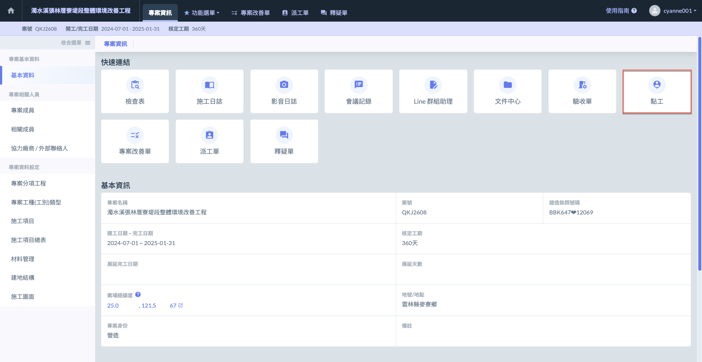
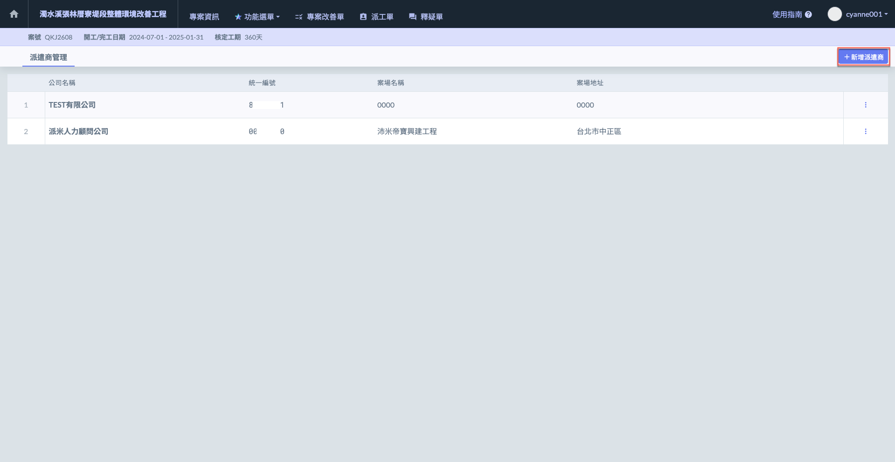
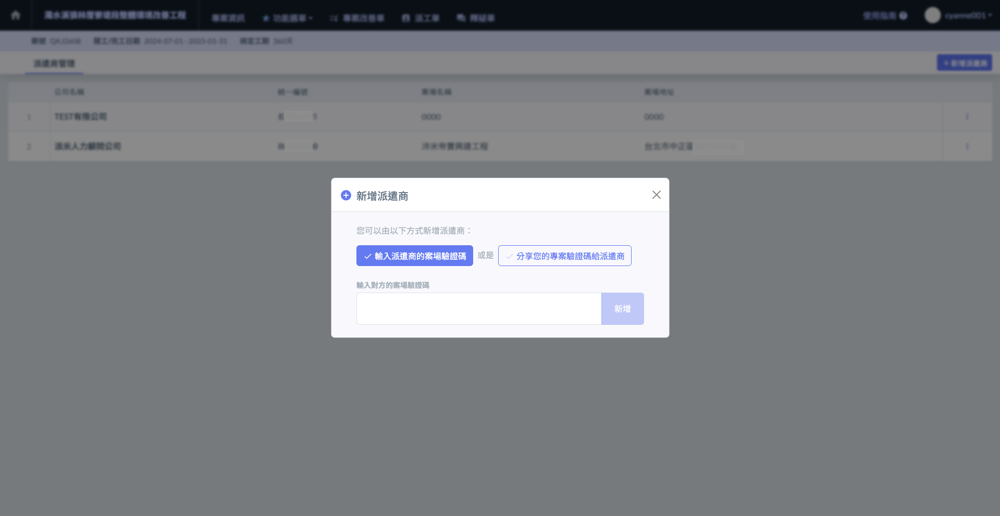
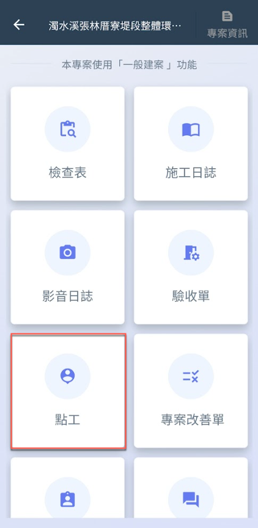
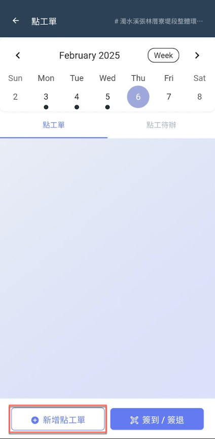
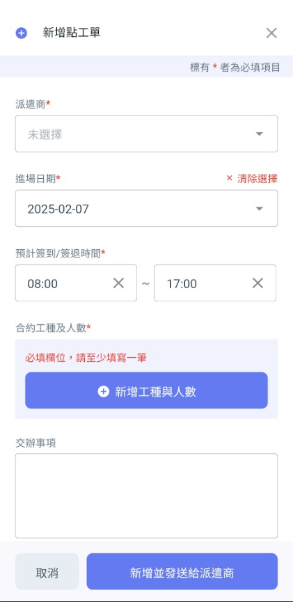
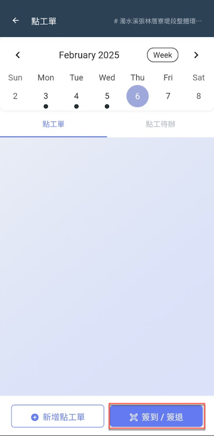

# 營建商

## 建議流程說明

!!! warning
    &#x9664;**「新增派遣商」**&#x65BC;**網頁版**操作，其餘步驟皆於**App**內執行。



### 新增派遣商

新增派遣商僅能於網頁版操作。

於專案內部點&#x9078;**「點工」**&#x529F;能，並點&#x64CA;**「＋新增派遣商」**&#x958B;始新增派遣商資料 (輸入驗證碼/分享驗證碼)

!!! info
    每個專案支援多個派遣廠商關聯。(派遣商是與您的專案關聯，而非與公司關聯)

 

 




### 新增點工單

以下開始為App內操作，詳細說明可查看 **➙** [新增點工單](contractor/dian-gong-dan/xin-zeng-dian-gong-dan)

於專案內部點&#x9078;**「點工」**&#x529F;能，並點&#x9078;**「新增點工單」**&#x958B;始新增點工需求資料，包括：

(派遣商、進場日期、預計簽到/簽退時間、合約工種及人數、交辦事項及現場照片)

  




### 簽到 / 簽退

系統提供兩種讓營建商紀錄臨時工之簽到/簽退時間，分別為：**QR code掃描**與**手動操作**。

以下為QR code掃描處 (掃描派遣工個人之專屬QR code)，詳細說明請參閱 **➙** [簽到/簽退](contractor/dian-gong-dan/qian-dao-qian-tui)

 



