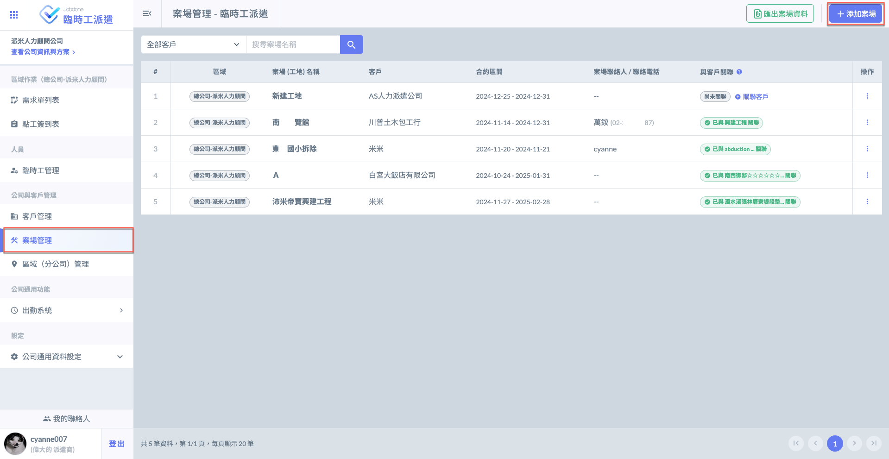
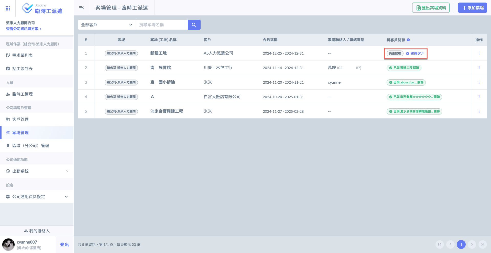
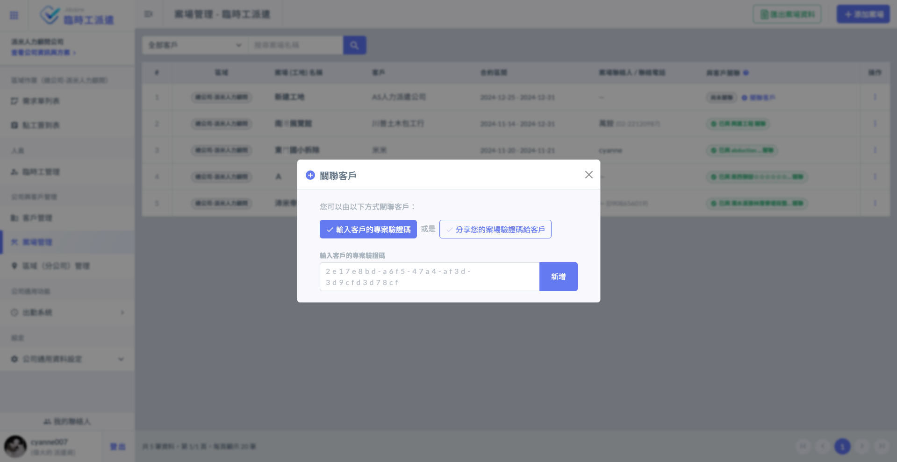
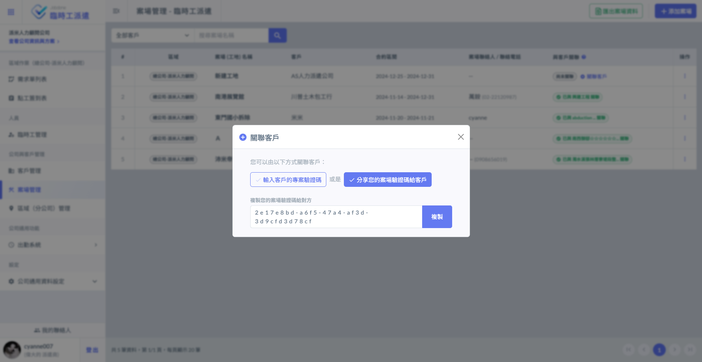

# 關聯客戶

為了實現跨公司合作的功能系統提&#x4F9B;**「關聯」**&#x529F;能。但在部分客戶尚未使用 Jobdone 平台的情況下仍能順利運作，系統提供單方面操作的選項，使得即便對方未加入平台，您仍能進行有效協作和管理。

**「關聯」**&#x529F;能讓您能即時接受營建商的點工需求，營建商亦可查看您發出的派遣需求。

!!! warning
    然而，若您需要關聯客戶 (使用關聯功能)，您與營建&#x5546;**「都需」**&#x4F7F;用 Jobdone 系統。

***

## 關聯客戶

若案場已新增完畢，於**與客戶關聯**欄位將顯示尚未關聯，並請您關聯客戶。

如圖一紅框圈選處，點&#x9078;**「關聯客戶」**&#x5373;可輸入客戶專案驗證碼/分享驗證碼。

!!! tip
    每個案場只能與一個專案關聯，但一個專案可以與多個案場關聯。

#### 輸入客戶專案驗證碼

!!! info
    營建商須&#x65BC;**「點工」**&#x4E4B;**「新增派遣商」**&#x529F;能中，產生驗證碼給您。

#### 分享專案驗證碼

!!! info
    營建商須&#x65BC;**「點工」**&#x4E4B;**「新增派遣商」**&#x529F;能中，輸入您分享的驗證碼。

