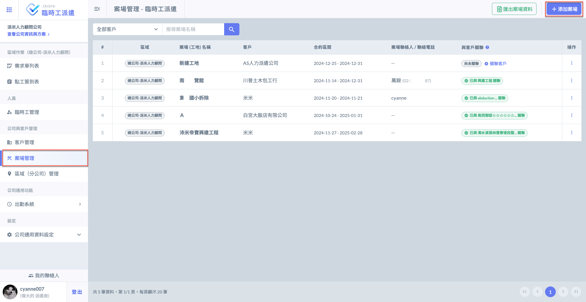
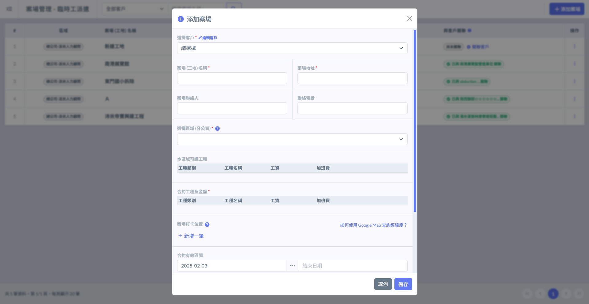
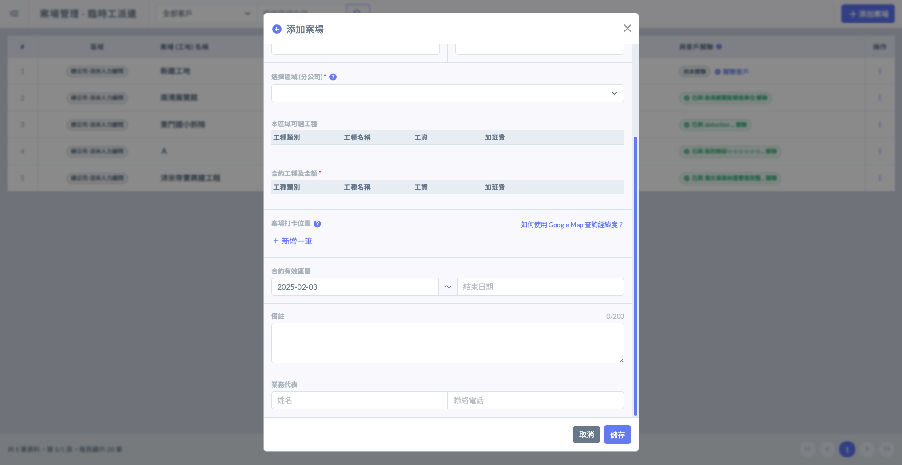
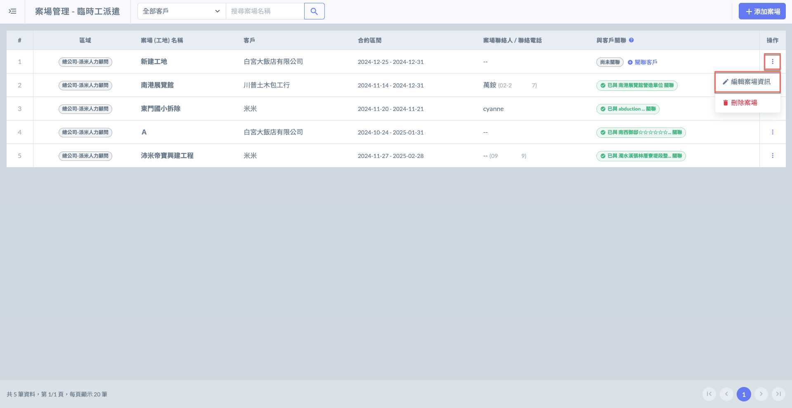
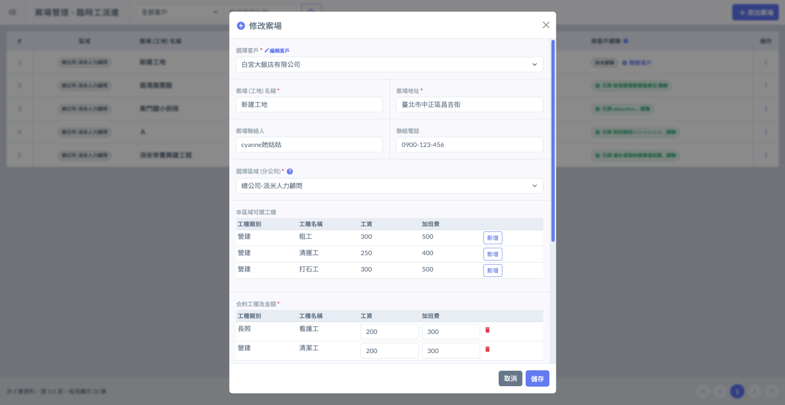
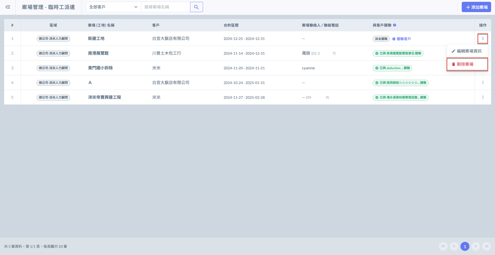
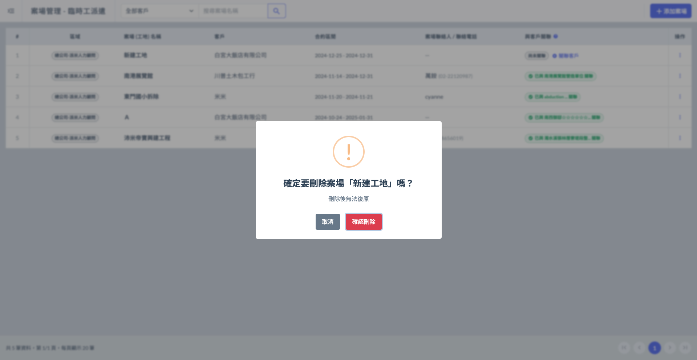

# 新增 / 編輯案場

## 01｜新增案場

如圖一紅框圈選處，進入案場管理頁面後，點選右上角&#x4E4B;**「＋添加案場」**&#x5373;可進入添加畫面，填寫案場資料。

 案場資料如下

客戶、案場 (工地) 名稱、案場地址、案場聯絡人、聯絡電話、案場打卡位置、合約有效區間、業務代表、選擇區域 (分公司) 及該區域可選工種。

!!! tip
    依需求選擇該案場會使用之工種類型。

!!! warning
    由於填寫資料時需&#x8981;**「選擇客戶」**&#x53CA;**「選擇區域 (分公司) 」**，務必確認相關資料都已填寫完畢。

 

***

## 02｜編輯案場

如左圖紅框圈選處，於欲編輯之案場其右側**操作**欄位，點&#x9078;**「編輯案場資訊」**，即可更動案場資訊。

 

***

## 03｜刪除案場

如左圖紅框圈選處，於欲刪除之案場其右側**操作**欄位，點&#x9078;**「刪除案場」**，即可刪除該案場。

 

