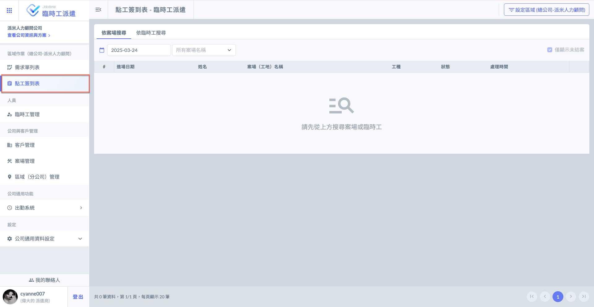
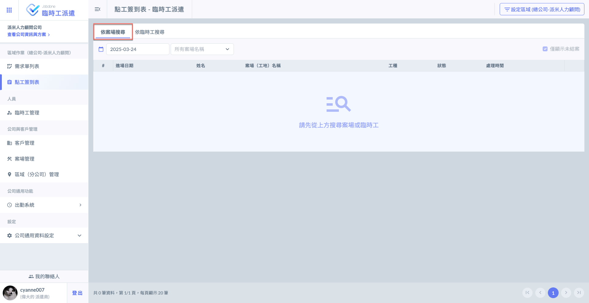
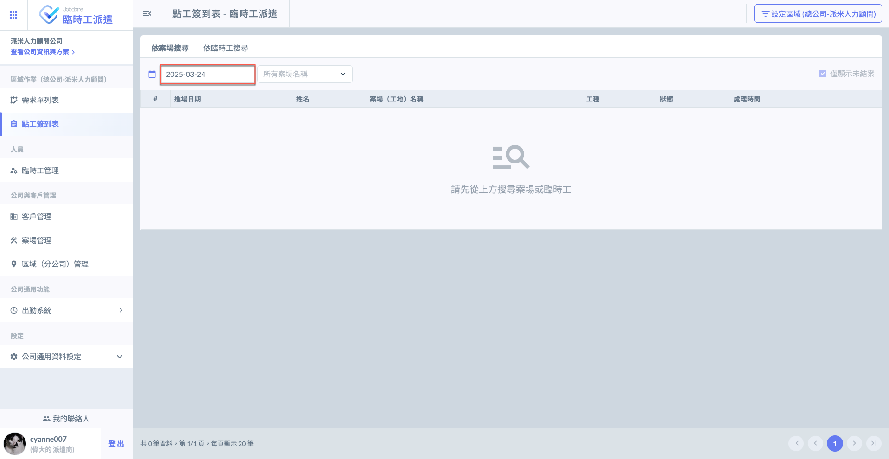
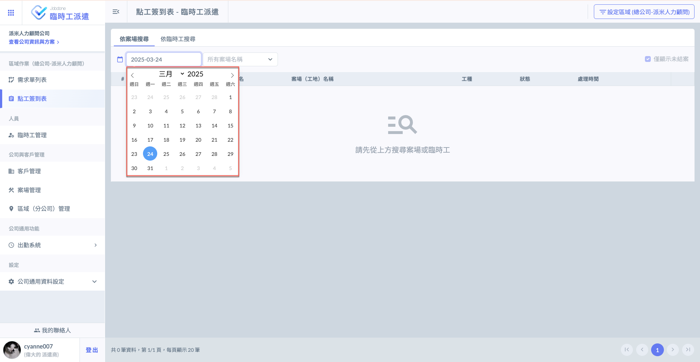
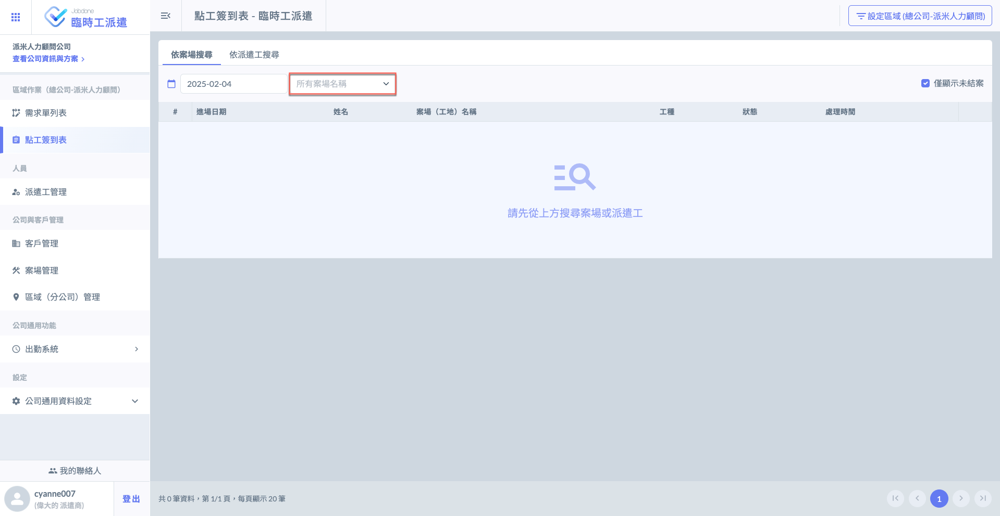
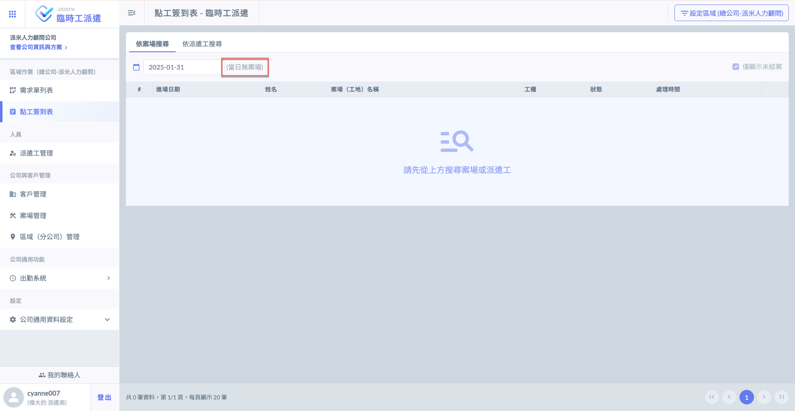
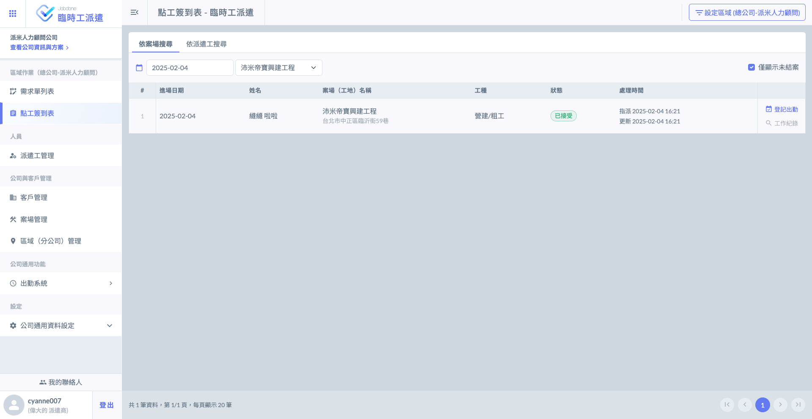
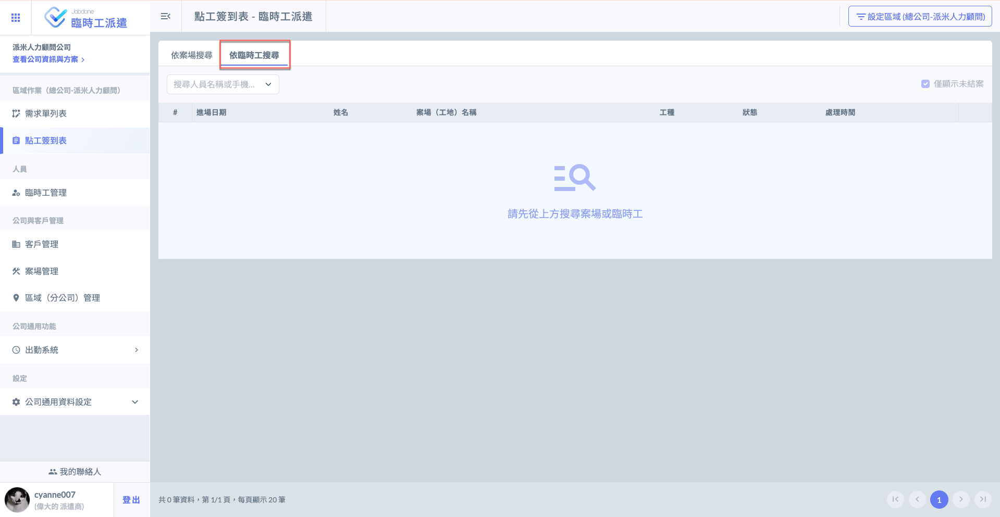
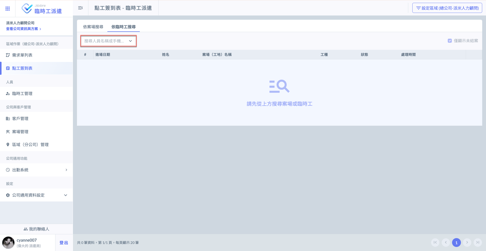
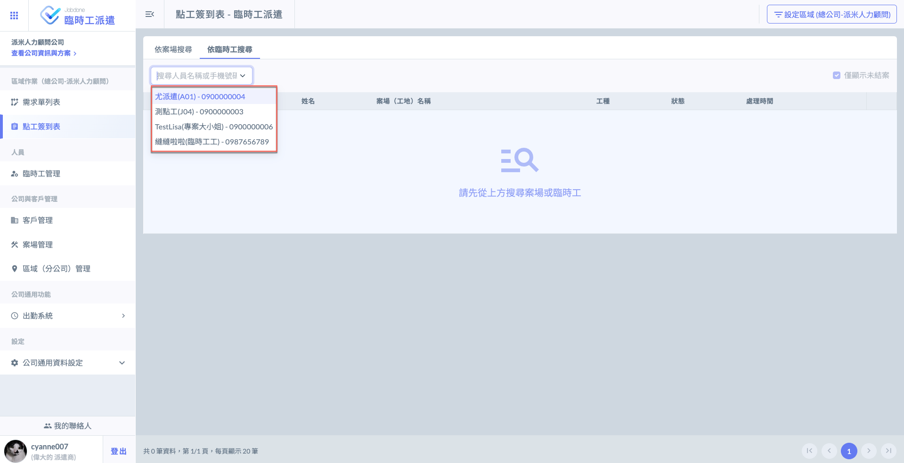

# 點工簽到表

系統提供兩種查看模式，分別為：<kbd>**依案場搜尋**</kbd>及<kbd>**依臨時工搜尋**</kbd>。

如下圖，進入**點工簽到表**功能頁面。

***

## 01｜<kbd>依案場搜尋</kbd>&#x20;

進入點工簽到表頁面後，點選<kbd>**依案場搜尋**</kbd>頁籤。

!!! info
    系統預設僅顯示未結案之工單，如需查看其他狀態之工單，將其取消勾選即可。

### 01 - 1｜選擇日期與案場

點選圖一紅框圈選處即可選擇日期(圖二)。

若選擇日期**有案場**，則**可選擇**相關案場；若選擇日期**無案場**，則**不可選擇**案場且提示當日無案場(圖三、圖四)。

 

如上述，若選擇日期有案場，即可選擇案場(圖三)；若無案場，則不可選擇案場且提示當日無案場(圖四)。

 

示例如下：

***

## 02｜<kbd>依臨時工搜尋</kbd>

進入點工簽到表頁面後，點選<kbd>**依臨時工搜尋**</kbd>頁籤。

!!! info
    系統預設僅顯示未結案之工單，如需查看其他狀態之工單，將其取消勾選即可。

### 02 - 1｜選擇臨時工

此處可選擇之人員依&#x64DA;**「臨時工管理」**&#x4E4B;資料，如需新增/編輯臨時工，請參閱 **➙** [新增 / 編輯臨時工](lin-shi-gong-guan-li/xin-zeng-bian-ji-lin-shi-gong)

 

