# 派遣商

## 建議流程說明



### 建立公司

註冊完畢後，請依照您的情況選擇合適的操作，分別為**首次建立公司**及**加入現有公司**：



若您是 **Jobdone** 系統中首位為您所屬公司進行建立的用戶，請點&#x9078;**「建立公司」**&#x4EE5;完成公司資料的設定。



若您的同事已經在 **Jobdone** 中建立了您的公司，請點&#x9078;**「尋找我的公司」**&#x4E26;完成加入程序。



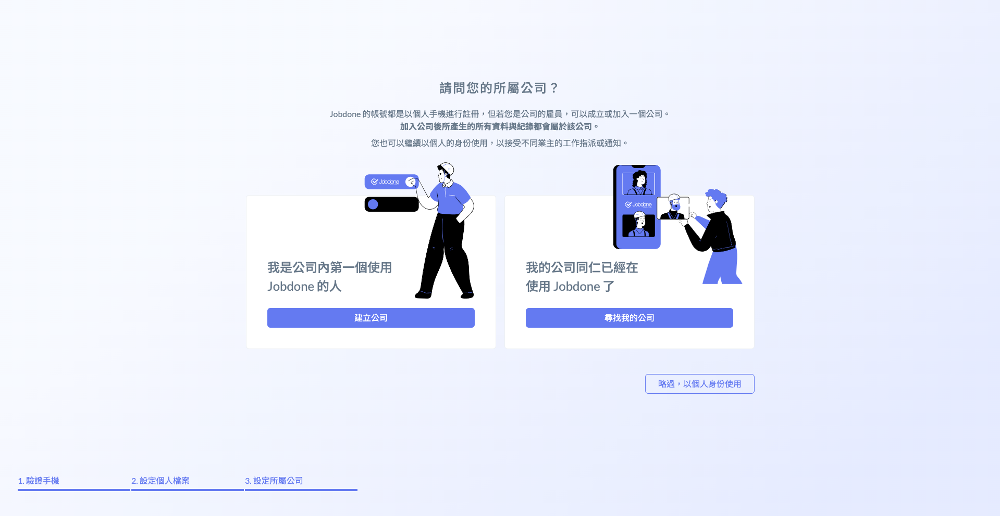

#### 一、尋找我的公司

請&#x60A8;**「擇一」**&#x8F38;入貴公司的**公司名稱**、**統一編號**、**開業證號**以讓您順利加入所屬公司。

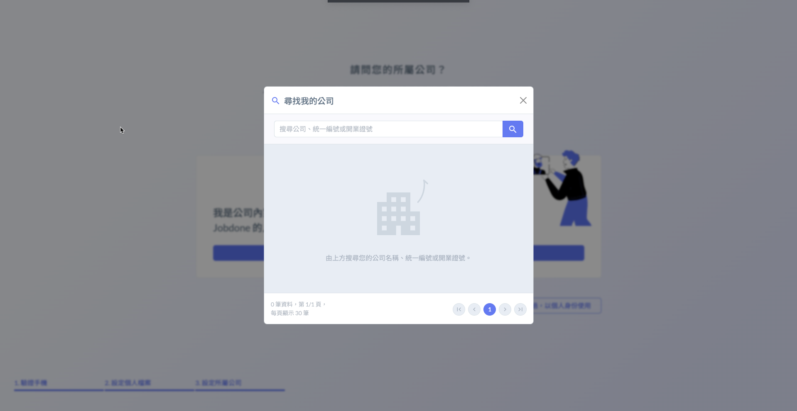 

#### 二、建立公司

請您詳細輸入公司資料，並&#x65BC;**「請選擇公司適用的模組」**&#x9078;&#x64C7;**「臨時工派遣」**。

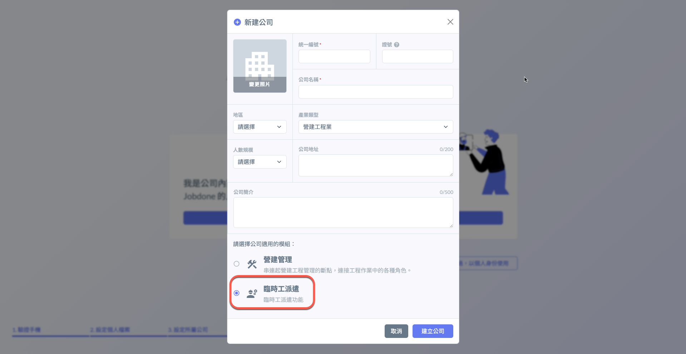



### 公司相關資訊與方案

詳細資訊可查看 **➙** [公司相關](../company_level)



### 區域 (分公司) 管理

進入主頁面後，點選**公司與客戶管理**&#x4E4B;**「區域 (分公司) 設定」**，並點選右上角&#x4E4B;**「＋新增區域」**。

!!! info
    &#x20;一個工地，只會跟一個分公司關聯，也就是每個區域分公司會有其業務範圍。

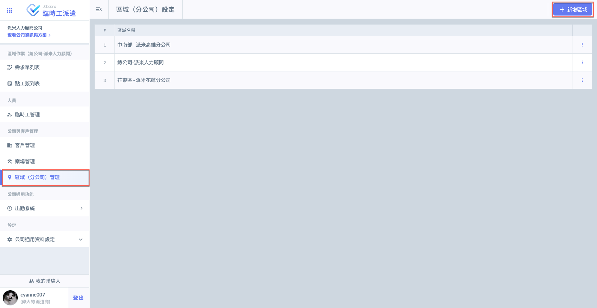

開始新增您的公司基礎資料，並選擇各公司&#x4E4B;**「組織工種」**，並同時設定各工種之基本參考工資。

!!! warning
    請注意，基本工資以 (元/工) 為單位，並非以時數計。&#x20;

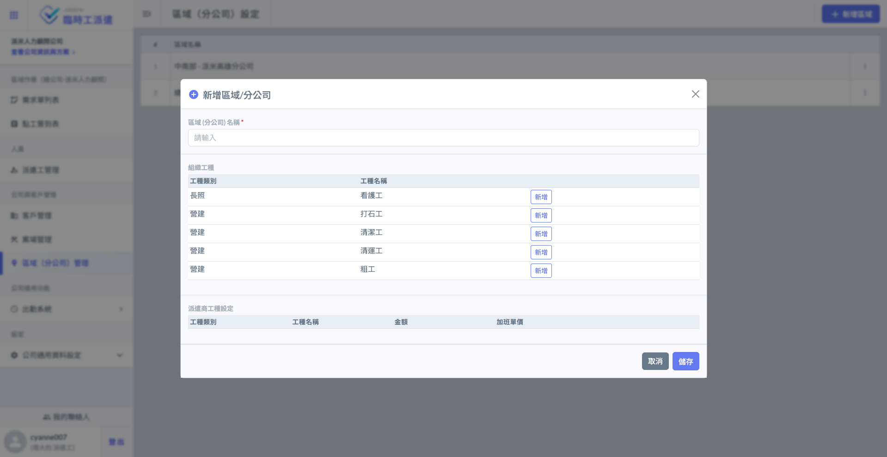 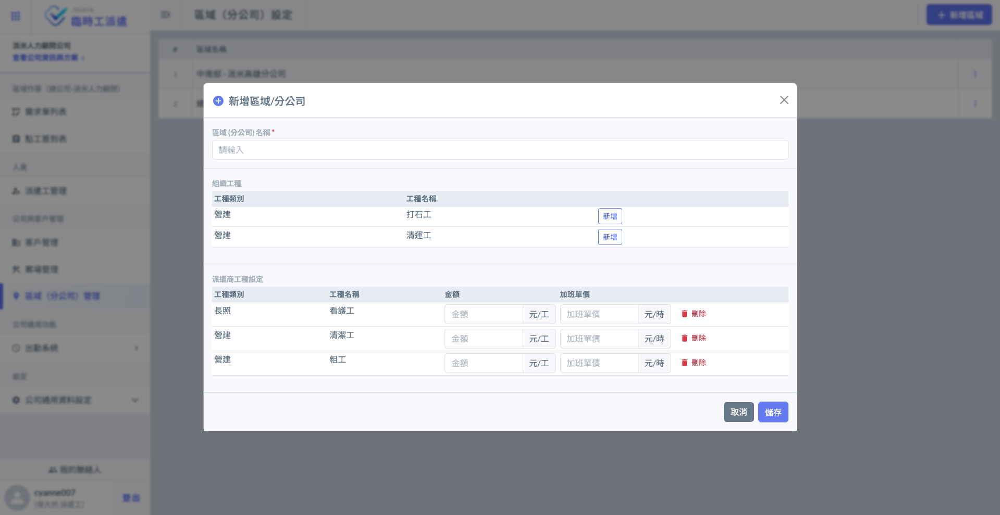




### 新增客戶

於主頁面點&#x9078;**「客戶管理」**，並點選右上角&#x4E4B;**「＋新增客戶檔案」**，開始填寫客戶資料。

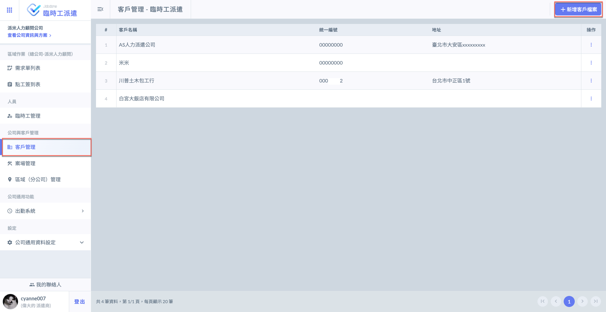 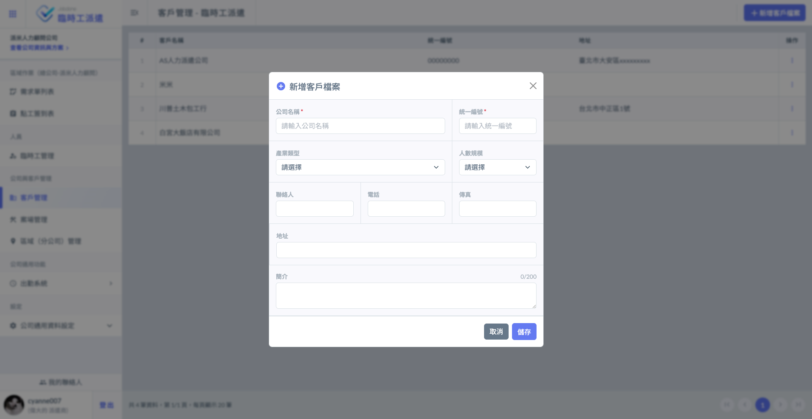




### 請派遣工安裝「臨時工接單 App」

請派遣工下&#x8F09;**「臨時工接單 (Jobdone)」**&#x41;PP，支援 Android 和 iOS 系統。

詳細可參考 **➙** 「[派遣工](temporary-worker)」操作說明



### 新增臨時工

於主頁面中點&#x9078;**「臨時工管理」，**&#x4E26;點&#x9078;**「新增派遣人力」**&#x958B;始新增臨時工資料。

詳細說明可查看 **➙** [新增 / 編輯臨時工](lda/lin-shi-gong-guan-li/xin-zeng-bian-ji-lin-shi-gong)

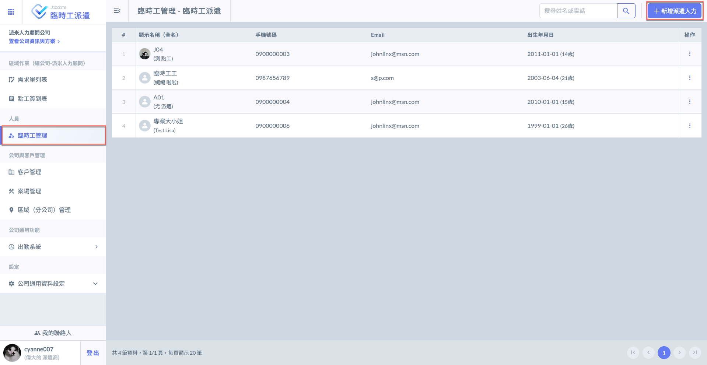



### 新增案場

於主頁面中點&#x64CA;**「案場管理」，**&#x4E26;點&#x9078;**「＋添加案場」**&#x958B;始新增案場資料。

詳細說明可參考 **➙** [新增/編輯案場](lda/an-chang-guan-li/xin-zeng-bian-ji-an-chang)

!!! warning
    填寫案場資料時需&#x8981;**「選擇客戶」**&#x53CA;**「選擇區域 (分公司) 」**，務必確認資料都已填寫完畢。

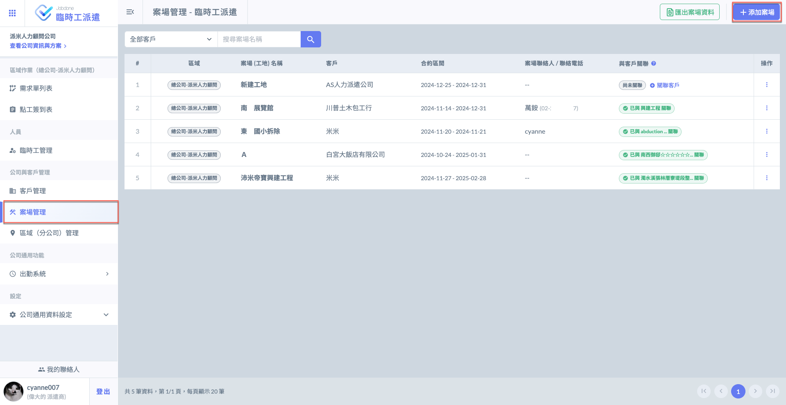



### 關聯客戶

詳細說明請參閱 **➙** [關聯客戶](lda/an-chang-guan-li/guan-lian-ke-hu)



### 新增派遣需求

於主頁面中點&#x64CA;**「需求單列表」，**&#x4E26;點&#x9078;**「＋新增需求單」**&#x958B;始新增點工需求。

詳細說明可參考 **➙** [需求單列表](lda/requisition-list)

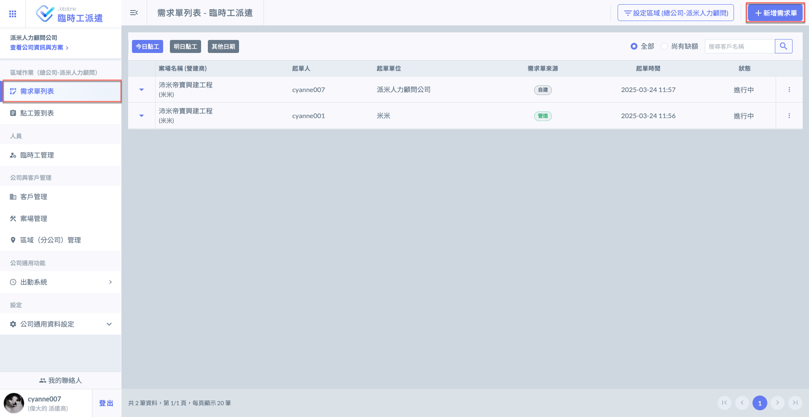


