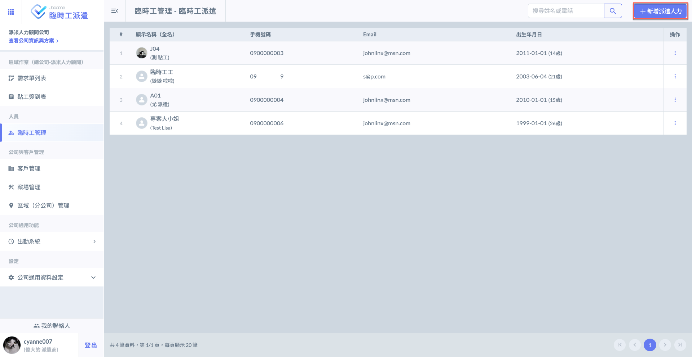
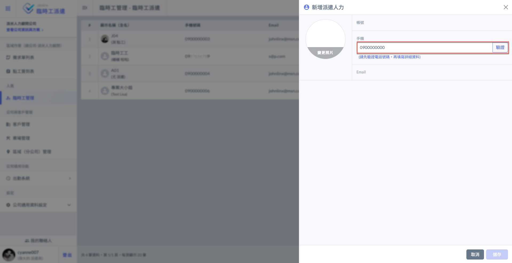
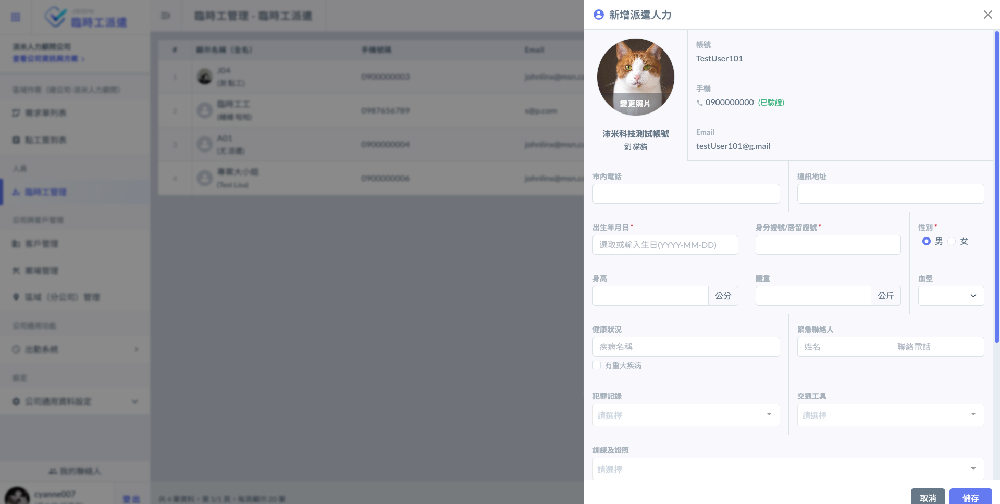
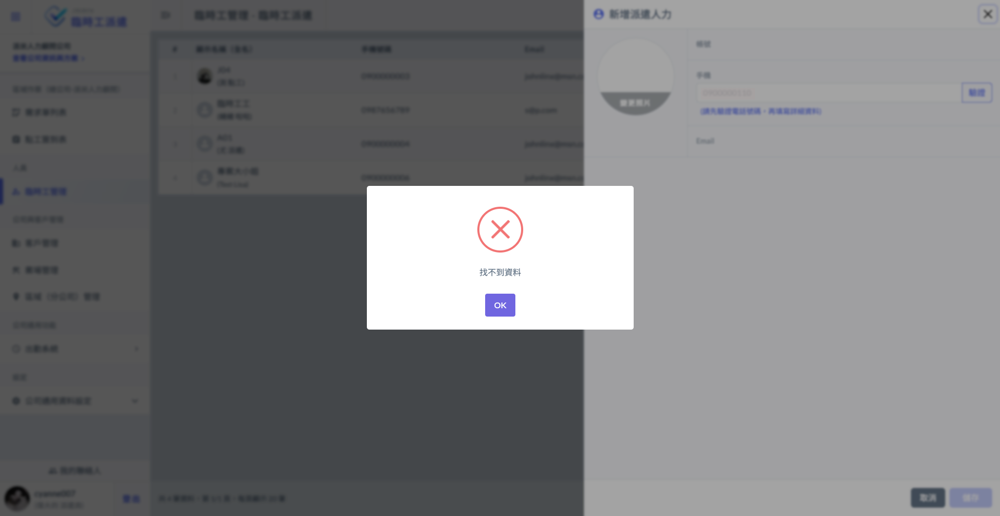
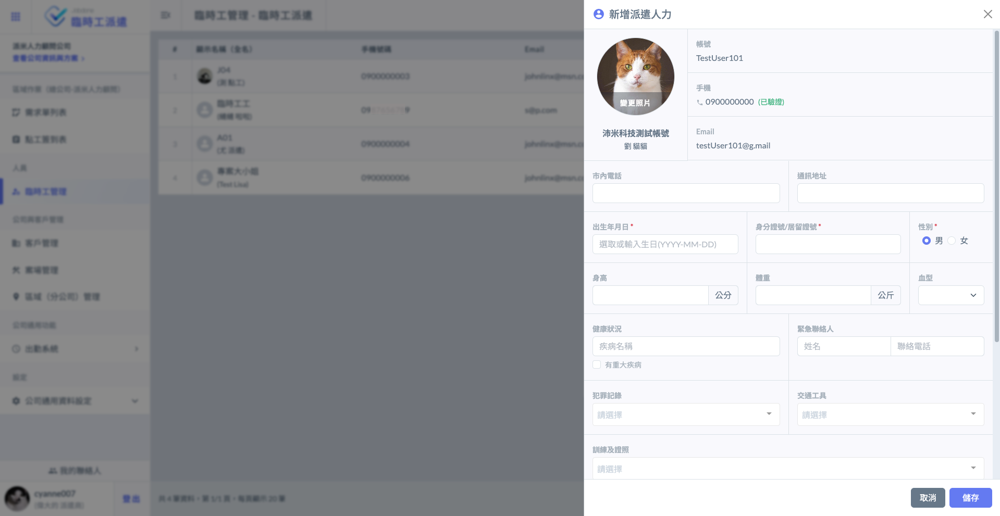
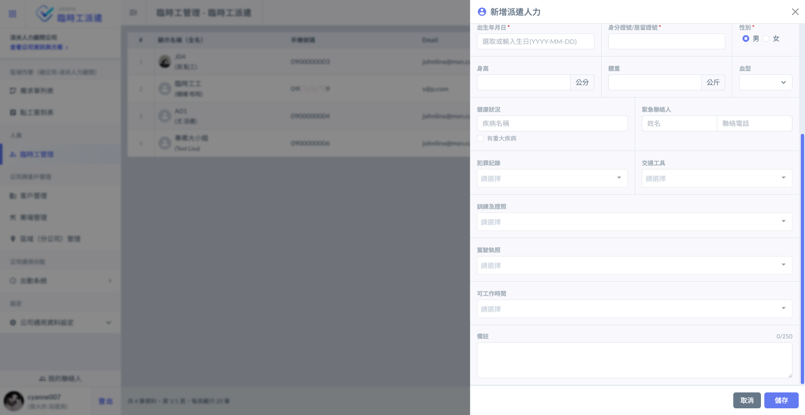
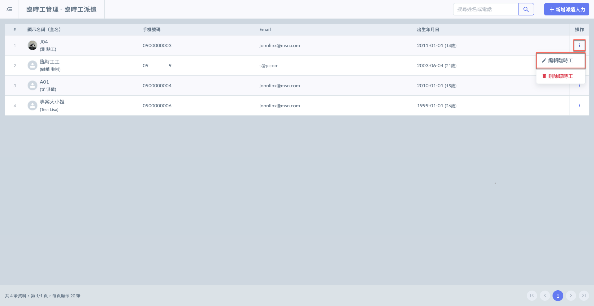
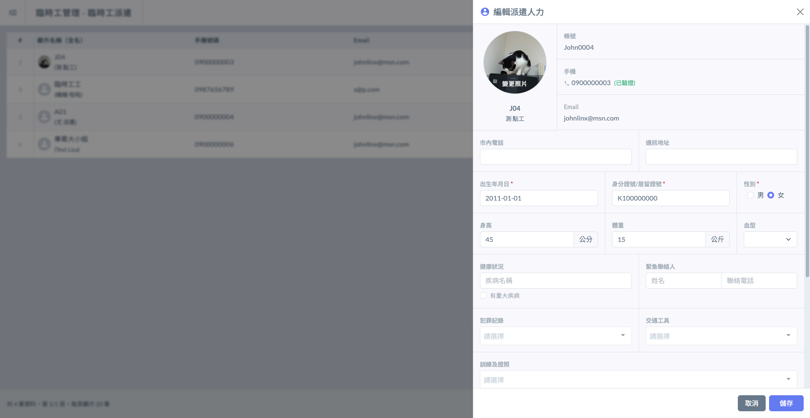
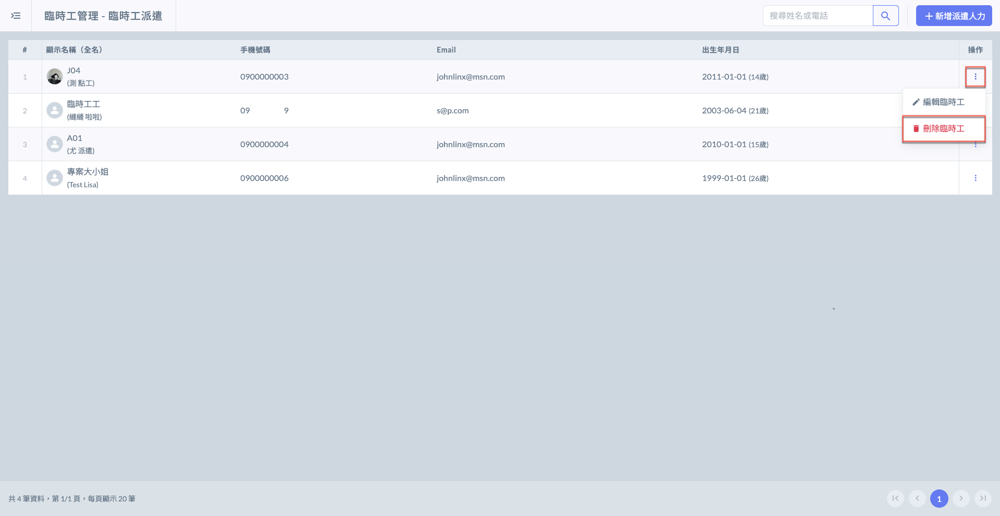
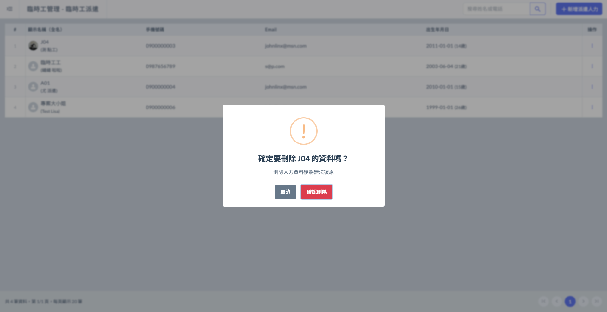

# 新增 / 編輯臨時工

## 01｜新增派遣人力



### 新增派遣工

如下圖紅框圈選處，進入臨時工管理頁面後，點選右上角&#x4E4B;**「＋新增派遣人力」**，即可開始輸入臨時工電話並驗證。




### 填寫臨時工電話

將臨時工電話填寫完畢並經過驗證，便可開始填寫其詳細資料。

!!! warning
    由於需要電話驗證，務必確認欲新增之派遣工已&#x65BC;**「臨時工接單 App」**&#x8A3B;冊帳號。

將電話填寫完畢後，即可點選右方&#x4E4B;**「驗證」**。

若驗證成功則可開始填寫詳細資料；若驗證失敗則會跳出**找不到資料**之提示。

以下為**驗證失敗**與**驗證成功**之範例。

!!! warning
    若驗證失敗，請您再次確認輸入之號碼是否有誤，或聯絡臨時工儘快註冊帳號。

 




### 填寫臨時工資料

詳細資料如下，請您妥善填寫臨時工之個人檔案。

 

系統已於：犯罪紀錄、訓練及證照、駕駛執照及工作時間等欄位內建相關資料供您選擇。

可參考下方影片：

{% embed url="https://files.gitbook.com/v0/b/gitbook-x-prod.appspot.com/o/spaces%2FEqUCL3D5WQfpxJw8NL3P%2Fuploads%2F6RsJSxnBkyuZLvV4dJi0%2F%E6%B4%BE%E9%81%A3%E5%B7%A5%E7%9B%B8%E9%97%9C%E5%BD%B1%E7%89%87.mp4?alt=media&token=485267a6-57b1-413e-857e-76580798295a" %}



***

## 02｜編輯臨時工

如左圖紅框圈選處，於欲編輯之派遣工右側**操作**欄位，點&#x9078;**「編輯臨時工」**，即可如右圖開始編輯其資料。

 

***

## 03｜刪除臨時工

如左圖紅框圈選處，於欲刪除臨時工右側**操作**欄位，點&#x9078;**「刪除臨時工」**。

 

