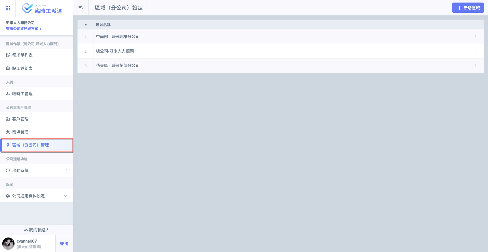
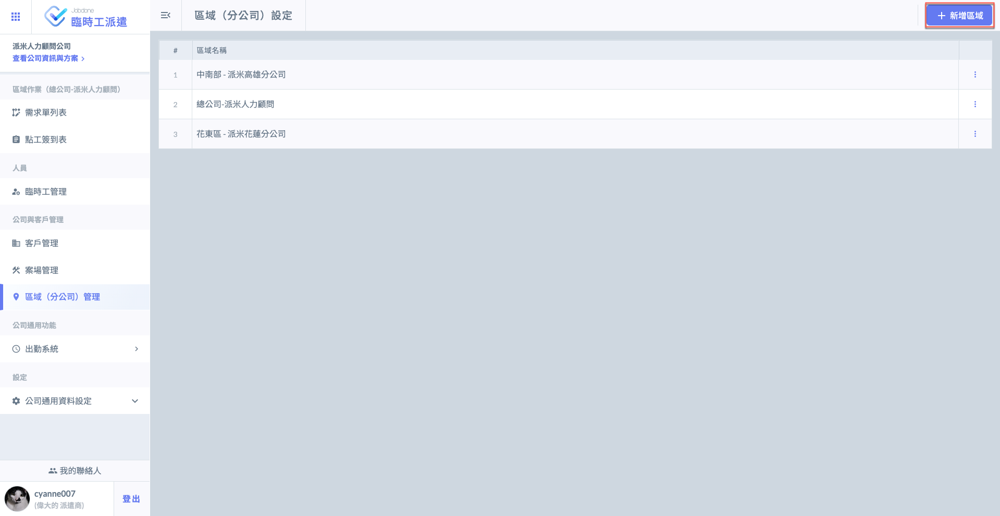
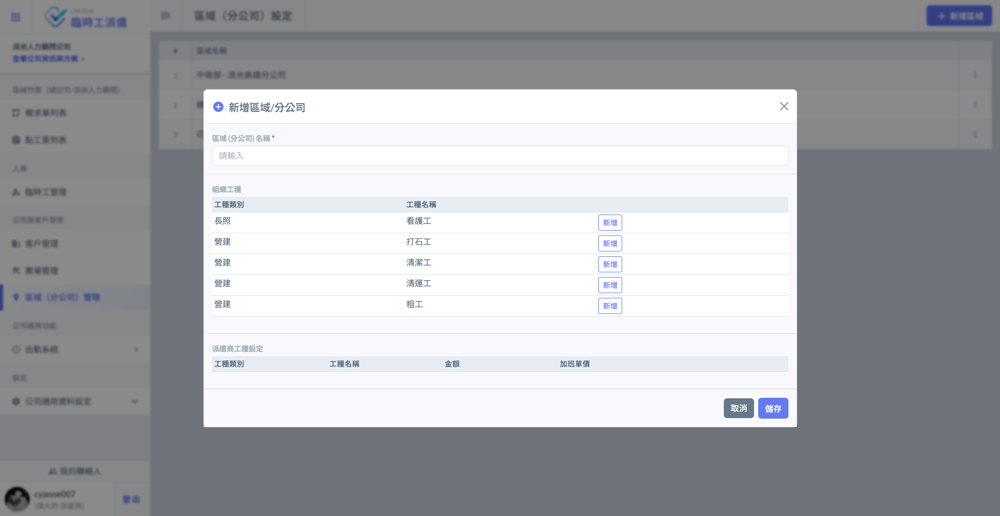
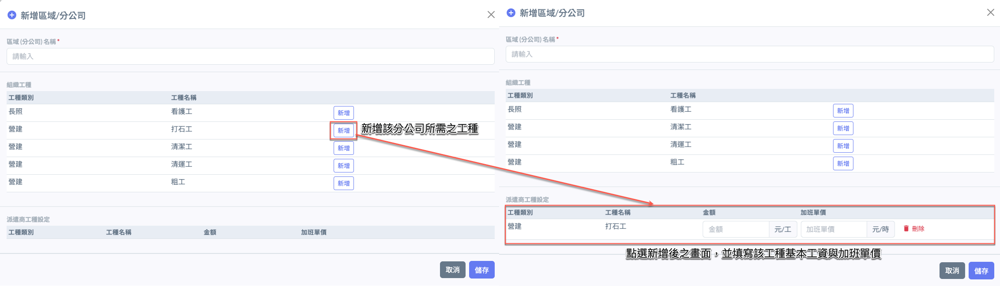
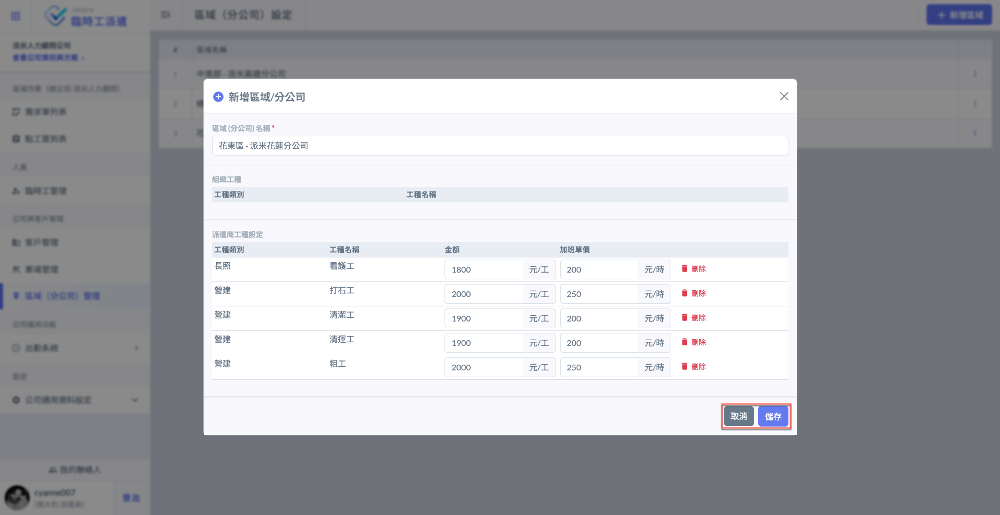
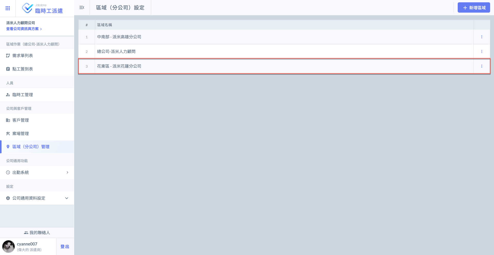
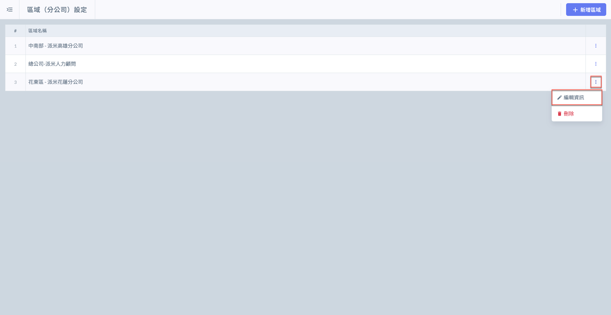
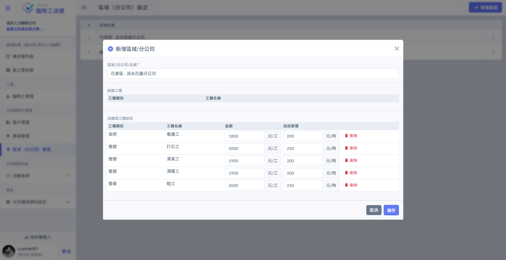
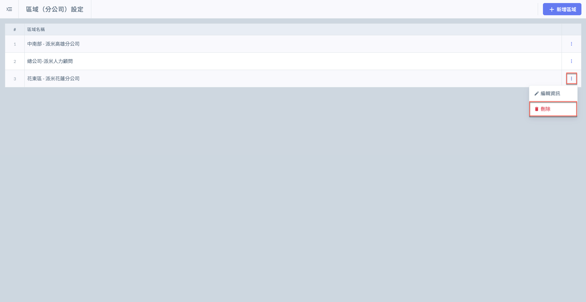
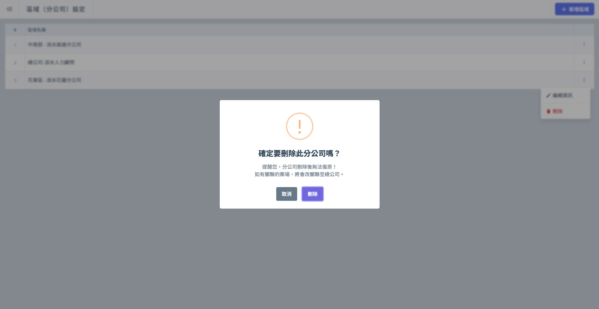

# 區域 (分公司) 管理

派遣商若有多個地區的辦公室，必須先設定(區域分公司)。因為工地(案場)是與分公司綁定，也就是同一個客戶的不同案場，會由固定的分公司負責(業務範圍)。

如下圖，進入**區域 (分公司) 管理**功能頁面。

***

## 01｜新增區域

進入**區域 (分公司) 管理**頁面後，如圖一紅框圈選處，點選右上角&#x4E4B;**「＋新增區域」**&#x5373;可進入圖二新增畫面。

 

填寫分公司名稱，並選擇該分公司適用之工種，選擇後即可填寫工種**基本工資**與**加班單價** (圖三)。

將資料填寫完畢並確認無誤後，點&#x9078;**「儲存」**&#x5373;可保存此筆資料，完成畫面如圖五。

 

***

## 02｜編輯區域

於欲編輯之區域右側，點&#x9078;**「⋮」**&#x4E4B;**「編輯區域」**，即可開啟(右圖)畫面編輯該區域資訊。

 

***

## 03｜刪除區域

於欲刪除之區域右側，點&#x9078;**「⋮」**&#x4E4B;**「刪除區域」**，即可刪除該區域。

!!! warning
    僅能刪除分公司，且分公司刪除後無法復原。如有關聯之案場，此案場將會改為與總公司關聯。

 

