# 派遣工種

如圖一，選定好欲查看/操作之需求單，點選其左側「」符號即可查看該單所有工種需求及派遣狀況。

如圖二，畫面會顯示各工種之**需求人數**、**已通知人數**、**已接受人數**及是否**缺額/額滿**。

!!! info
    若需修改**該單工種需求**或**各工種需求人數**等，請參考 **➙** [需求單]() (編輯需求單)

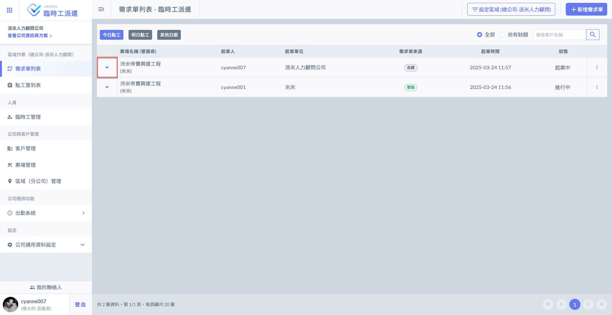 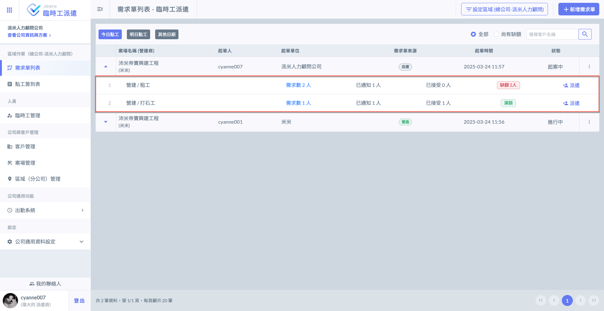

***

## 01｜派遣點工

如左圖紅框圈選處，於欲派遣的工種右側點選「」，即可開啟右圖畫面選擇派遣工(發送工作通知)。

!!! info
    組織人力清單依&#x64DA;**「派遣工管理」**&#x5EFA;立之資料，詳細操作可參閱 **➙** [新增/編輯派遣工](../../lin-shi-gong-guan-li/xin-zeng-bian-ji-lin-shi-gong)

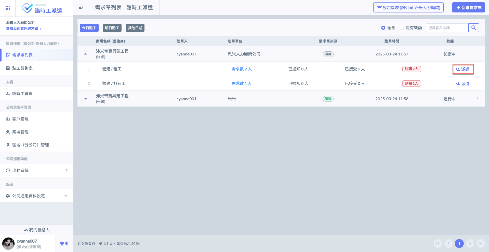 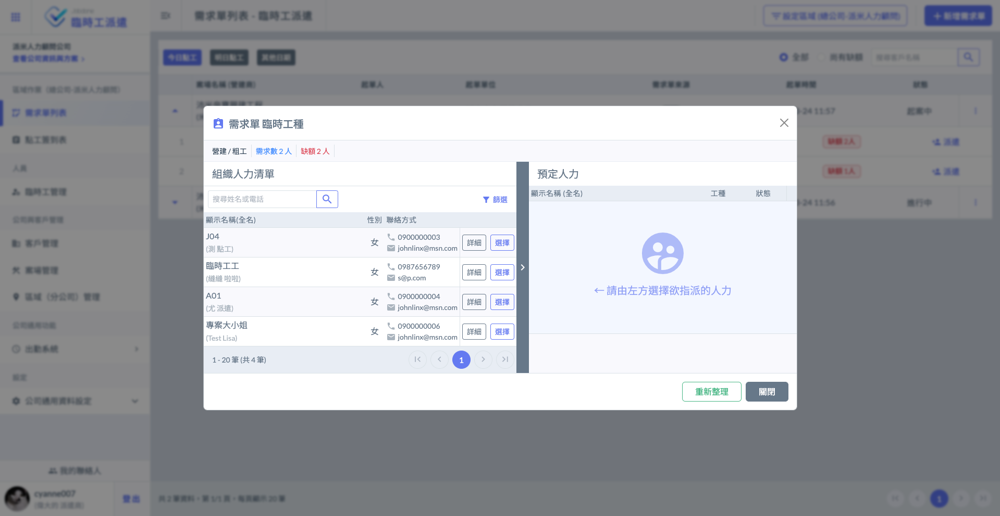



### 查看臨時工資料

如圖一，若欲查看派遣工資料，點&#x9078;**「詳細」**&#x5373;會跳出該工資料(圖二)。

!!! info
    若需查看/編輯更多詳細資料，如：犯罪紀錄、交通工具、訓練及證照、駕駛執照等，請參閱 **➙** [派遣工管理](../../lin-shi-gong-guan-li)

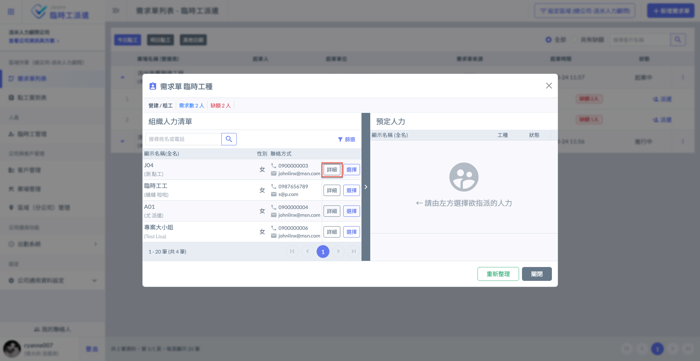 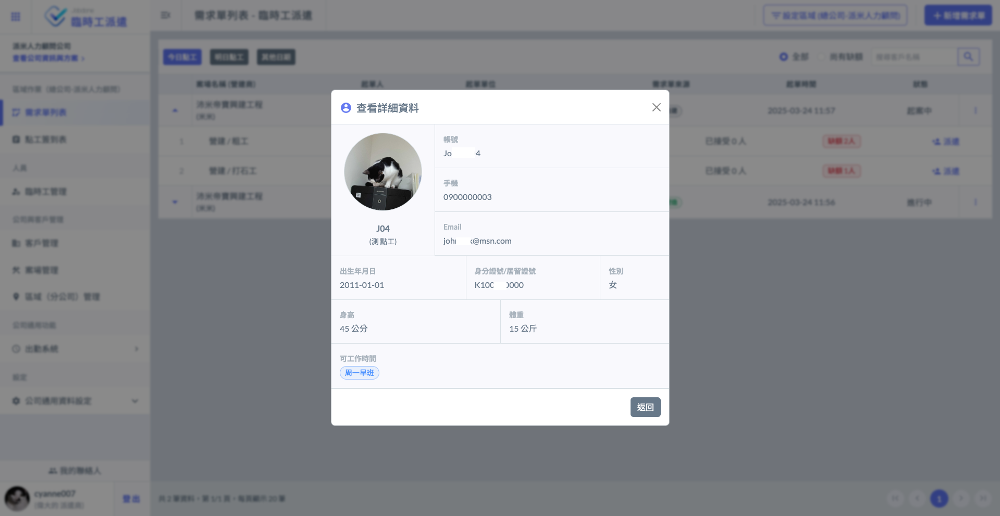




### 選擇臨時工

如圖三，於欲通知之派遣工右方，點&#x9078;**「選擇」**。即跳出(圖四)畫面，可填寫備註及上傳圖片。

確認派遣資訊無誤後，就可按&#x4E0B;**「發送通知」**。

!!! tip
    確定通知內容後發送，該派遣工之手機 APP 會即時收到您的派遣通知。

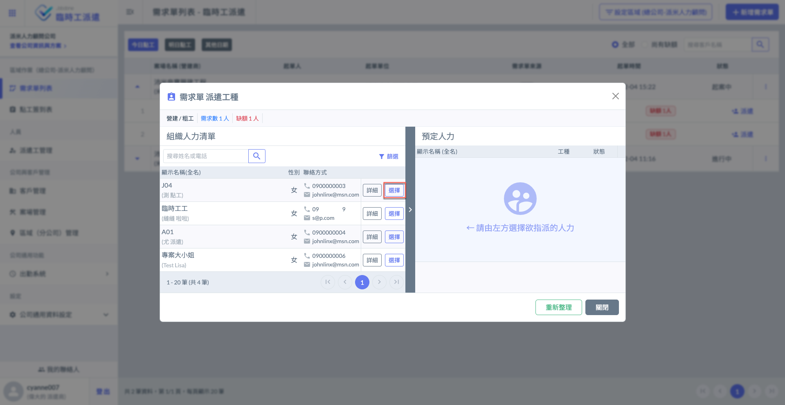 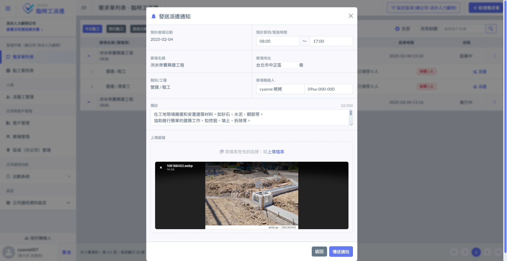

若需通知多位人員，重複上述操作即可。完成畫面如下，被通知人員之狀態會顯示&#x70BA;**「已通知」**。

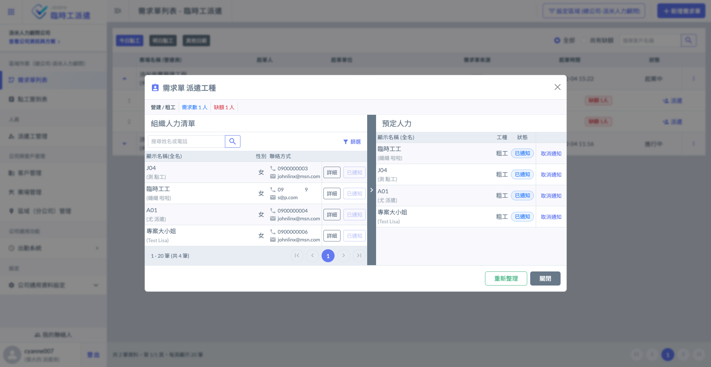



***

## 02｜預定人力狀態說明

系統將預定人員狀態分為四類，分別為：**已通知**、**已接受**、**已拒絕**及**已失效**。



當您已對派遣工發送派遣通知，但派遣工**尚未回復**時，系統將會顯示此狀態。



派遣工**接受**您的派遣通知後，系統將會顯示此狀態。



當您已對派遣工發送派遣通知，派遣工**拒絕**此點工需求，系統將會顯示此狀態。



當您**取消**對派遣工的派遣通知，或派遣工**尚未回復工作但人員已額滿**時，系統將會顯示此狀態。



如下圖範例，該工種需求人數為1人，若在通知派遣的過程中，有人首先接受此任務，則其他尚未回覆的通知將會顯示&#x70BA;**「已失效」**。(即表示該需求單**已額滿**)

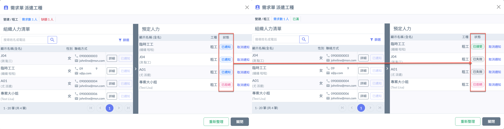

***

## 03｜取消通知

若想重新指派人員或其他操作因素，系統提供取消通知功能。

(即使為已接受之人員，只要其**尚未簽到**都可對其取消通知)。

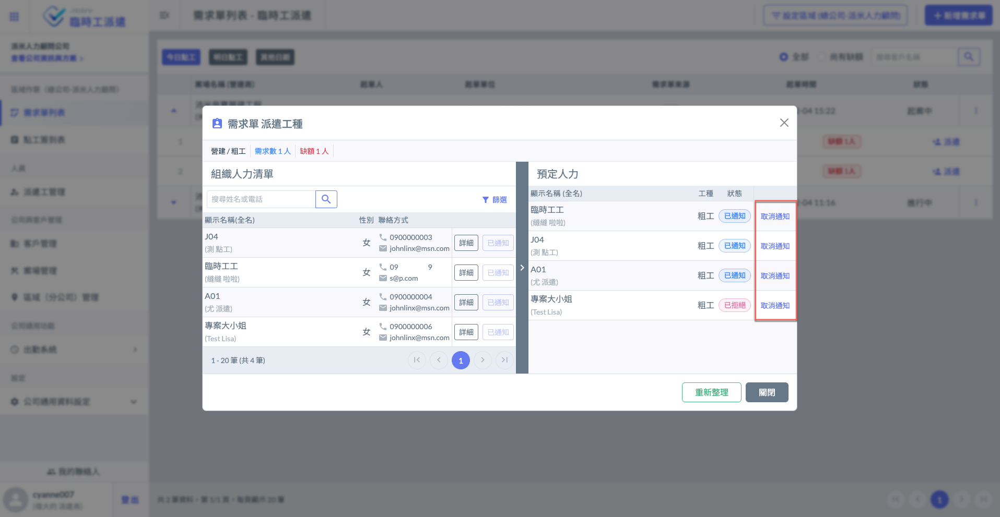
