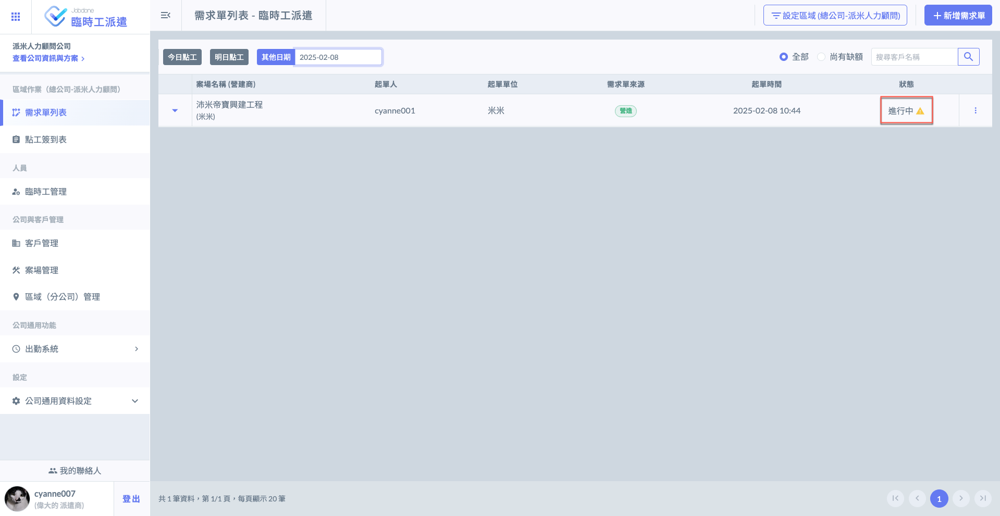
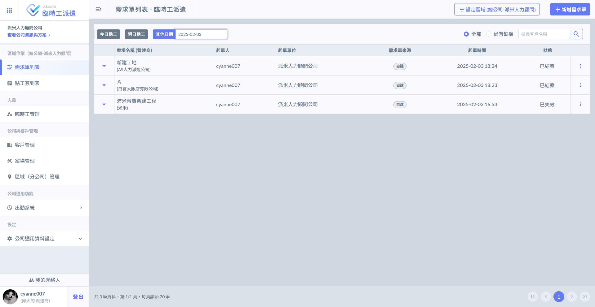

# 需求單狀態說明

系統將需求單狀態分為四類：**起案中**、**進行中**、**已結案**及**已失效**。



縱使已有點工接受派遣通知，該需求單之所有派遣工**皆尚未進行簽到**，即會顯示此狀態。



縱使該單尚有缺額，若該需求單之任一派遣工已進行簽到，即會顯示此狀態。



若該單所有派遣工作皆無缺額，且皆已被派遣商結算(即登記出勤)，則會顯示此狀態。



今日以前且狀態仍為起案中之需求單，則會顯示此狀態。

若該單並未結案，仍為進行中之狀況下，縱使已過期，狀態依然為進行中(但有醒目提示)。



 

