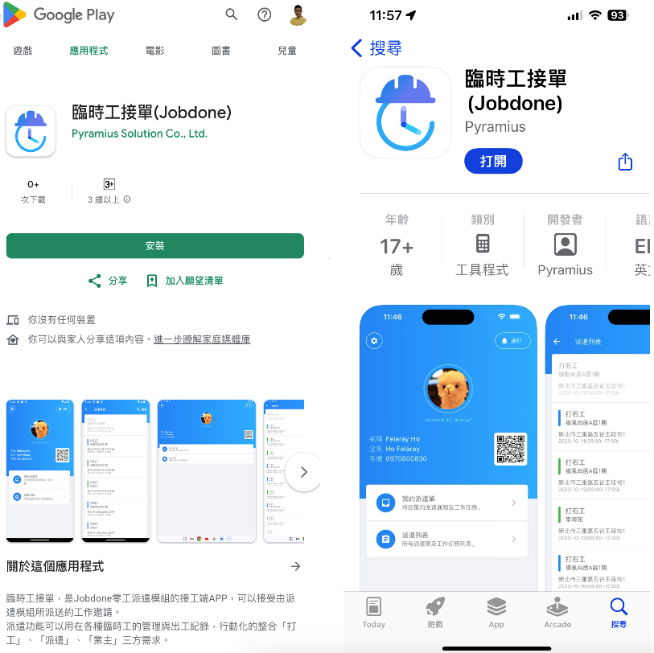
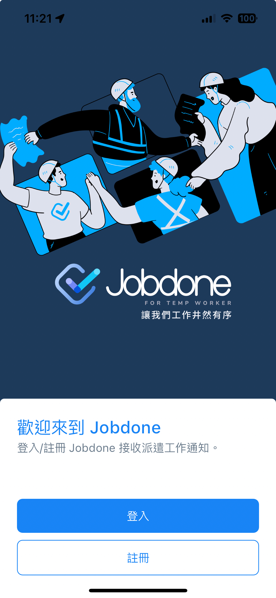
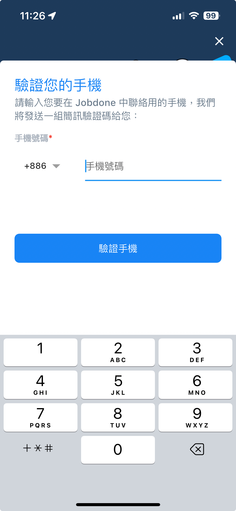
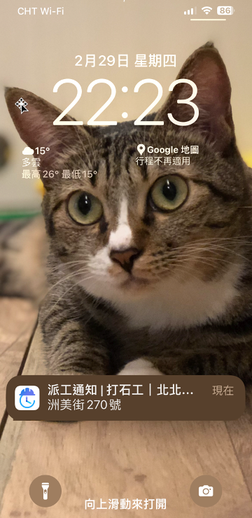
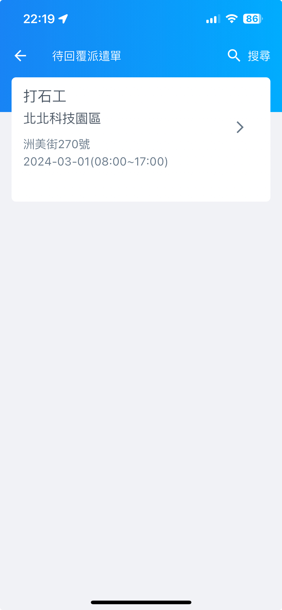
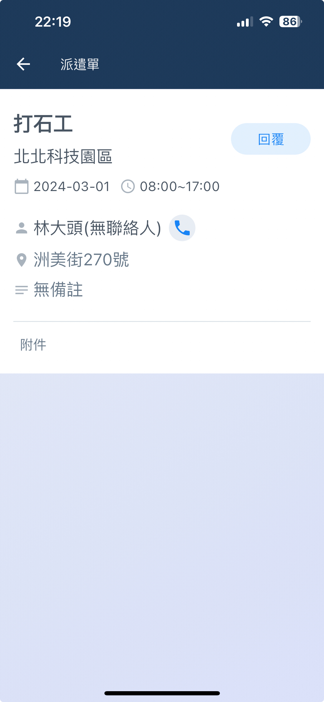
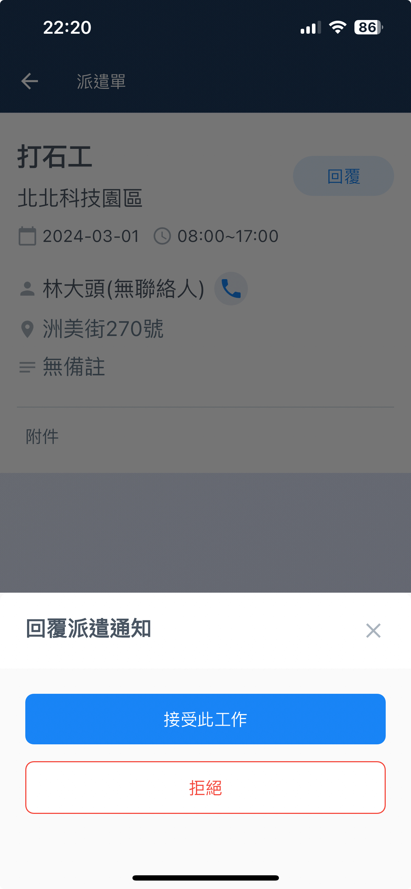

# 臨時工



### 安裝 APP

請您下&#x8F09;**「臨時工接單 (Jobdone)」**&#x41;PP，支援 Android 和 iOS 系統。

可掃描下方 QR code

 




### 註冊

如果您已經擁有帳號，請直接登入。

!!! tip
    每個人只需註冊一個帳號，即可與多家派遣公司進行合作。

填寫您&#x7684;**「帳號 ID」**、**「密碼」**，於閱&#x8B80;**「隱私權聲明」**、**「使用者同意聲明」**、**「服務條款」**&#x540C;意並註冊。

 

輸入您的手機號碼，&#x4E26;**「接收簡訊驗證碼」**。完成驗證後，填寫您的個人資料，即可完成註冊程序。

 




### 登入

登入後，您將看到一個 QR Code，點擊即可放大。

這個 QR Code 是您的個人掃碼檔，可用於快速簽到和簽退（營建商掃碼）。




### 與派遣商聯繫

確保派遣商已透&#x904E;**「派遣工管理」**&#x5C07;您加入至派遣工列表內。

詳情請參閱 **➙** 派遣商 - [派遣工管理](lda/lin-shi-gong-guan-li)



### 接單與回覆

&#x7576;**「派遣商發出派遣通知」**&#x6642;，App會自動通知您有派工通知，請務必保持App的通知功能開啟。

進&#x5165;**「待回覆派遣單」**，即可看到工單內容。

選擇回覆，決定是否要接單。接受或拒絕後，系統即會回覆派遣商。

  



