# 簽到與簽退

## 派遣單資訊說明

以下為派遣單的畫面，請參考下圖資訊說明。(案場名稱、地址、聯絡人、進場日期及簽到/簽退時間)

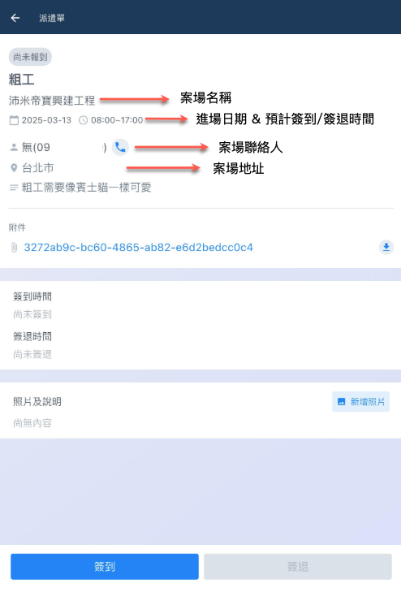

***

## 工作流程說明

點選簽退當您接受派遣通知，並到場執行工作後，即可開始進行簽到/簽退，以及填寫工作紀錄回報。



### 進入預排工作

進行臨時工App主畫面後，點&#x9078;**「預排工作」**，即可看到今日派遣工作 (您已接受的)。

 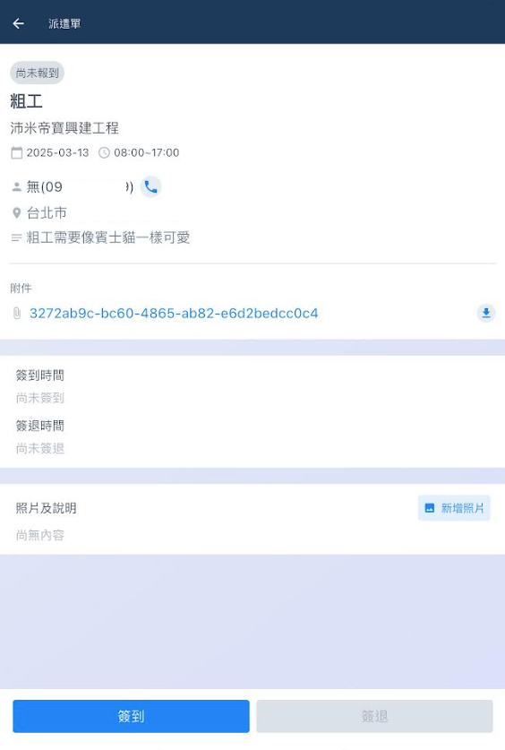




### 簽到

營建方與派遣商都可查看您的簽到紀錄，營建方亦可紀錄點工之簽到時間。

進入派遣單後，您即可於下方點&#x9078;**「簽到」**。系統會自動依當前時間作為簽到時間，您無需選擇時間。如圖三，簽到成功後即可於簽到時間欄位查看。

!!! warning
    請注意，簽到紀錄無法進行二次更動，您只能簽到一次。

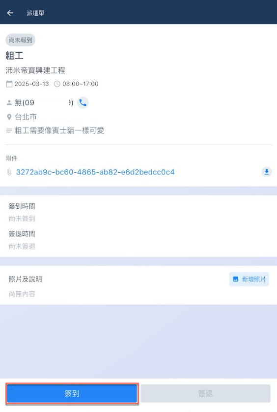  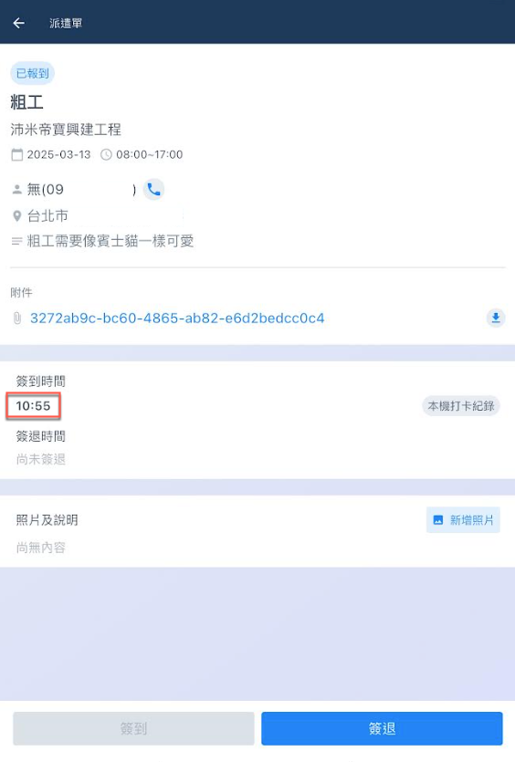

#### 本機打卡紀錄/營建商已更新



表示此筆紀錄為您自行打卡之紀錄。



表示此筆簽到紀錄為營建商填寫之，包含營建商首次為您簽到或是更動簽到時間。



!!! tip
    營建商雖可更動您的簽到時間，但於營建商及派遣商畫面上，仍然可看到您自行打卡之紀錄。

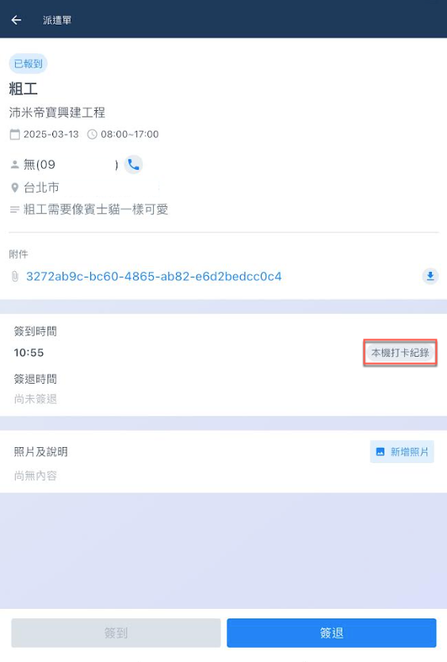 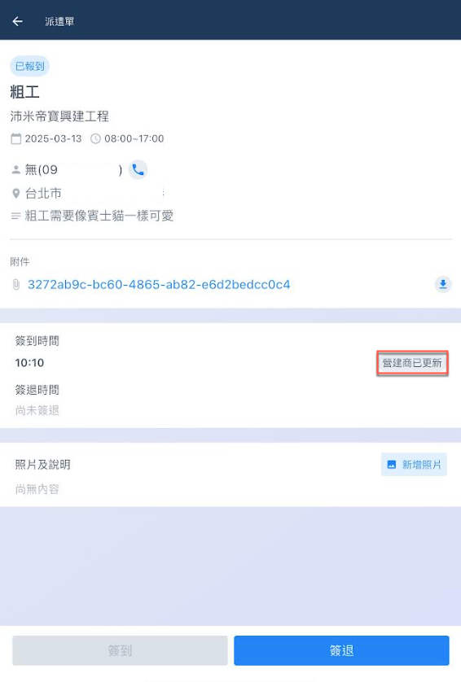




### 回報工作狀況

您可拍攝現場狀況、工作內容等等，派遣商即可查看您的工作回報。

於照片及說明欄位右側點&#x9078;**「新增照片」**，即可開始上傳照片並為其填寫相關說明。

如圖三，上傳成功後，點擊照片即可放大，點&#x64CA;**「****」**&#x5373;可刪除該照片。

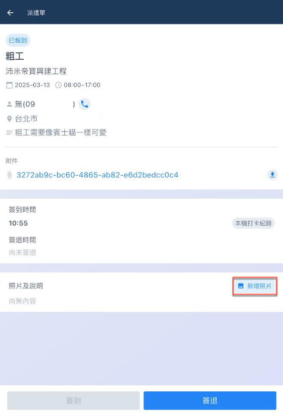 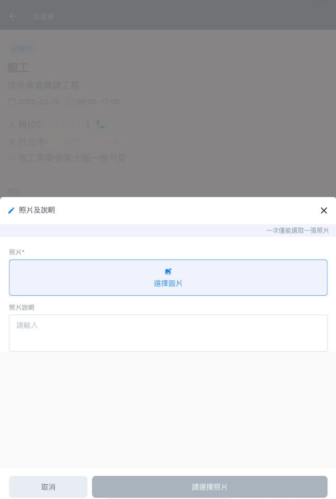 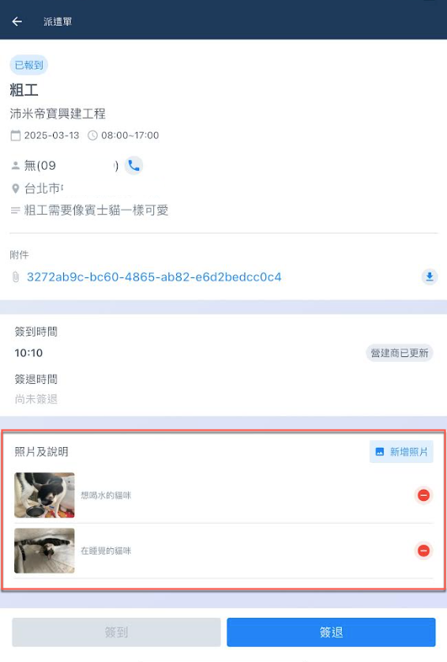




### 簽退

營建方與派遣商都可查看您的簽退紀錄，營建方亦可紀錄點工之簽退時間。

進入派遣單後，您即可於下方點&#x9078;**「簽退」**。系統會自動依當前時間作為簽到時間，您無需選擇時間。如圖三，簽退成功後即可於簽退時間欄位查看。

!!! warning
    請注意，您可進行多次簽退，每一次簽退都會覆蓋上一次的簽退時間，務必謹慎操作。
    
    且一但營建商已確認您的出勤紀錄，或更動您的紀錄。您將無法再進行任何操作。（除編輯工作回報)

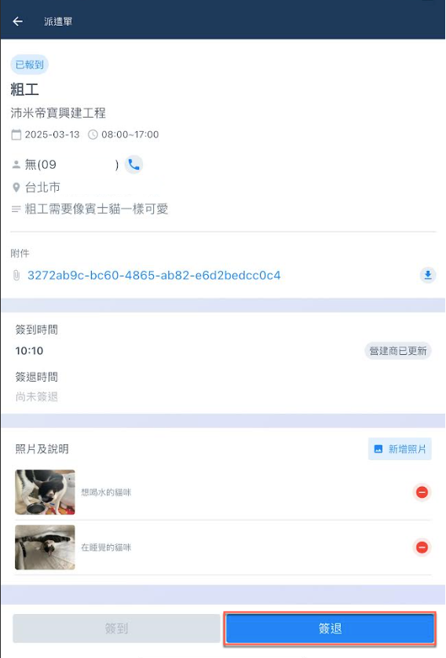  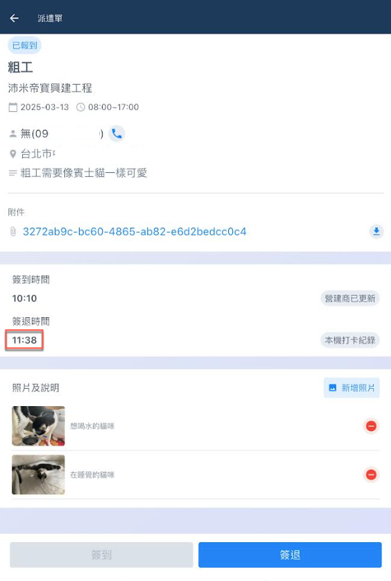



