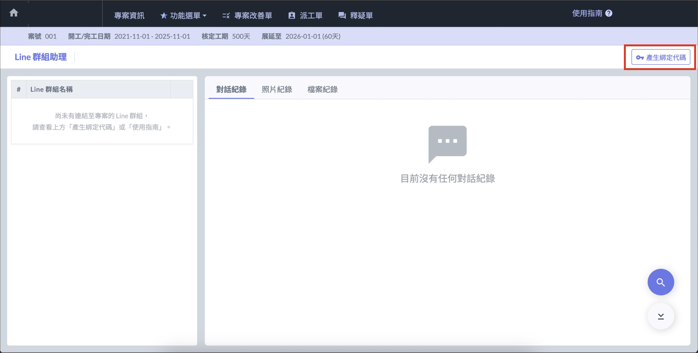
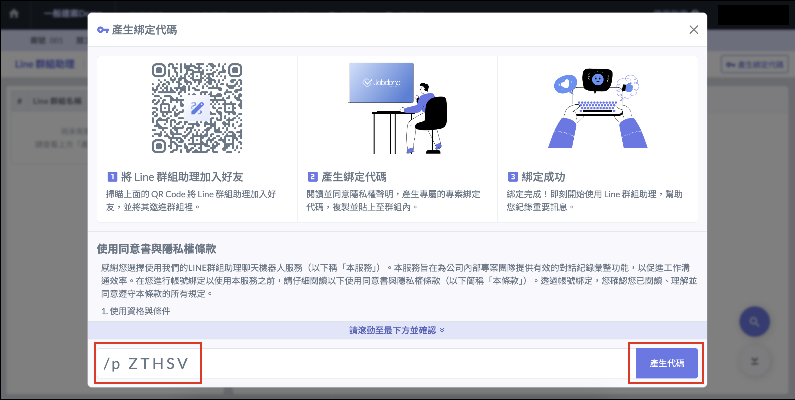
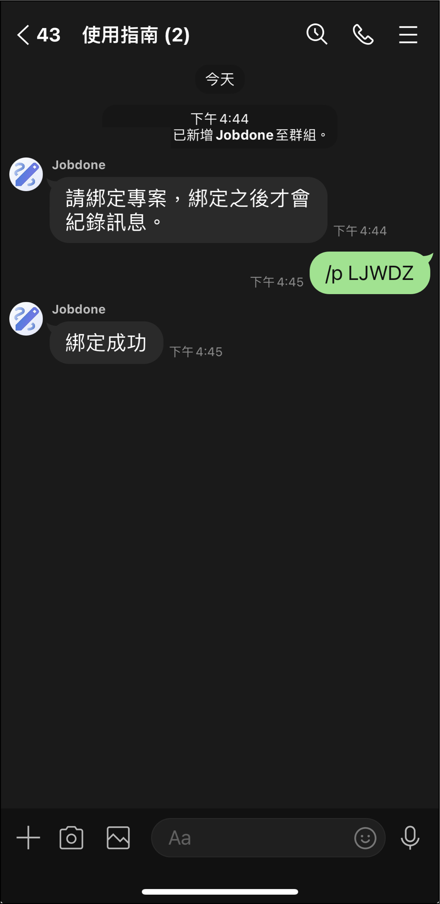

# LINE 群組助理

LINE 群組助理能將專案與 LINE 群組的紀錄進行連結，自動將群組內的聊天記錄保存，並可以在專案下隨時查看或尋找訊息。

!!! info
    一個專案只能連結一個 LINE 群組。

## 綁定LINE 群組助理

進入想要綁定的專案，點選 「 LINE 群組助理 」 ，選擇右上角 「 產生綁定代碼 」，並依指示步驟完成前置作業後，複製代碼貼至群組內即可綁定成功。

## 終止紀錄

如果要停止紀錄群組，請直接將 LINE 群組助理移出群組即可。

!!! info
    若群組中有一方公司已經不再參與專案，請將聊天機器人先退出群組。若其它公司需要繼續紀錄，請再次進行綁定。

