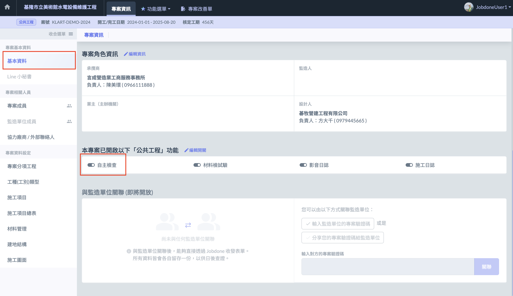
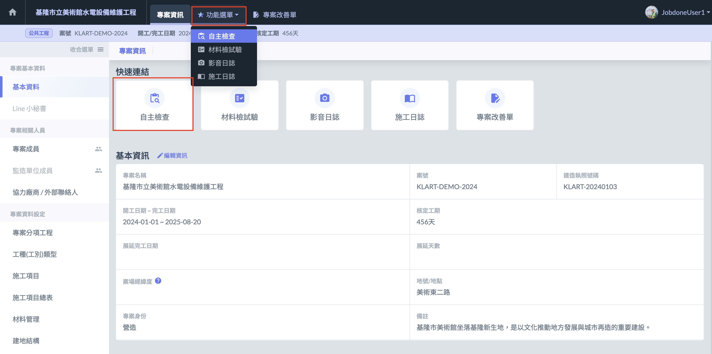

# 檢查表

自主/自動檢查表。

專案內的自主檢查包含「[設定專案檢查範本](qc/template)」、「[執行自主檢查工作](qc/implement-web)」及「[審核自主檢查表](qc/self-check-review-n-sign-web)」三個主要步驟。

***

!!! info
    使用檢查表功能時，您可能會使用到**協力廠商**、**施工圖面**、**建地結構**等功能。

### 啟用 「 自主檢查 」

由專案管理員，於專案下的基本資料中啟用「自主檢查」功能，如下圖：

開啟此功能後，方可透過功能選單或快速連結進入自主檢查頁面。

