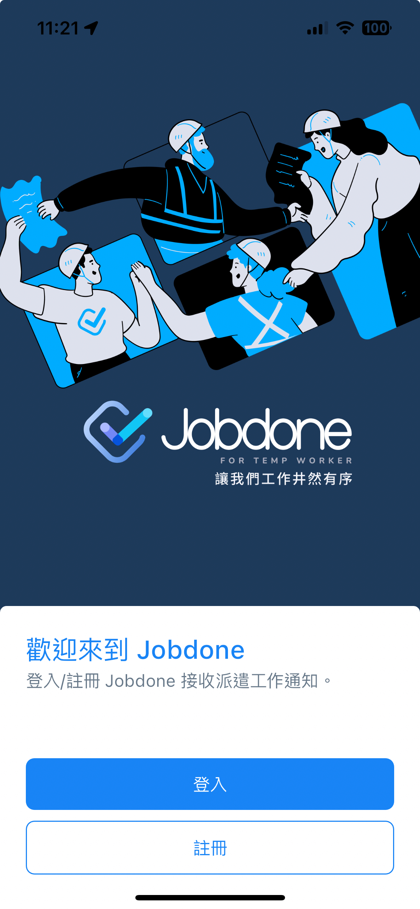
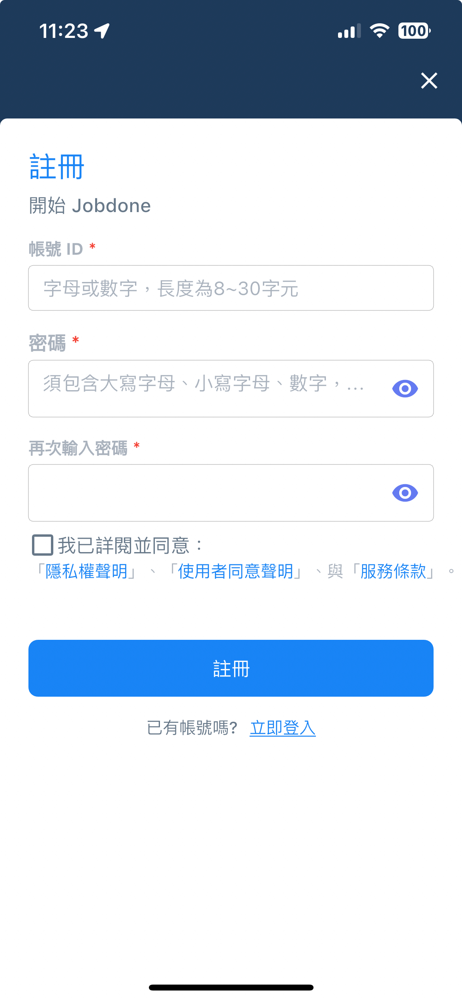
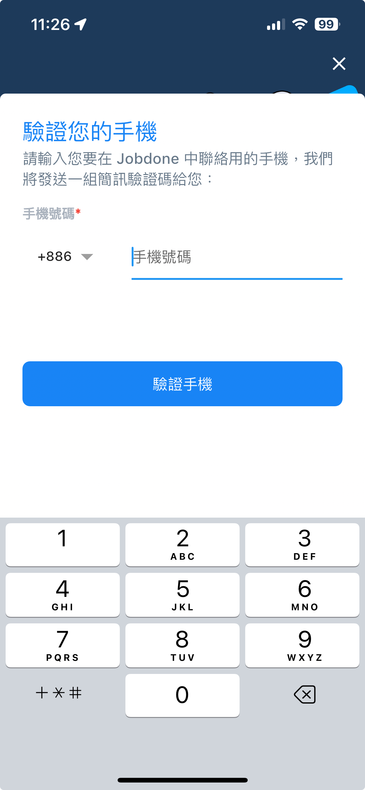
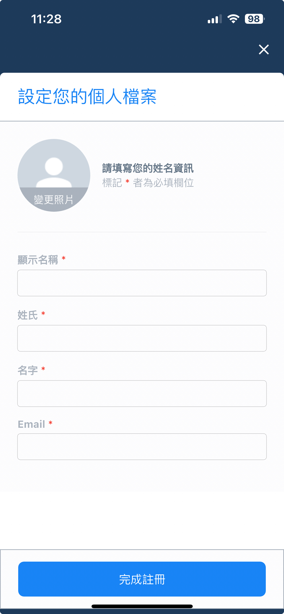
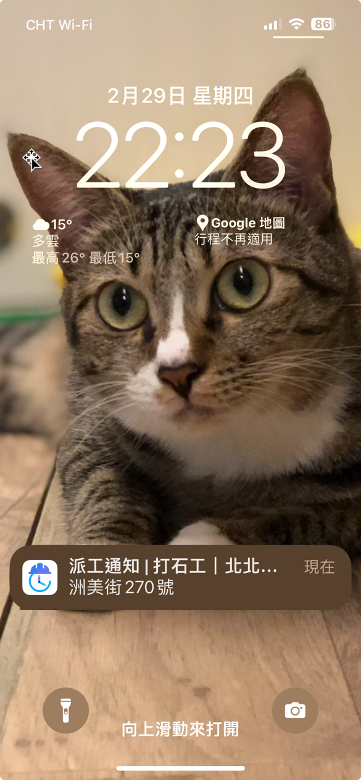
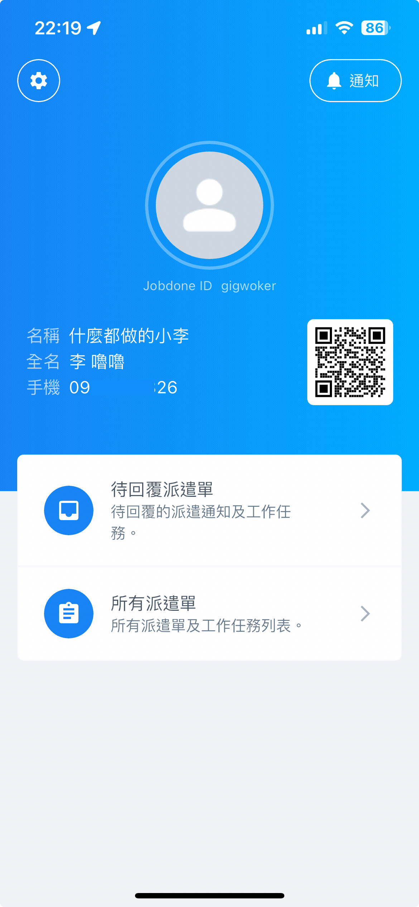
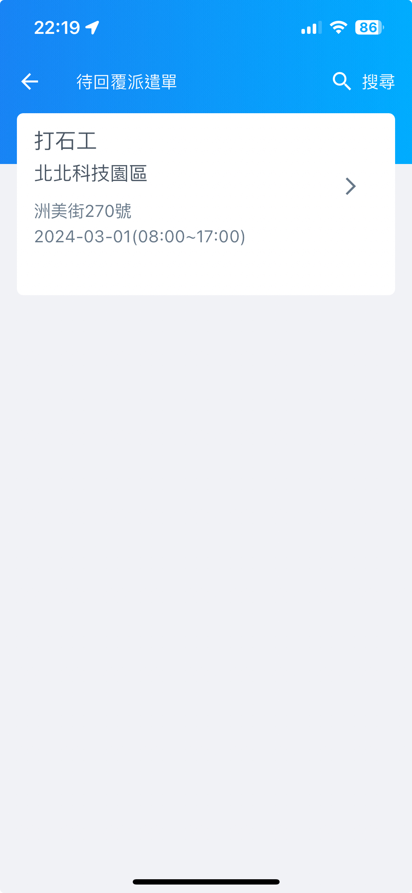
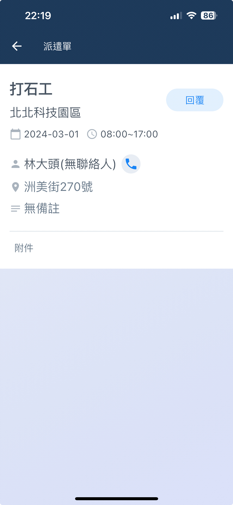
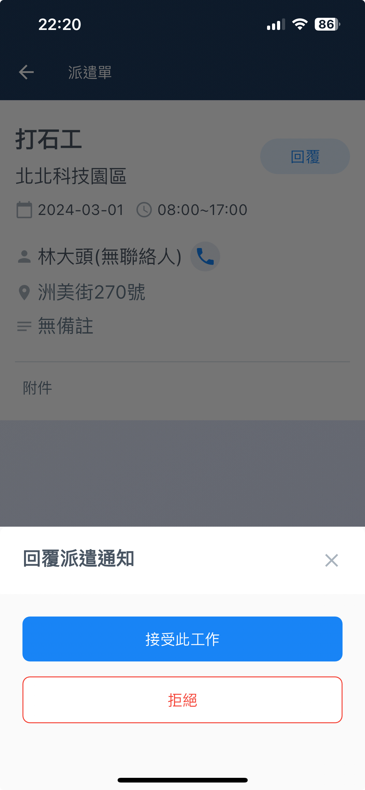

# 被派遣人員APP

## 安裝

請派遣工下載Android或iOS的APP。可直接掃描QR Code或至「Google Play」、「App Store」搜尋 【臨時工接單(Jobdone)】。

 

## 註冊

每個人只需要註冊一個帳號，即可與多家仲介公司合作。若已經有帳號，直接登入不需要再註冊。

1. 若沒有註冊過，請點選註冊。簡單設定 「帳號ID」、「密碼」。閱讀 「隱私權聲明」、「使用者同意聲明」、「服務條款」後勾選 【同意】。

 

2. 請輸入手機號碼，並收取簡訊驗證碼。完成驗證後，填入您的個人基本資料，即可完成註冊程序。

 

3. 登入後，會在中間看到一個QR Code，點擊可以放大。該QR Code就是個人的掃碼檔，可用在快速簽到、簽退。

## 接單與回覆

裝好APP並且註冊完成後，只要等著派遣工作上門。當派遣商發出派遣通知時，手機APP會自動發出訊息，請務必保持APP的通知功能開啟。

 

**進入待回覆的派遣單，可以看到工單內容。**

 

**選擇回覆，決定是否要接單。**

**接受或拒絕後，系統即會回覆派遣商。**

