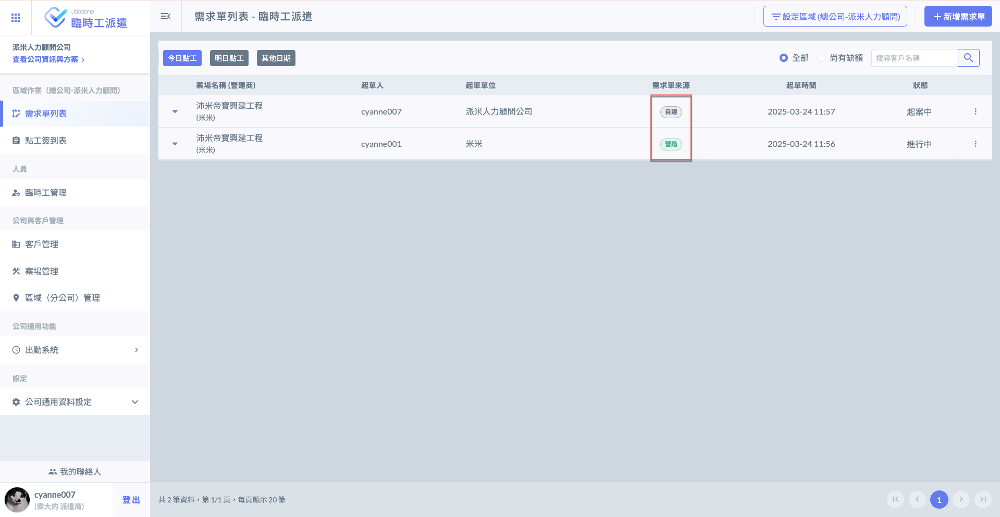

# 需求單列表

---
description: Requisition List
---

# 需求單列表

需求單是指客戶在某一案場（工地）提出的，針對特定日期所需工種和人數的請求。所有的派遣安排必須根據客戶的具體需求和人數要求進行。

**需求單來源有二：**

1. 當派遣商從工地接到來自各種渠道（如LINE、電話、電子郵件等非系統方式）的需求通知後，為客戶新增相應的需求單。
2. 客戶案場的管理人員可通過「點工」功能自行創建「需求單」，並且該需求單會自動同步到使用Jobdone系統之派遣商負責的區域內。

***

如上所述，下圖演示需求單來源，包括<kbd>**營建商申請**</kbd>與<kbd>**派遣商自建**</kbd>：

相關說明可參閱 **➙** [使用簡介與通用流程](../user-guide-and-general-workflow)  (實務流程簡介)

