# 需求單

---
description: Requisition Form
---

# 需求單

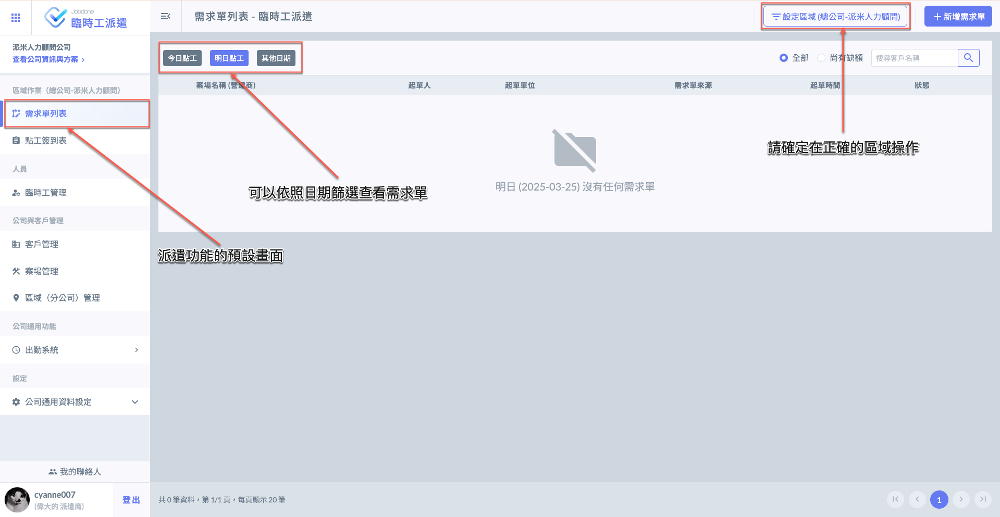

***

## 01｜新增需求單



### 設定公司區域

您可依據不同工種需求及地點，選擇適切之區域 (分公司)，妥善管理派遣需求與回報。

!!! warning
    務必確認選用之公司已有對應之案場資料，才能於該區域新建需求單。

進入需求單列表頁面後，如圖一紅框圈選處，點選右上角&#x4E4B;**「設定區域」**&#x5373;可開始選擇分公司。

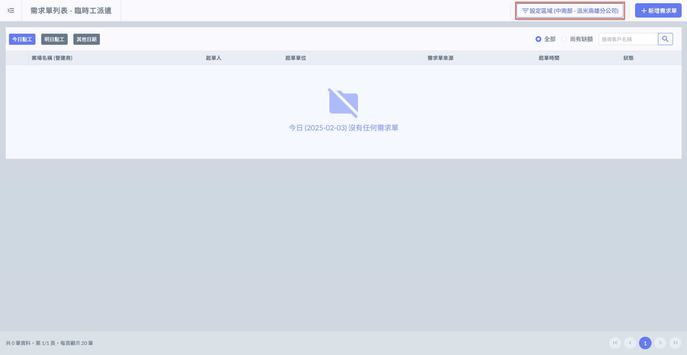

點選圖二紅框圈選處，即可開啟選單選取公司區域(圖三)。

!!! tip
    選擇分公司。您可查看該區域所有派遣紀錄，以及於該區域管理其下之派遣需求。

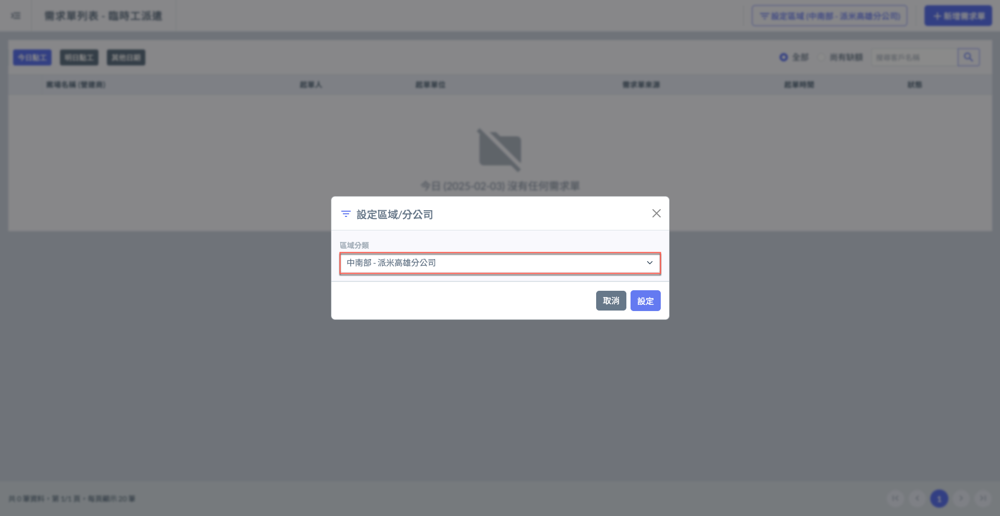 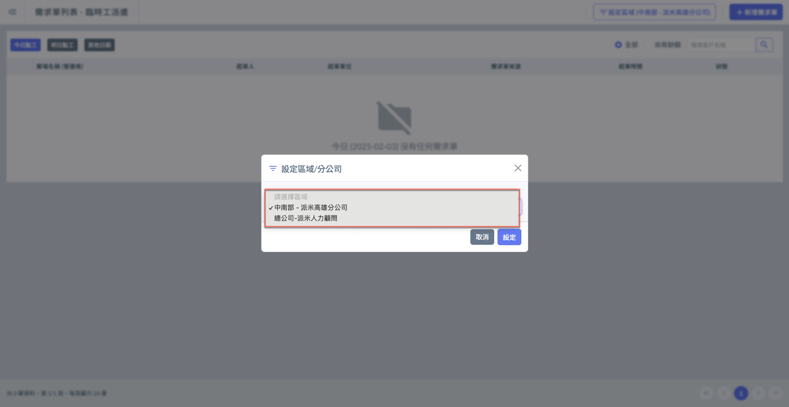




### 新增需求單

進入需求單列表頁面後，如圖一紅框圈選處，點選右上角&#x4E4B;**「＋新增需求單」**&#x5373;可填寫需求資料。

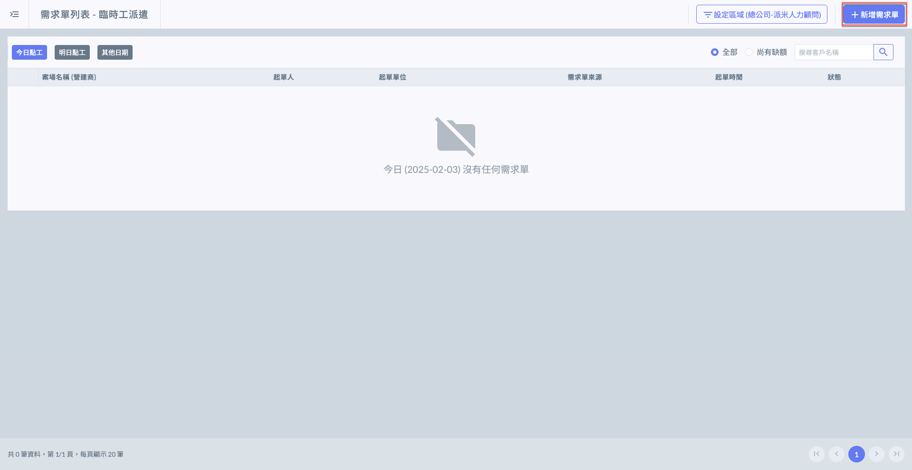 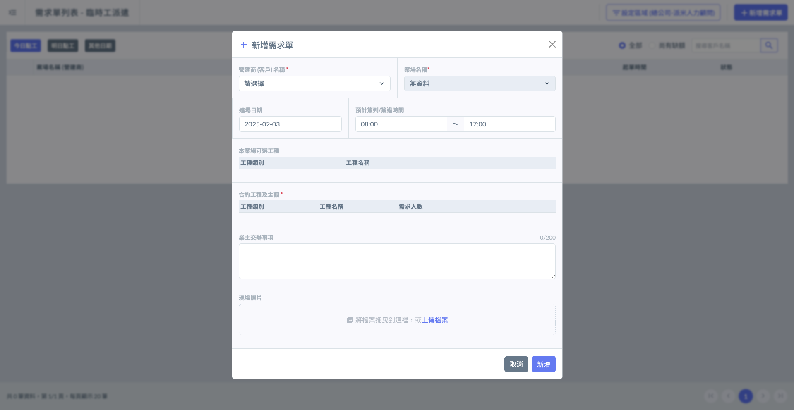

如下圖，您需要**選擇客戶**及其**相關案場** (各案場有其可選工種)，並選擇**所需工種**及**需求人數**。

將資料填寫完畢並確認無誤後，點&#x9078;**「新增」**&#x5373;可保留此筆資料，完成畫面如圖四。

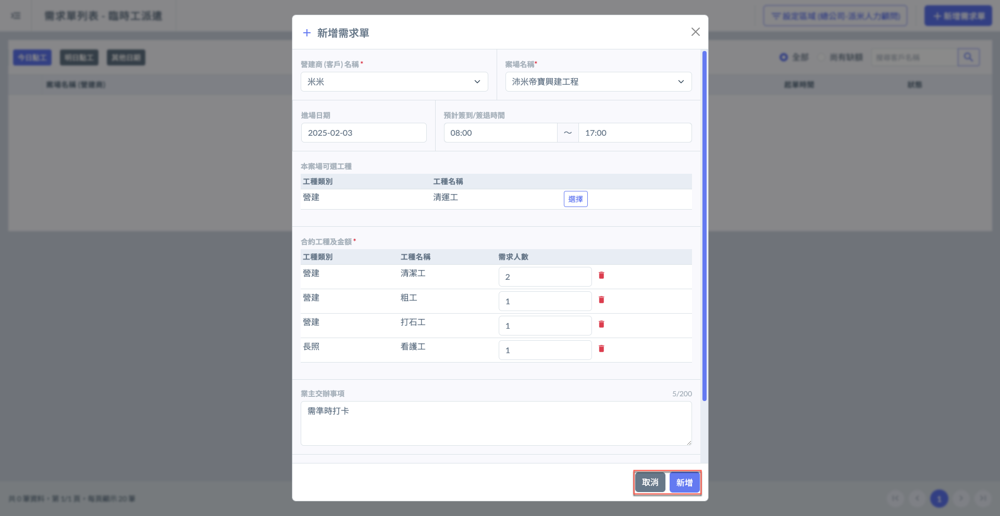 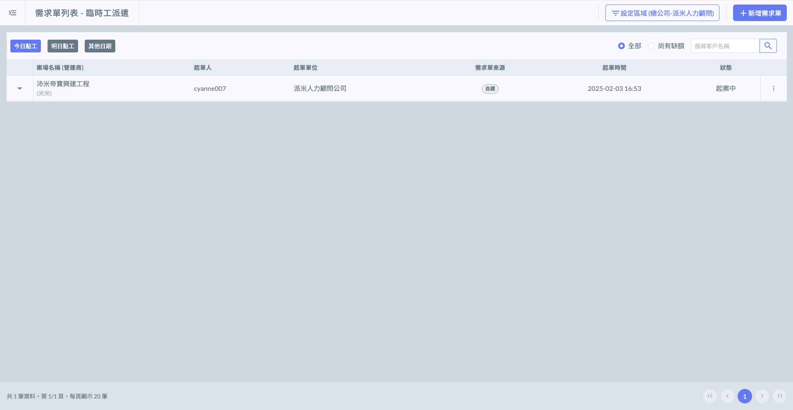




***

## 02｜編輯需求單

進入需求單列表頁面後，於欲編輯之需求單右側，點&#x9078;**「⋮」**&#x4E4B;**「檢視需求單」**，即可修改需求單資料

(僅能修改**預計簽到/簽退時間**、**工種選擇**及**需求人數**、**業主交辦事項**。)

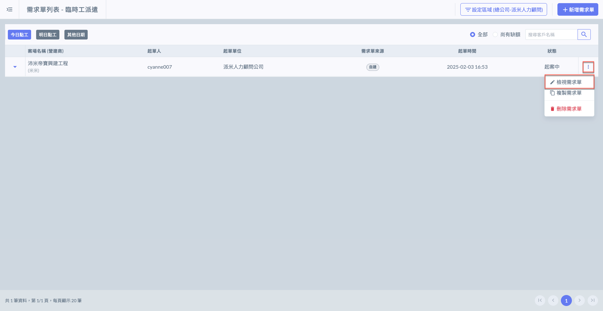 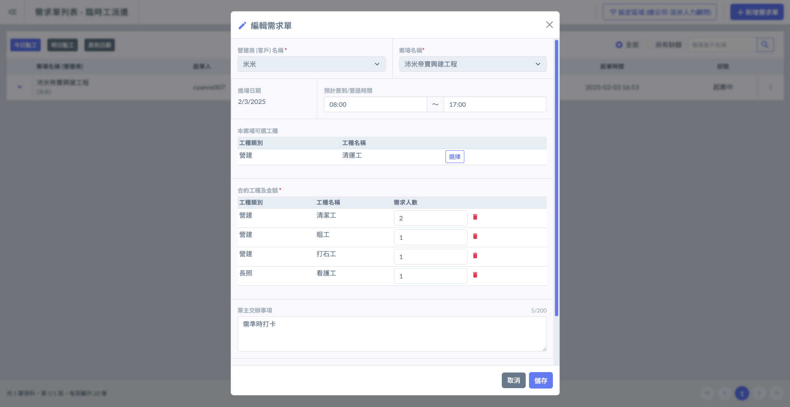

***

## 03｜複製需求單

於欲複製之需求單右側，點&#x9078;**「⋮」**&#x4E4B;**「複製需求單」**，即可複製該筆需求單至特定日期(右圖)。

點選右圖紅框圈選處，即可選擇特定日期，將此需求單複製於該日期。

!!! warning
    由於已過期之需求單即無法操作，因此複製日期僅能為**當天**及**未來**之日期。
    
    若需求單有上傳照片，複製時將不會連同照片一併複製，需另行上傳！

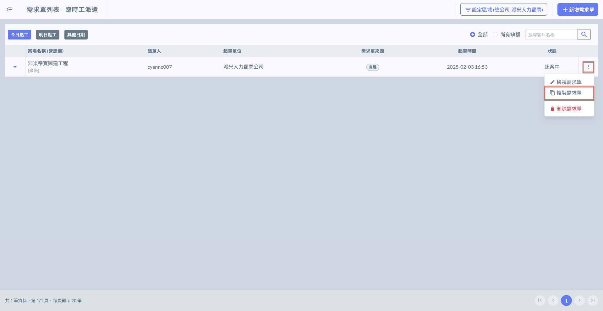 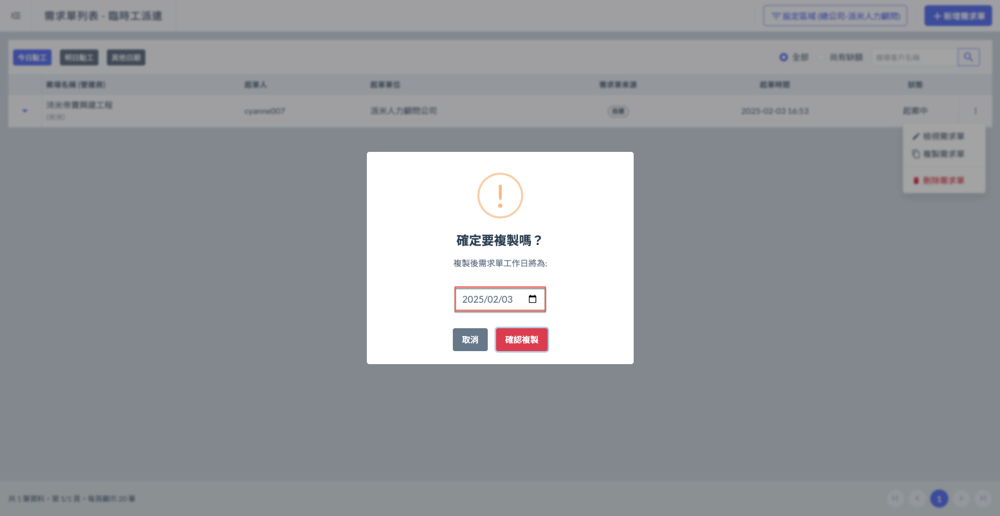

***

## 04｜刪除需求單

進入需求單列表頁面後，於欲刪除之需求單右側，點&#x9078;**「⋮」**&#x4E4B;**「刪除需求單」**，即可刪除該筆需求單。

!!! warning
    僅狀態處&#x65BC;**「起案中」**&#x4E4B;需求單可被刪除。
    
    詳細狀態說明可參考 **➙** [需求單狀態說明](requisition-form/xu-qiu-dan-zhuang-tai-shuo-ming)

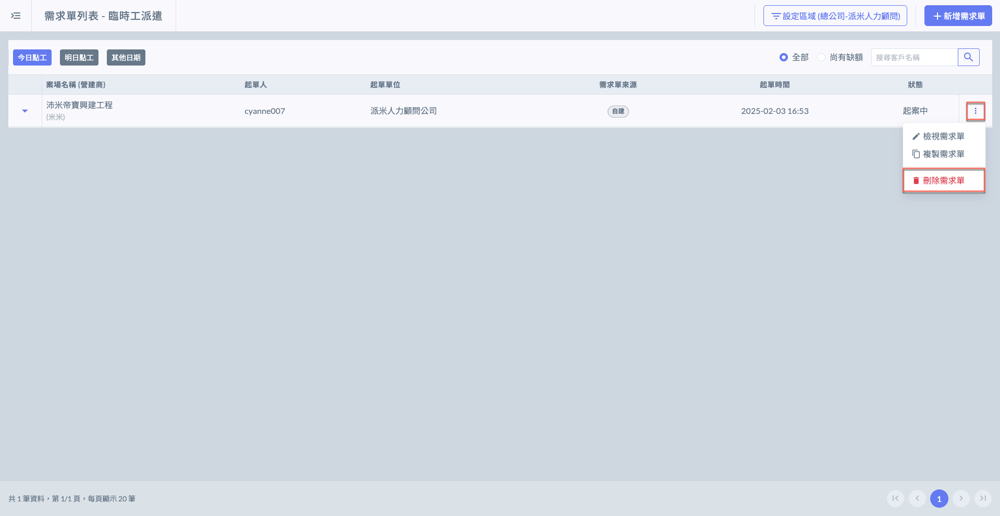 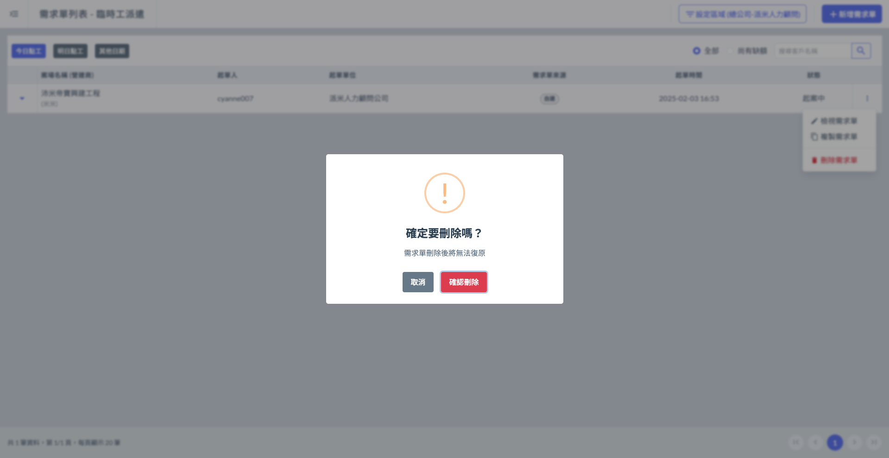

***

## 05｜查看需求單

系統將<kbd>**今日點工**</kbd>模式設為預設畫面，您還可藉由下圖圈選處查看各日期之需求單。

如右圖，選擇<kbd>**其他日期**</kbd> 模式即可自行選擇欲查看的日期。

!!! tip
    當您查看<kbd>**其他日期**</kbd>時，系統僅顯示有需求單的日期。

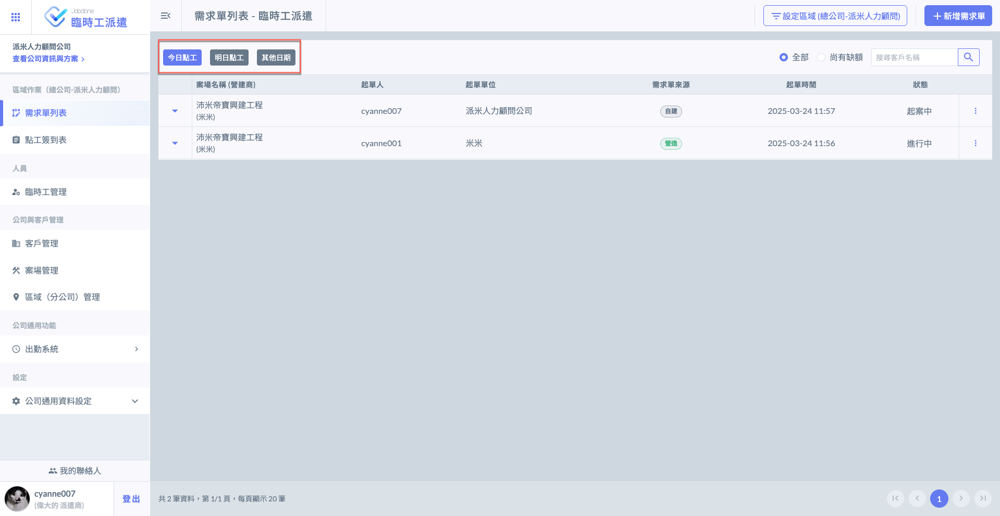 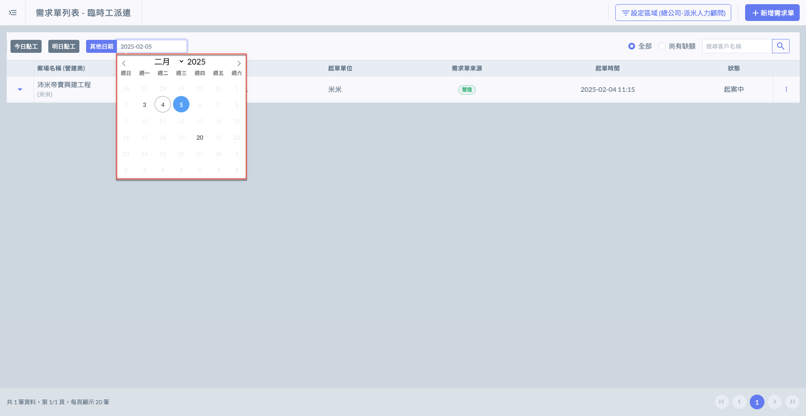

