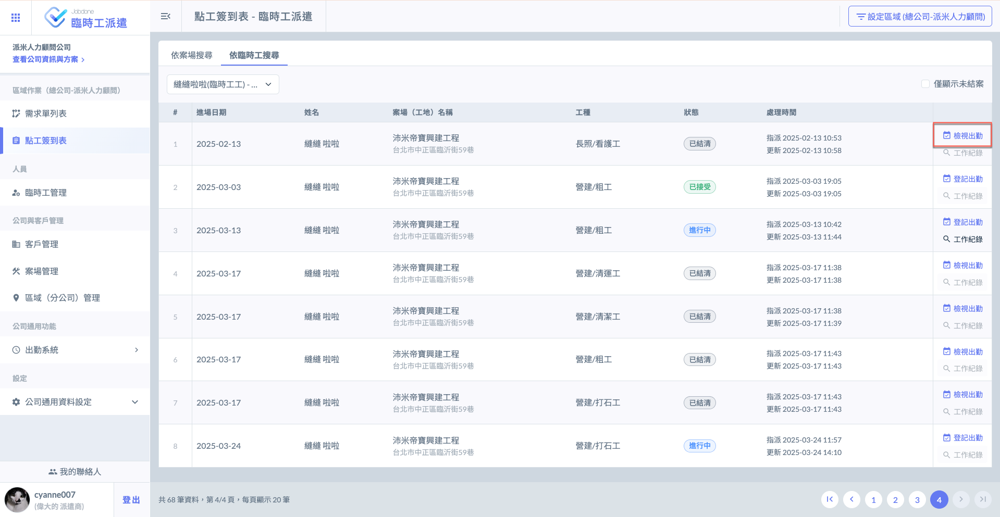
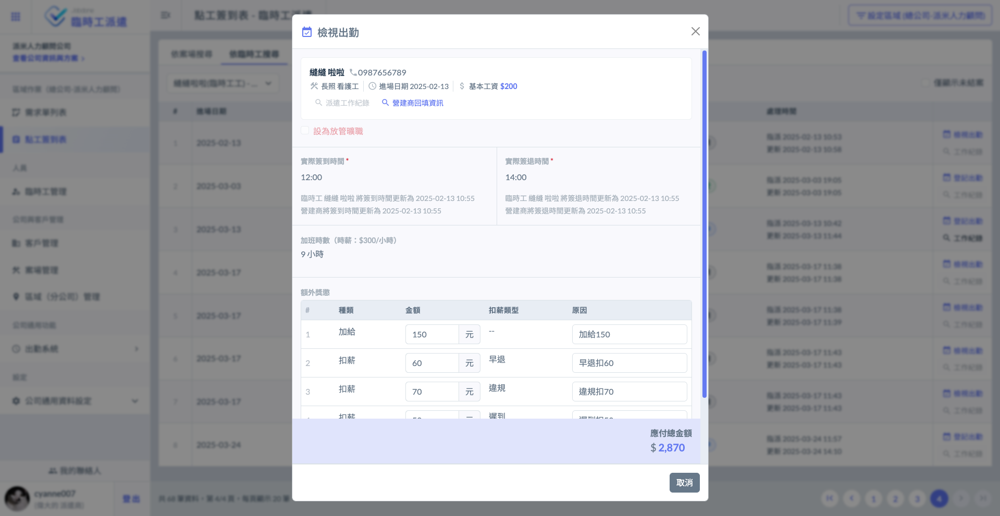
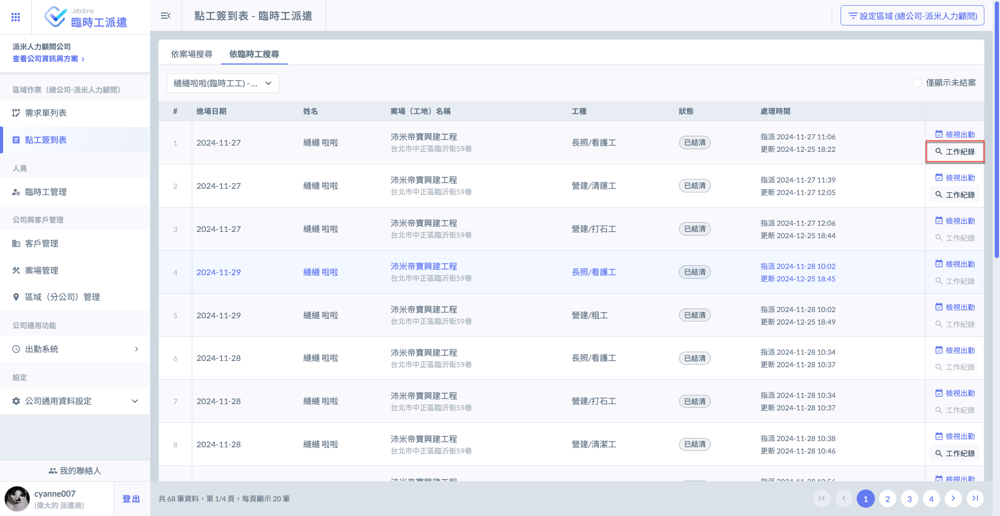
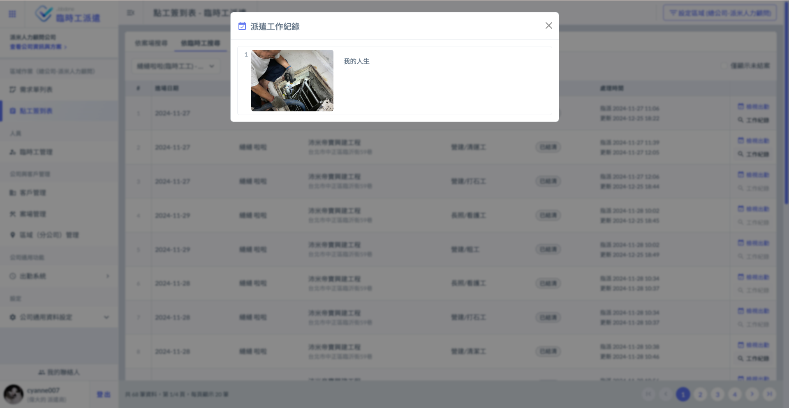

# 檢視出勤

---
description: View Attendance
---

# 檢視出勤

## 01｜檢視出勤

僅已結清/派遣商確認放管的工單，才會顯示<kbd><mark style="color:blue;">**檢視出勤**<mark style="color:blue;"></kbd>按鈕。在案件尚未結案之前，皆為<kbd><mark style="color:blue;">**登記出勤**<mark style="color:blue;"></kbd>。

(檢視出勤即為檢視先前已結案之工單資料)

 

***

## 02｜查看工作紀錄

若臨時工有自行填寫**工作照片及說明**，派遣商即可查看其工作紀錄。

如下圖所示，點&#x9078;**「工作紀錄」**&#x5373;可查看臨時工之工作紀錄。

!!! tip
    於**檢視出勤**及**登記出勤**時，亦可查看臨時工之工作紀錄。

 

