# 登記出勤 / 結算

---
description: Attendance Registration / Settlement
---

# 登記出勤 / 結算

## 01｜狀態說明 (未結算)

未結案前，個別點工的狀態可分為三種：**已接受**、**進行中**及**出勤已確認**。



臨時工已回復且接受派遣通知，但尚未進行簽到。



若臨時工已自行簽到/營建商為其簽到，皆會顯示為進行中。



若營建商針已審核臨時工打卡結果 (按下出勤確認)，便會顯示此狀態。



!!! warning
    出勤已確認亦可表示：簽退時間由臨時工自行打卡，營建商並未修改其簽退時間，且派遣商並未填寫**加班時數**、**額外獎懲**及**備註訊息**等。
    
    若該工簽退時間**由營建商輸入**/**營建商修改**臨時工輸入之簽退時間，將依仍顯示為**進行中**。

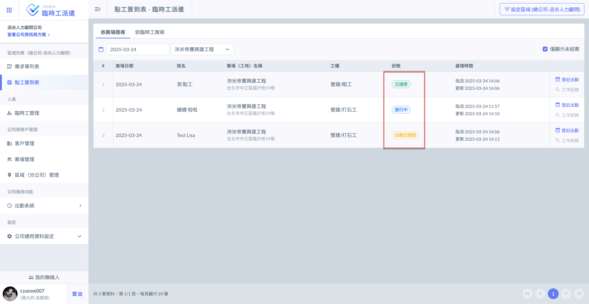

### 01 - 1｜細部狀態說明

如下圖紅框圈選處，於各工單右側點&#x9078;**「登記出勤」**，即可查看該臨時工簽到/簽退紀錄。

以下將演示三個範例 (示例一、示例二及示例三）。

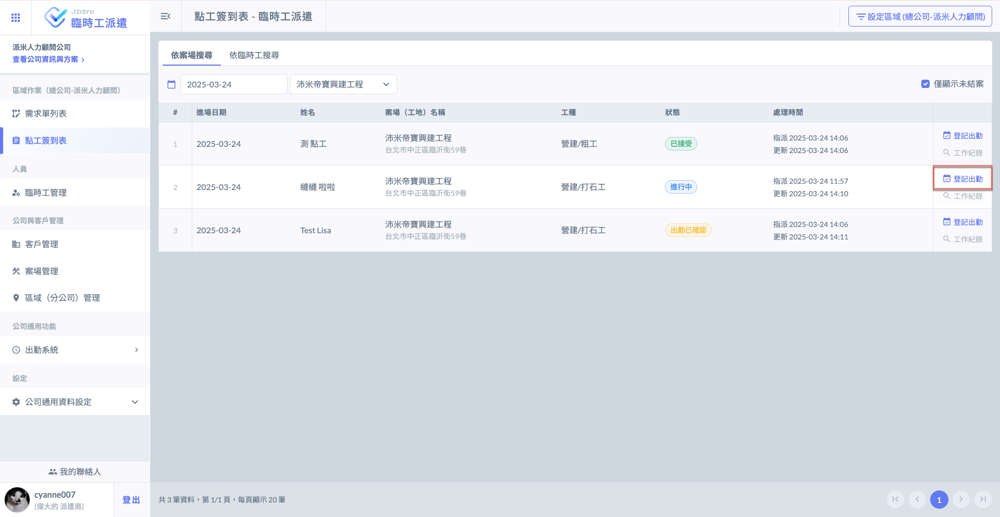

***

#### 示例ㄧ

見下圖，您可於此查看簽到及簽退時間，分別經過哪些人員輸入。



您可在下方看到「營建商將簽到時間更新為...」，表示該簽到時間**由營建商輸入**，派遣工**並未**自行簽到。



您可在下方看到「派遣工將簽到時間更新為...」，表示該簽到時間**由派遣工輸入**，且營建商後續**並無**更動。



亦有上方圖示供您判斷，如簽退時間上方顯示：<kbd><mark style="background-color:blue;">**派遣工打卡記錄**<mark style="background-color:blue;"></kbd>及<kbd><mark style="color:green;background-color:green;">**營建商已確認**<mark style="color:green;background-color:green;"></kbd> ，但下方並未顯&#x793A;**「營建商將簽退時間更新為...」**，表示營建商已確認過派遣工打工時間，且沒有再進行更動。

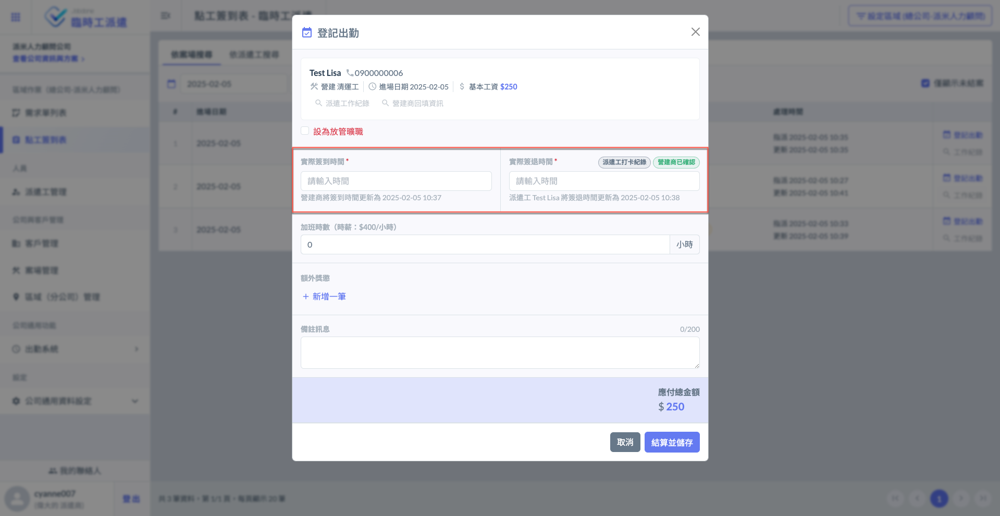

***

#### 示例二

此情形與示例一之情形略有差異。

您可看到於簽到、簽退時間下，都有標註：「派遣工將簽到/簽退時間更新為...」 及 「營建商將簽到/簽退時間更新為...」。



此情況說明派遣工已自行進行第一次簽到，但營建商**再次更動**其簽到時間。



表示派遣工已自行完成簽退，但營建商**再次更動**其簽退時間。



因此，若營建商並非只確認派遣工打工時間，而是有再對其簽退時間做更動，您會看到僅有<kbd><mark style="color:green;background-color:green;">**營建商已確認**<mark style="color:green;background-color:green;"></kbd>標示，並無示例一之<kbd><mark style="background-color:blue;">**派遣工打卡記錄**<mark style="background-color:blue;"></kbd> 標示。

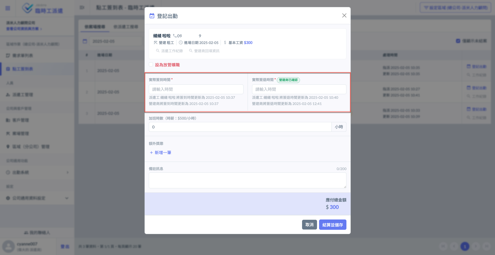

***

#### **示例三**



您只看到「派遣工將簽到時間更新為...」，表示營建商**並未**進行簽到。

因此與示例一及示例二皆不同，您可看到<kbd><mark style="background-color:blue;">**派遣工打卡記錄**<mark style="background-color:blue;"></kbd>標示。



您只看到「派遣工將簽退時間更新為...」，表示僅派遣工自行輸入簽退時間。

與示例一及示例二皆不同，僅有<kbd><mark style="background-color:blue;">**派遣工打卡記錄**<mark style="background-color:blue;"></kbd> 之標示，且無<kbd><mark style="color:green;background-color:green;">**營建商已確認**<mark style="color:green;background-color:green;"></kbd> 標示，表示營建商**尚未確認**該派遣工簽到及簽退時間。



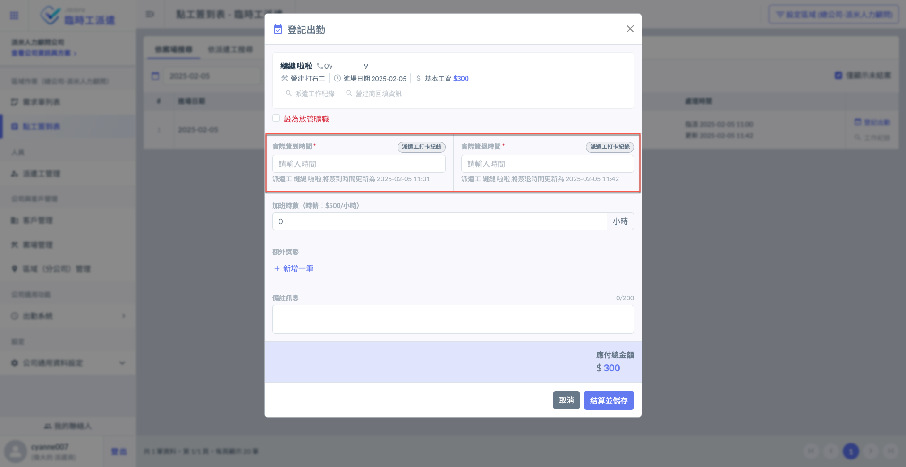

***

## 02｜登記出勤 / 結算

### 02 - 1｜畫面說明

點&#x9078;**「登記出勤」**&#x5F8C;，即會進入以下畫面，您可開始填寫該派遣工實際簽到、簽退時間，並結算工資。

!!! warning
    由於派遣商主要負責最終結算發薪，因此針對派遣工結算，多以派遣商輸入之資料為最終結算依據。以下說明各欄位結算依據。



系統將顯示是否有派遣工及營建商的簽到紀錄，但結算時間將以派遣商填寫的時間為準。



系統將顯示是否有派遣工及營建商的簽退紀錄，但結算時間將以派遣商填寫的時間為準。



若營建商已填寫加班時數，派遣商將**無法**更動；若營建商尚未填寫加班時數，則派遣商可填寫。



若營建商**有給予**額外獎懲，派遣商可&#x65BC;**「營建商回報資訊」**&#x4E2D;參考，但仍以派遣商自行填寫並作為結算依據；若營建商**未給予**額外獎懲，則由派遣商自行填寫並作為結算依據。



若營建商**有填寫**備註訊息，則派遣商可&#x65BC;**「營建商回填資訊」**&#x53C3;考，但仍以派遣商自行填寫並作為為最後依據；若營建商**未填寫**備註訊息，則由派遣商自行填寫並作為結算依據。



!!! danger
    派遣商**無法**更動營建商填寫之加班時數，且若營建商有填寫，將以此筆資料為結算依據。

以下示例營建商有/無填寫加班時數、額外獎懲及備註訊息。(見圖一、圖二)



營建商並未填寫額外獎懲/備註訊息，因此無法點擊(與圖二不同)。

營建商亦未填寫加班時數，因此派遣商仍可進行編輯。



營建商有填寫額外獎懲/備註訊息，因此可點擊(與圖一不同)。

營建商有填寫加班時數，因此派遣商無法進行編輯 (如圖二紅框圈選處)。



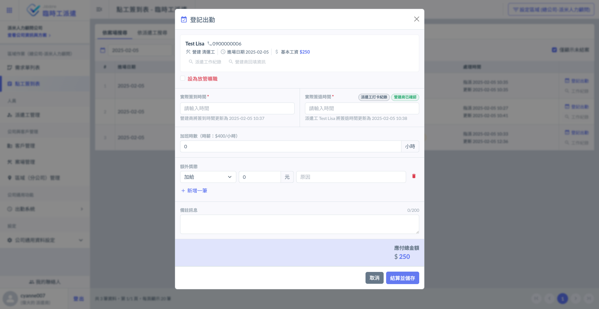 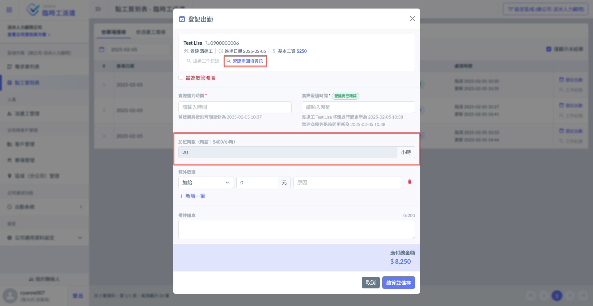

***

### 02 - 2｜派遣工作紀錄 / 營建商回報資訊

#### 派遣工作紀錄

該處的工作紀錄資料由**派遣工**填寫提供。

如左圖紅框圈選處，點&#x9078;**「派遣工作紀錄」**&#x5373;可見到右圖畫面，查看派遣工回報之工作紀錄。

 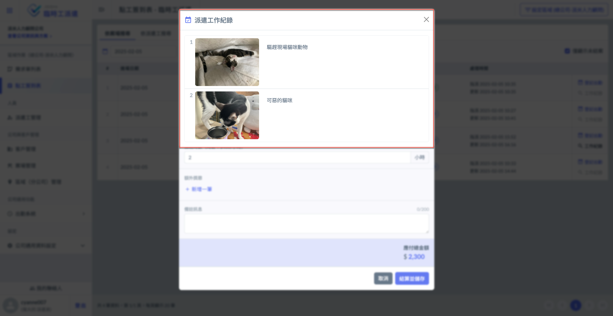

#### 營建商回報資訊

該處回報資訊由**營建商**填寫提供，可查看**額外獎懲**及**備註訊息**。

如左圖紅框圈選處，點&#x9078;**「營建商回報資訊」**&#x5373;可見到右圖畫面，查看營建商回報之**額外獎懲**及**備註訊息**。

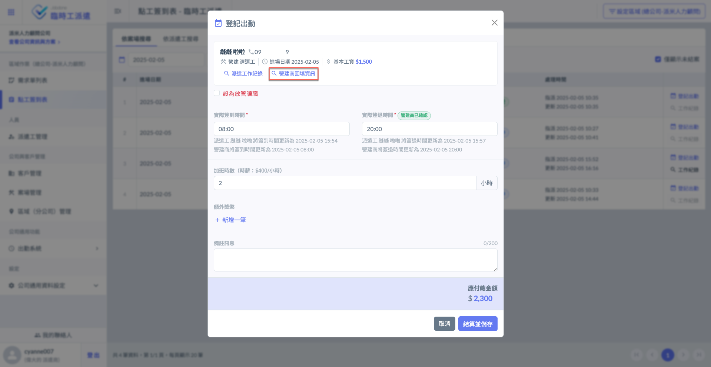 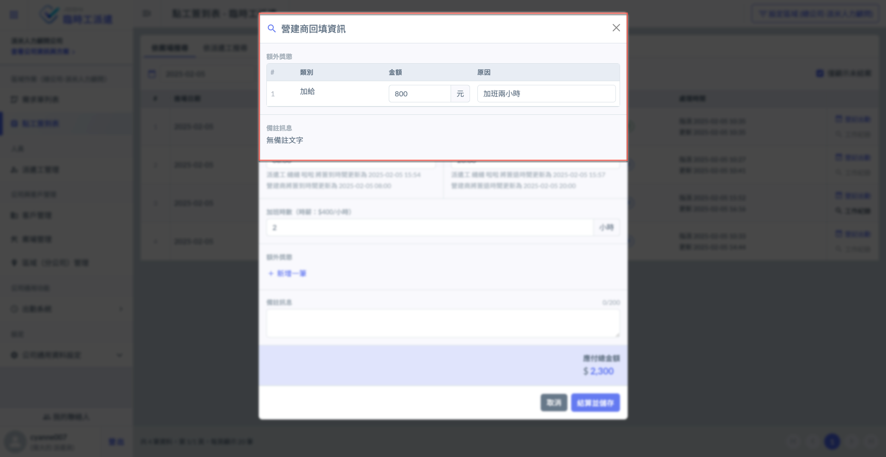

***

### 02 - 3｜填寫資料並結算

如下圖，派遣商填寫**實際簽到/簽退時間**、**加班時數**、**額外獎懲**及**備註訊息。**

填寫完畢並確認無誤後，點&#x9078;**「結算並儲存」**&#x5373;結案 (無法再修改資料＆工單狀態為已結清)。

!!! info
    額外獎懲提供三類：**加給**、**扣薪** (遲到、早退及違規)

#### 扣薪類型選擇

如下圖，若有扣薪需求，請選擇扣薪原因：早退、遲到及違規。

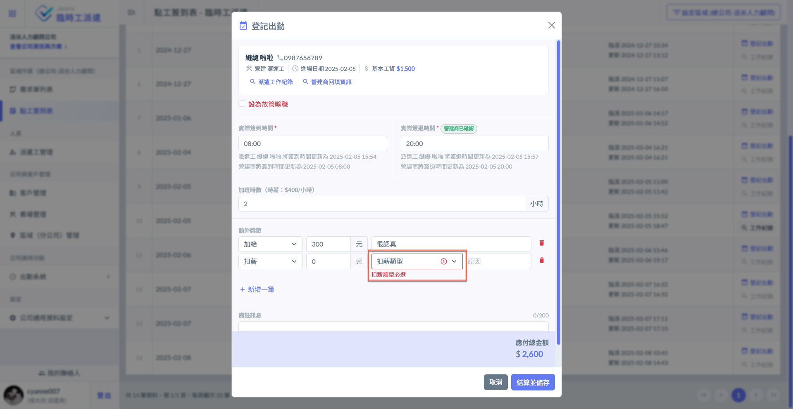 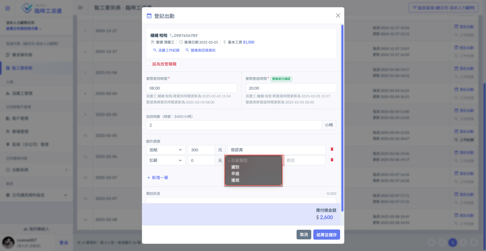

!!! tip
    應付總金額計算如下：
    
    基本工資 ＋ (加班時數金額) ＋ (加給) － (扣薪) ＝ 應付總金額

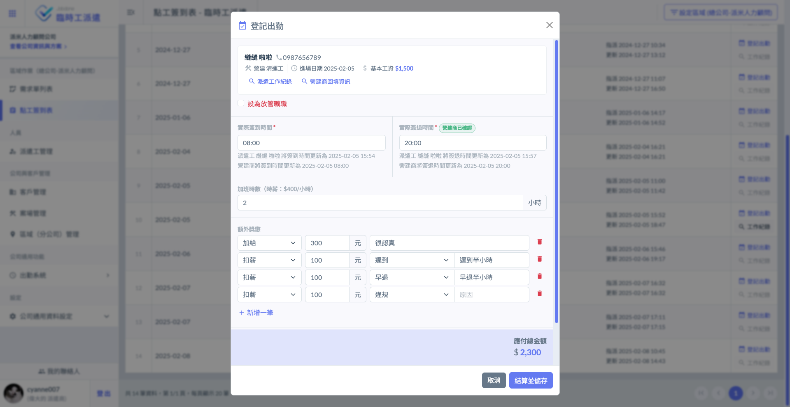 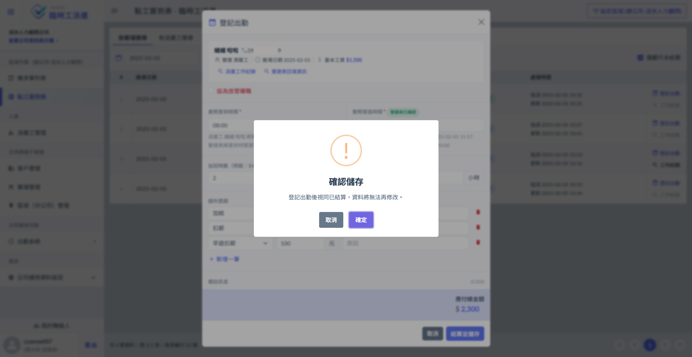

