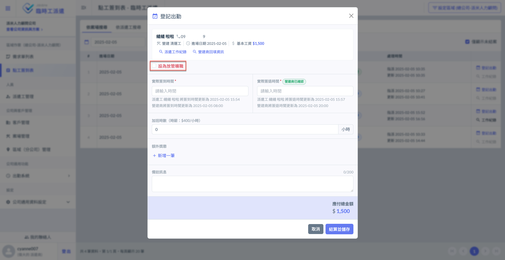
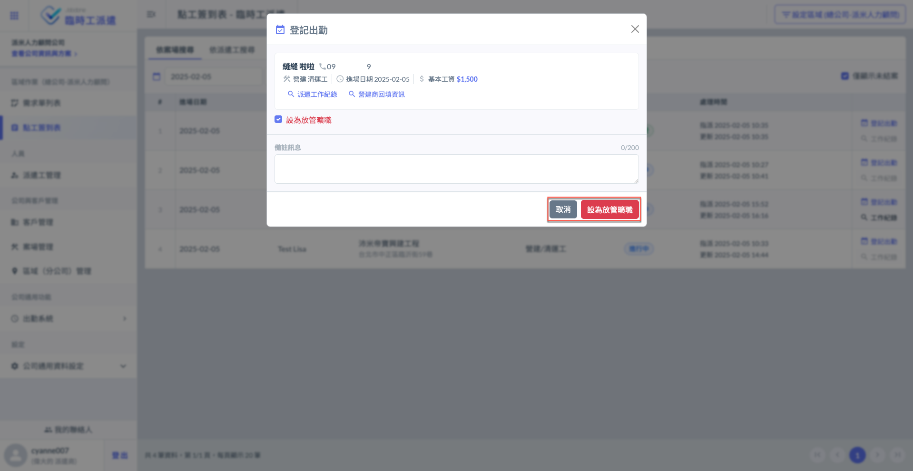
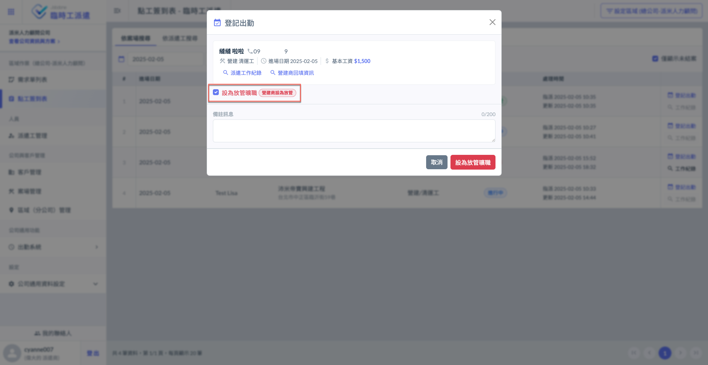

# 設為放管曠職

---
description: Mark as Absent without Leave (AWOL)
---

# 設為放管曠職

## 01｜設為放管曠職

若派遣工已接收派遣工作通知，卻無故消失或其他突發原因，您可直接對其進&#x884C;**「放管」**。

點&#x9078;**「登記出勤」**&#x5F8C;即會進看到下圖畫面。點選左圖紅框圈選處，即可填寫備註並確認是否放管。

!!! warning
    請注意，確定設為放管曠職後，資料將無法進行修改 (工單狀態改為放管)，務必妥善操作。

!!! tip
    若派遣工已簽到/簽退，營建商與派遣商仍可執行放管曠職，有效管理出工狀況。

 

!!! warning
    請注意，若營建商已設為放管，派遣商無法自行取消放管，僅能由營建商進行取消。(如下圖)

***
