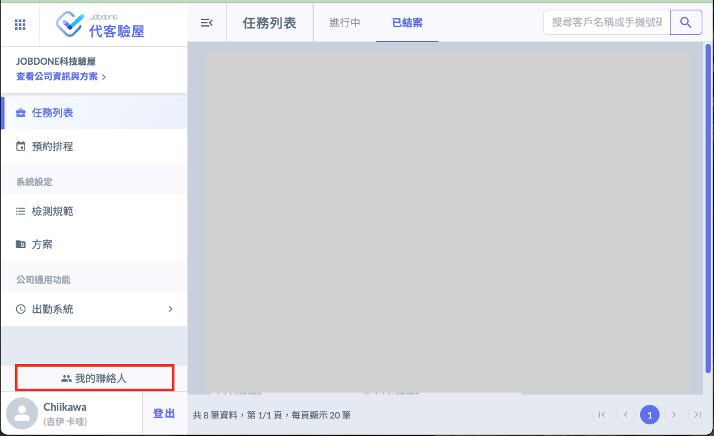
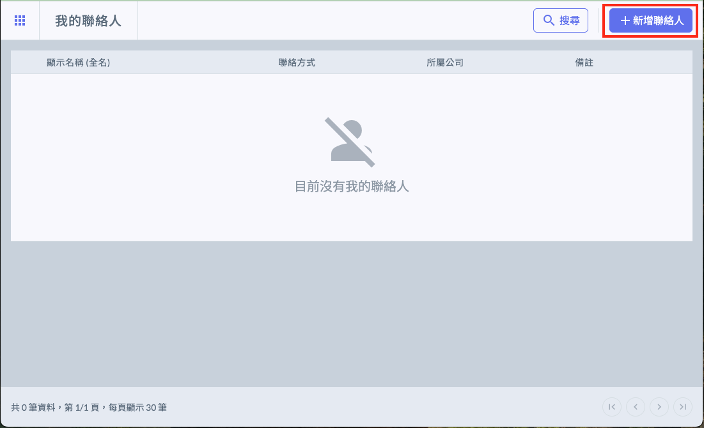
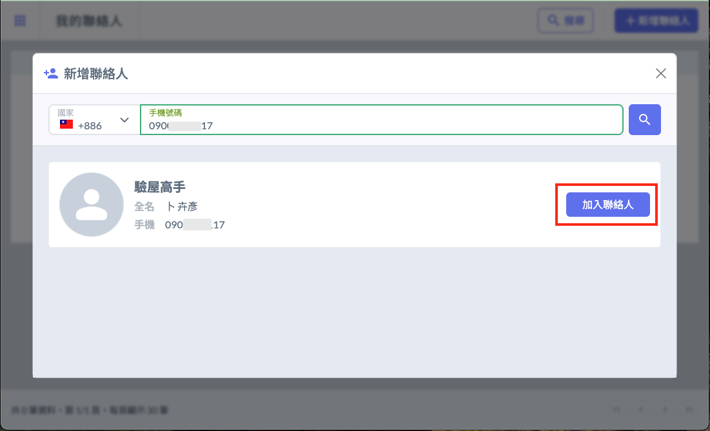
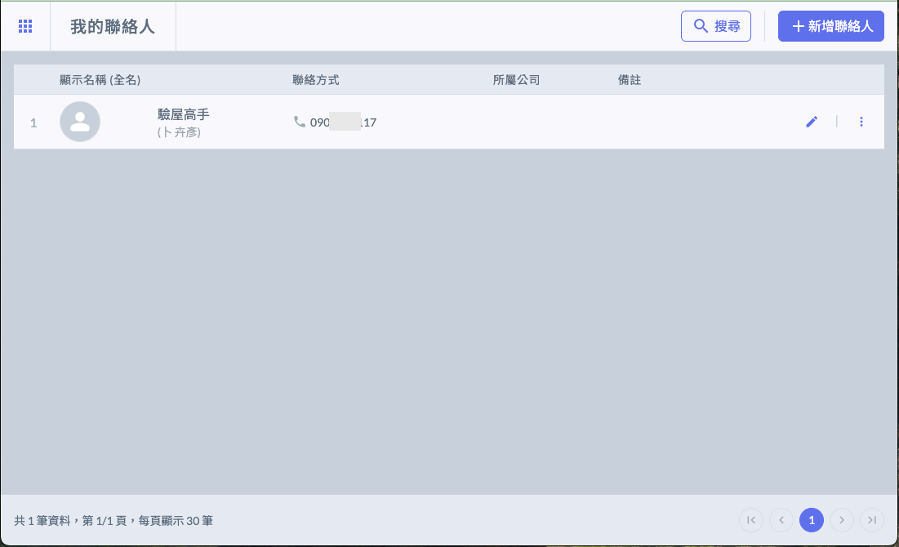

# 我的聯絡人

---
description: 驗屋工作不可能自己一個人就能解決，你會需要很多夥伴一起執行驗屋工作。
---

# 我的聯絡人

## Jobdone代客驗屋有免費的個人版（終身免費）

『 個人版本』 主要是提供給臨時支援驗屋工作的水電師傅，或者專門執行驗屋工作的非正式員工使用。

適用對象：現場執行驗屋的工程師、特約的驗屋高手、隨傳隨到的驗屋達人...等非正職驗屋人員。

功能限制：只能接受派遣的驗屋工作、透過APP將驗屋紀錄及照片回傳到Jobdone系統。

作法：

1. 請以上民間驗屋高手註冊Jobdone代客驗屋APP。
2. 系統管理者：在代客驗屋網頁的左下角，點開 『我的聯絡人』 將民間驗屋高手們加入進來。

3. 點選右邊上方的 『 ＋新增聯絡人 』 按鈕，開啟加入聯絡人。

4. 只要輸入有註冊Jobdone代客驗屋APP人員的 『手機號碼』 就可以搜尋到，立即將他加入『加入聯絡人』

5. 將這些驗屋高手加入你的聯絡人之後，未來就可以直接分派驗屋工作給他，並且他可以直接透過Jobdone APP直接上傳驗屋紀錄、照片及影片，非常的方便。

下一個章節，我們會介紹如何建立屋主的驗屋任務。
