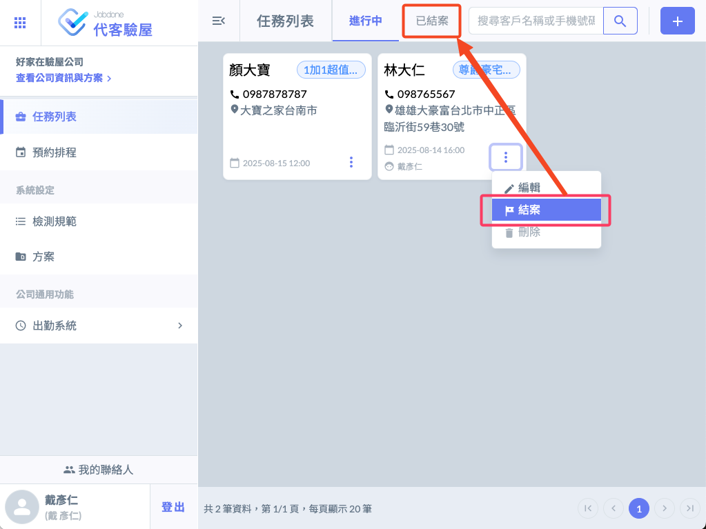
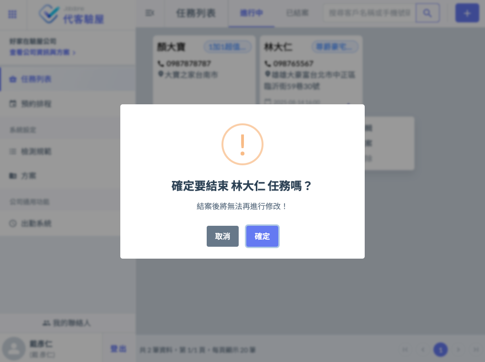
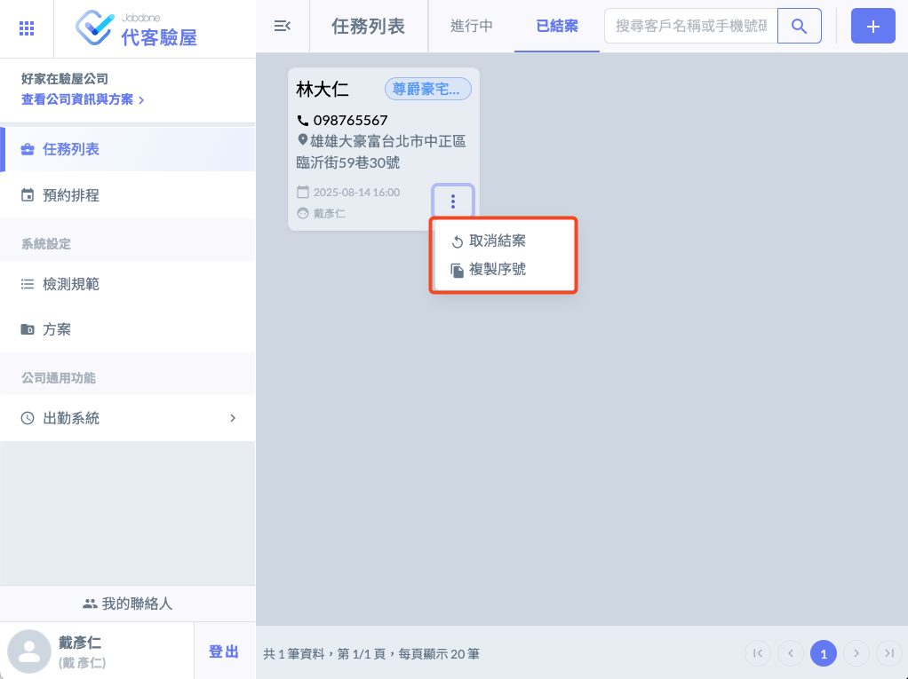
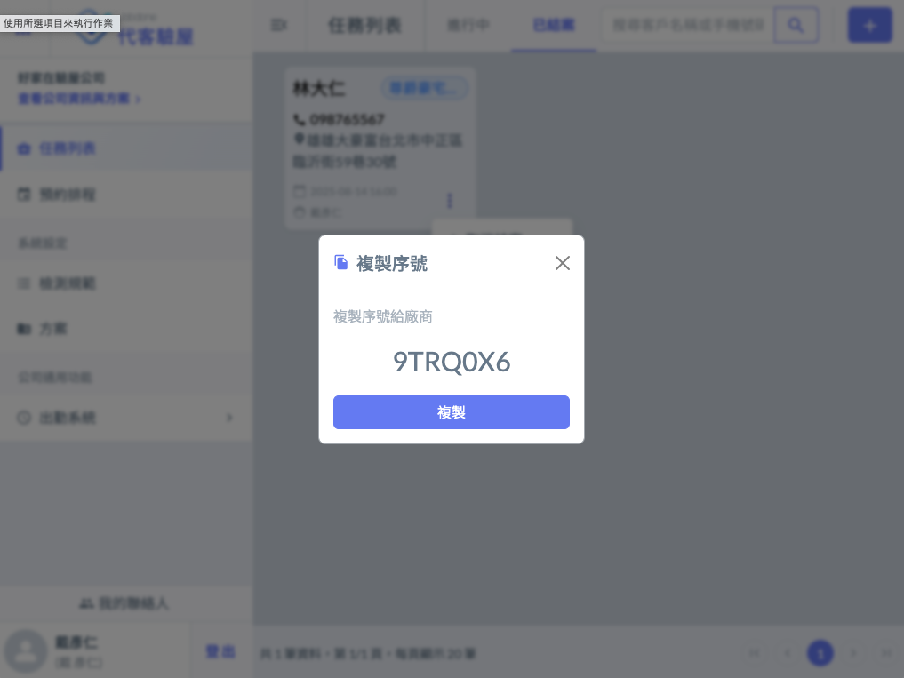

# 與建商同步『驗屋報告』資料

---
description: 提供給建商驗屋報告
---

# 與建商同步『驗屋報告』資料

接下來是代客驗屋APP的重要價值；直接將資料同步給建設公司或營造的 『[驗收單](../cpm/bc/acceptance)』。

我們的系統目的都是在優化整個產業鍊上所有人的流程，營造產業存在太多資訊的斷點，我們希望透過一套設計良好的平台串連起來。

## 結案

當你確定所有的檢查內容都完成後，可以按下結案。

結案後的任務會移到已結案的標籤下，並且不可再變更。

 

## 取消或同步

若需要再編輯驗屋紀錄，你可以取消結案。

## 提交驗屋報告給建商

如果屋主有交代需要提交一份驗屋報告給建商，可以匯出PDF檔案提供給建商。如果你遇到的建商是『遠雄建設』有另外一個更方便的做法，就是「複製序號」提供給遠雄建設的工程師就完成了。因為遠雄建設集團已經全面採用Jobdone驗屋系統，所以透過序號就可以直接匯入所有的缺失紀錄。

確定沒問題，你可以選擇 『**複製序號**』 ，這個序號是一次性的亂數編號，請以任何方式，提供給建設端的工程師，他們就可以將所有的缺失紀錄匯入他們的系統了。一旦，建設公司收到驗屋紀錄的缺失項目，就會安排工班在兩週內陸續將缺失問題解決，並且通過內部驗收之後就會再通知屋主安排時間複驗。

 

備註：目前「複製序號」適用的建案有『遠雄幸福成』、『遠雄藏萃』、『遠雄晴川』、『遠雄商舟』、『遠雄夏沐』等，後續有新建案落成會再更新資訊。
