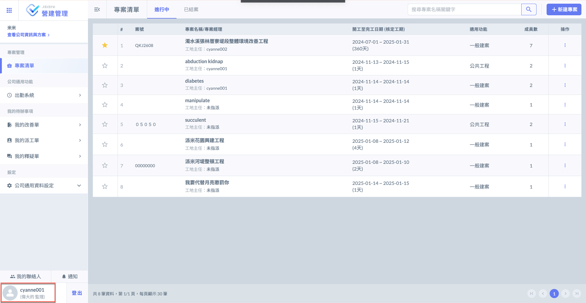
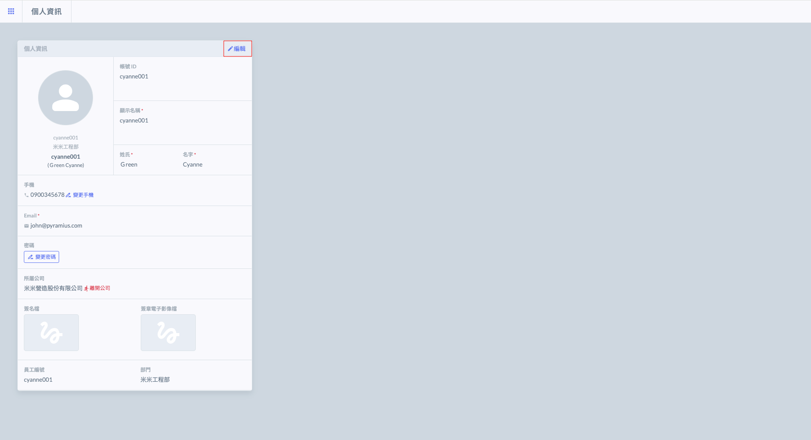
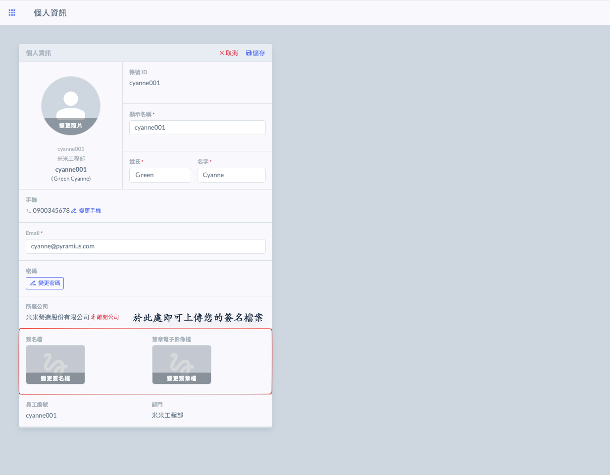
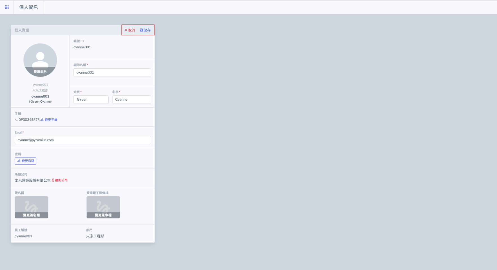
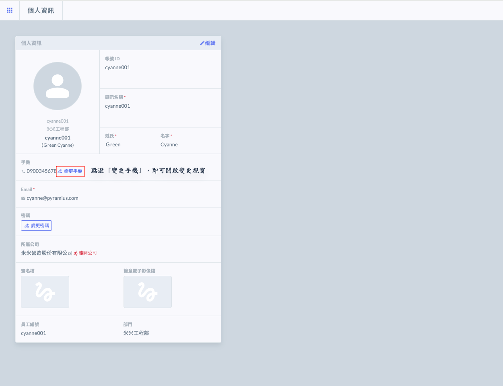
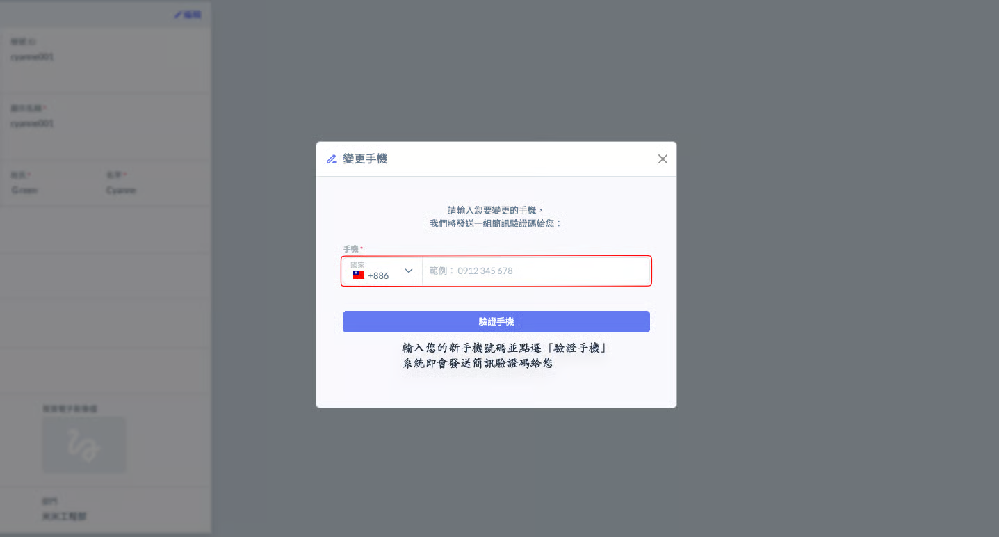
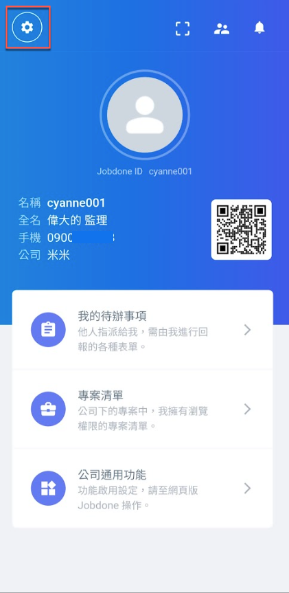
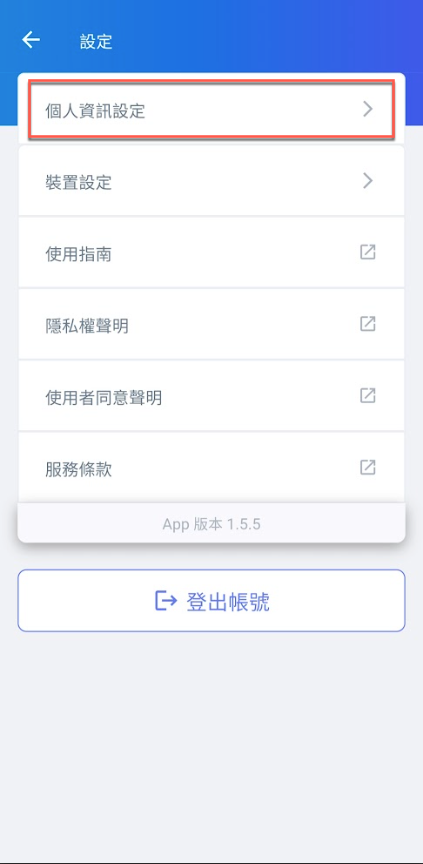
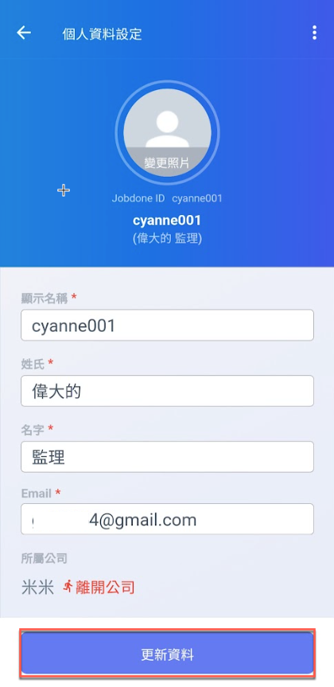

# 個人資料

個人資料由帳號擁有者自行建立與更新。我們建議您設置易於辨識的名稱與頭像，這樣其他人可以更輕鬆地找到您。

網頁及App上皆可對您的個人資料進行編輯，將在下方一併說明。

***

### 01｜網頁版

#### 01 - 1｜編輯個人資料

進入主頁面（即專案清單頁面）後，如下圖紅框圈選處，點選左下角進&#x5165;**「個人資訊」**&#x9801;面。

點選右上角&#x4E4B;**「編輯」**，即可修改個人資訊。

您可變更您的大頭貼照片、顯示名稱、Email、密碼、手機號碼等等，並可上傳您的<kbd>**簽名檔**</kbd>/<kbd>**簽章檔**</kbd>供日後各類報表及改善簽核使用。

完成修改後，按下<kbd><mark style="color:purple;">**儲存**<mark style="color:purple;"></kbd>即可保存所做的變更並完成修改；若需放棄變更，按下<kbd><mark style="color:red;">**取消**<mark style="color:red;"></kbd>則可恢復原有資料，無需儲存任何更動。

***

#### 01 - 2｜變更手機號碼

如圖一，點選手機欄位右側之，即可開啟變更視窗，並填寫您的新手機號碼。

輸入您的新手機號碼，確認無誤後，點選<kbd><mark style="color:purple;">**驗證手機**<mark style="color:purple;"></kbd>，系統即會發送通知請您驗證。

***

### 02｜APP 版

#### 02 - 1｜編輯個人資料

進入App後，請點選左上角的設定功能(圖一)，再點&#x9078;**「個人資訊設定」**。

進入個人資料設定頁面後，即可開始編輯您&#x7684;**「顯示名稱」**、**「姓氏」**、**「名字」**&#x53CA;**「Email」**。

確認資料無誤後，點&#x9078;**「更新資料」**&#x4FDD;留此次更改。

  

