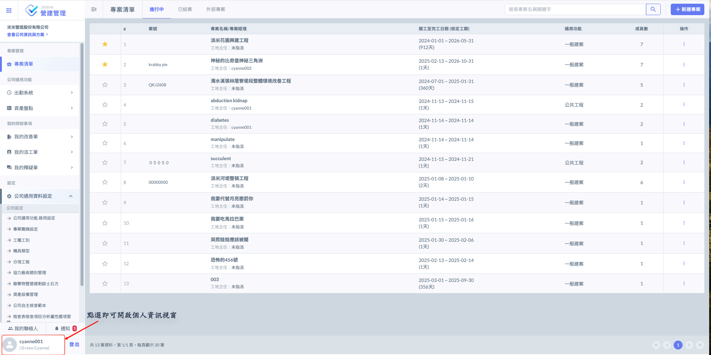
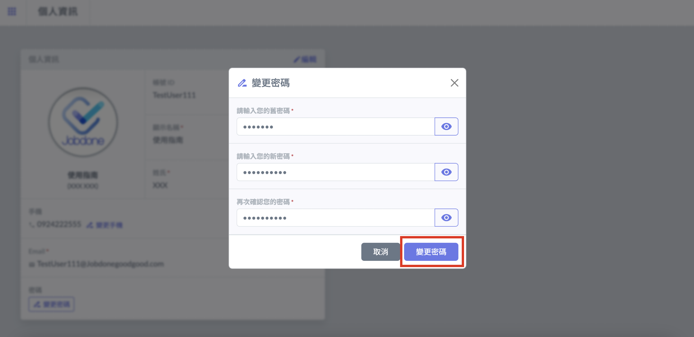
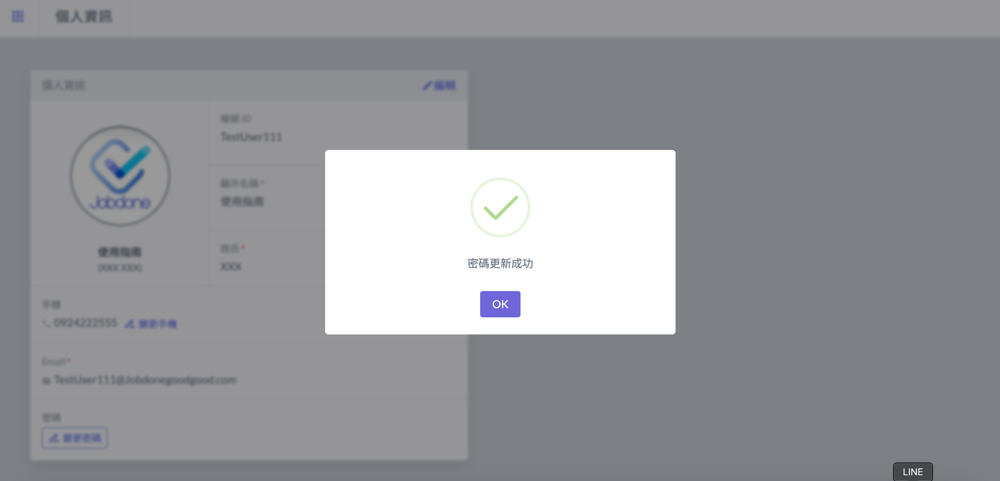

# 變更密碼

!!! warning
    請注意：密碼修改僅能於<kbd>**網頁**</kbd>上執行。

進入主頁面（即專案清單頁面）後，如下圖紅框圈選處，點選左下角進&#x5165;**「個人資訊」**&#x9801;面。

於個人資訊之密碼欄位，點選<kbd><mark style="color:purple;">**變更密碼**<mark style="color:purple;"></kbd>，即可開始修改您的密碼。

請先輸入您的舊密碼，再輸入您的新密碼並再次確認。確認無誤後，請點選<kbd><mark style="color:purple;">**變更密碼**<mark style="color:purple;"></kbd>。

跳出下圖顯示後，即代表密碼已完成更新。

