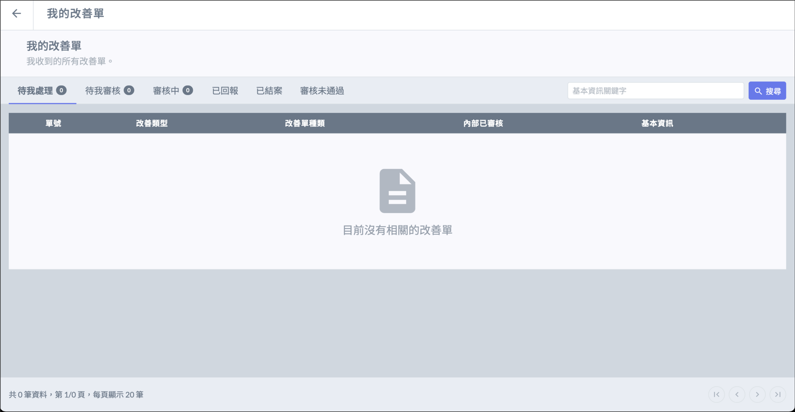
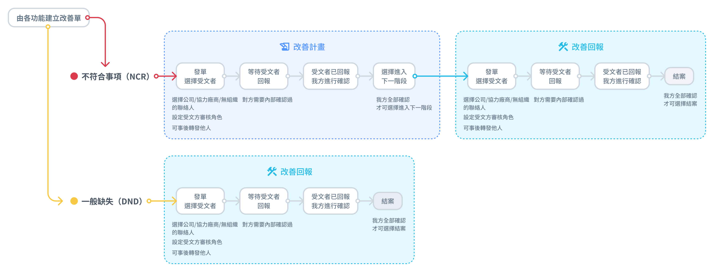

# 我的改善單

改善單都是由專案中的改善單功能發起，「 **我的改善單 」** 會列出與您個人相關的所有改善單。

***

## 欄位說明

* 待我處理：待我填寫改善計畫／紀錄回報
* 待我審核：待我進行內部審核
* 審核中：已送出填寫好的改善計畫／紀錄回報，交由內部審核
* 已回報：已將改善單回報給發文方
* 已結案：改善單已通過並結案，僅可檢視改善單資料，無法再編輯
* 審核未通過：改善單未通過，僅可檢視改善單資料，無法再編輯

## 改善單類型

* 一般缺失（DND）\
  **較小的瑕疵，可以直接修正補救。**\
  DND 須回報改善紀錄，內容包含填寫矯正措失、原因分析、預防再發生等。&#x20;
*   不符合事項（NCR)\
    **較嚴重的問題，需要先提出改善方案規劃。**

    NCR 需先提出改善計畫，經審核確認後，再回報改善紀錄

