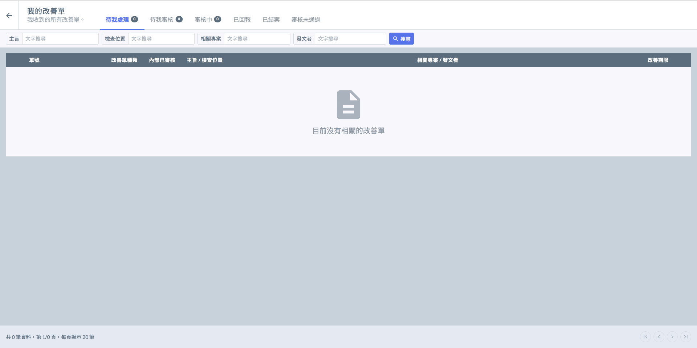

# 我的改善單

---
description: Corrective Action Plan / Corrective Action Report
---

# 我的改善單

改善單都是由專案中的改善單功能發起，「 **我的改善單 」** 會列出與您個人相關的所有改善單。

***

## 狀態欄位說明



待我填寫(執行)之改善計畫 / 記錄回報。



（由他人受理）待我進行內部審核之改善單。



（由你處理之）已送出回報之改善計畫 / 記錄回報，並交由內部等待審核。



（由你發起之改善單）受文方已回報此改善工作給您。



所有與您相關之改善單(含發起及接收)，且已通過所有審核階段並結案。

!!! warning
    已結案之改善單僅可檢視改善單資料，無法再編輯。




未通過審核之改善單。

!!! warning
    審核未通過之改善單，僅可檢視改善單資料，無法再編輯。




***

## 改善單類型

* 一般缺失（DND）\
  **較小的瑕疵，可以直接修正補救。**\
  DND 須回報改善紀錄，內容包含填寫矯正措失、原因分析、預防再發生等。&#x20;
*   不符合事項（NCR)\
    **較嚴重的問題，需要先提出改善方案規劃。**

    NCR 需先提出改善計畫，經審核確認後，再回報改善紀錄

