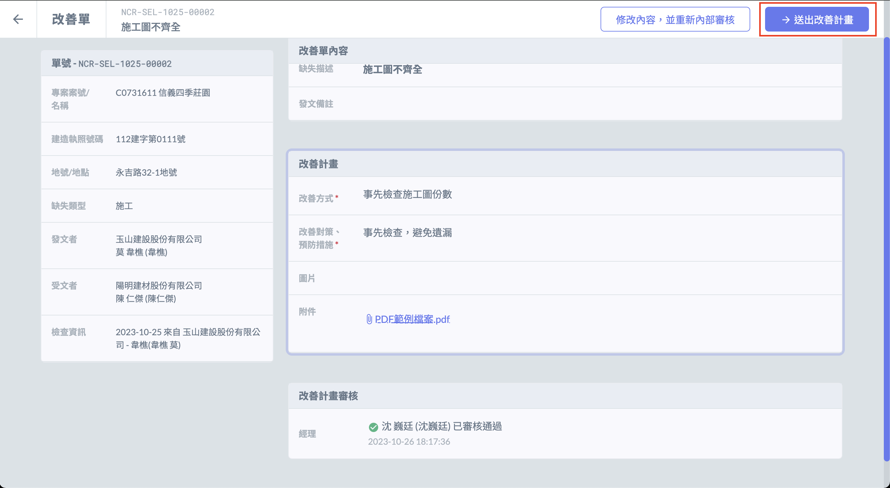

# 受文方內部審核

!!! info
    若收到誤發的改善單，可直接點選 「 拒絕審核 」，發起人即可重新選擇審核人。

## 網頁版

### 操作步驟

#### 一、審核人進入 「 我的改善單 」 後，可在 「 待我審核 」 分頁找到改善單。

#### 二、進入改善單後，可選擇 「 拒絕審核 」 或 「 審核通過 」。

#### 三、如審核人拒絕審核，受文者可重新選擇審核人。

***

## APP

### 操作步驟

#### 一、受文方審核人進入 「 我的改善單 」 後，可在 「 待我審核 」 分頁找到改善單。 

#### 二、進入改善單後，可選擇 「 拒絕審核 」 或 「 審核通過 」。   

