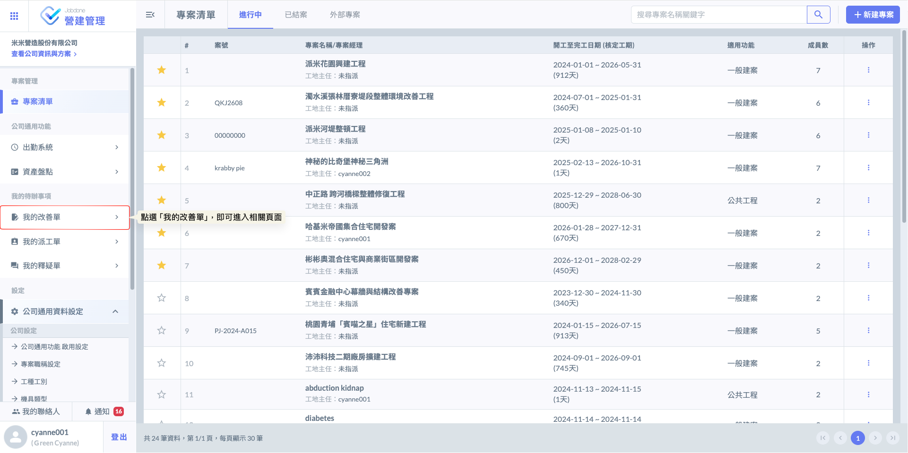
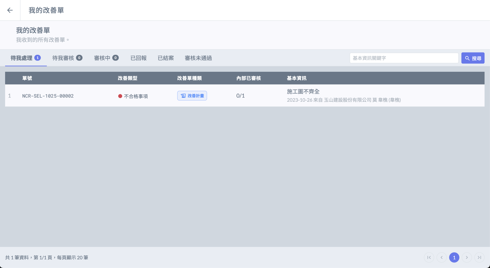
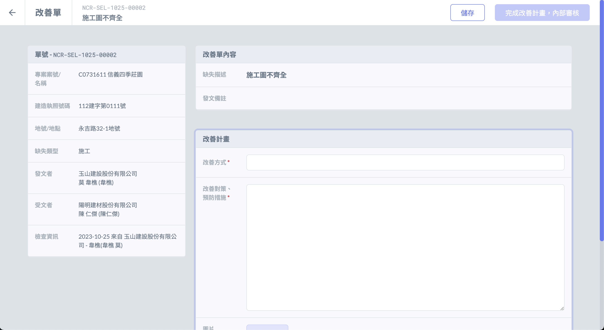
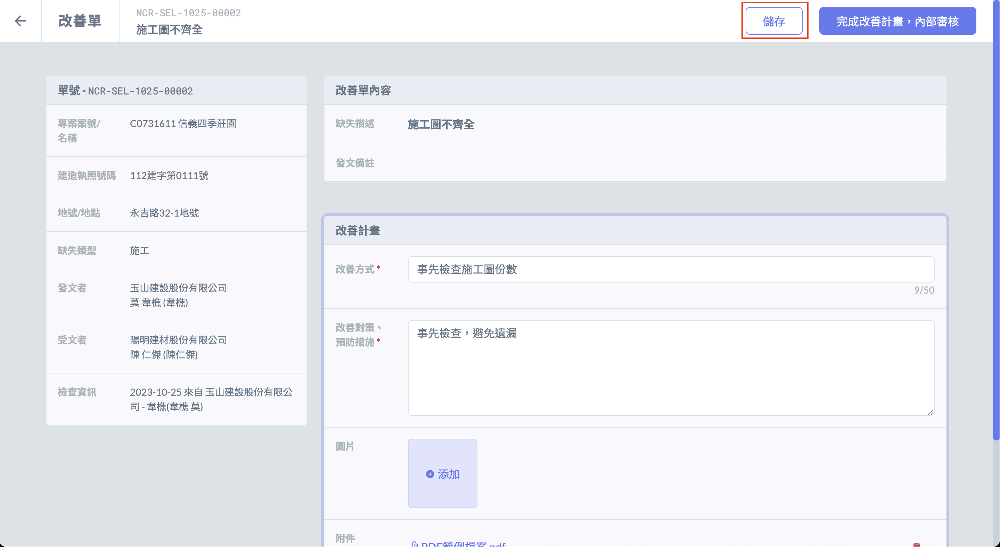
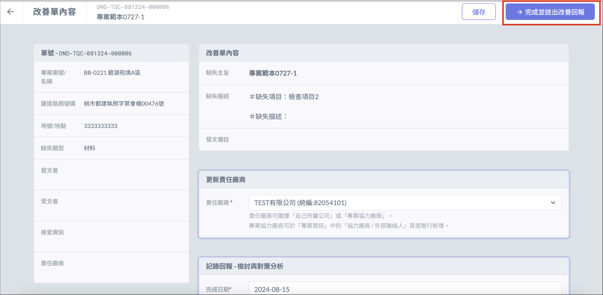
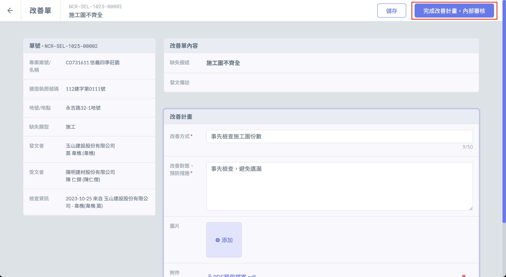
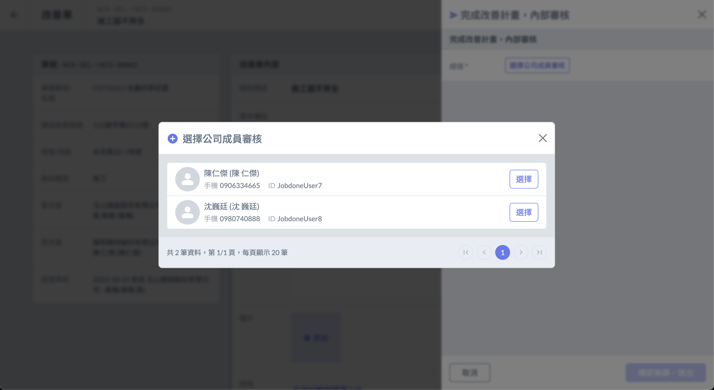
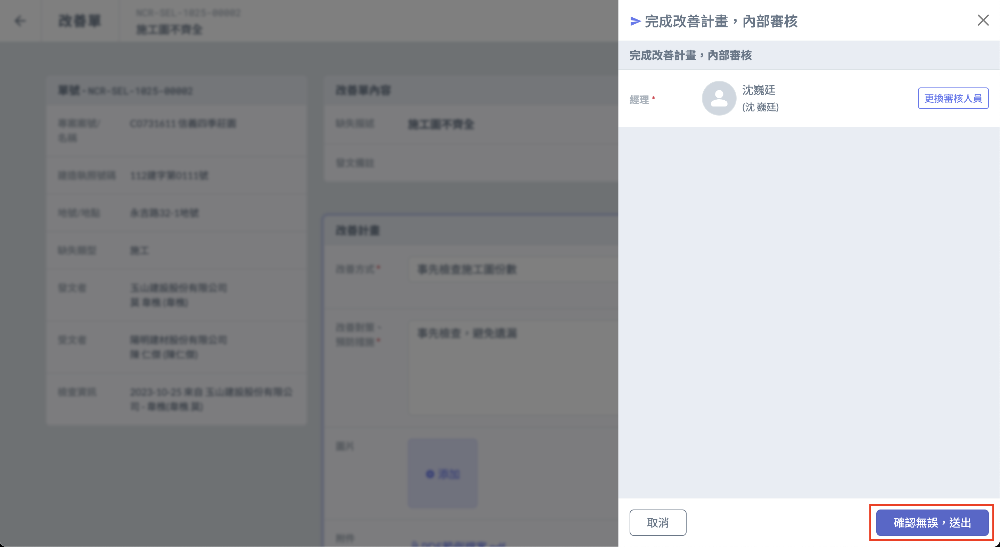
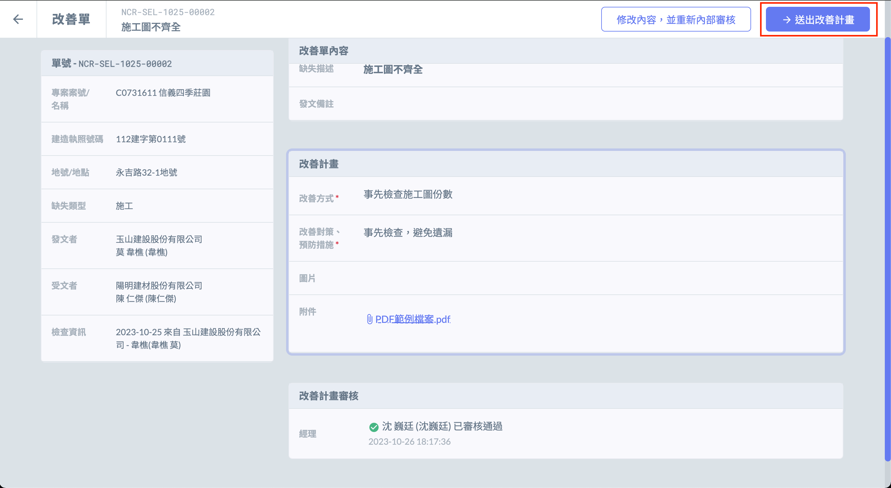
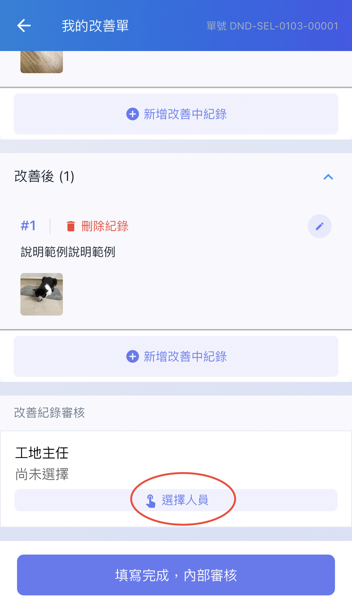

# 填寫改善單

***

### 網頁版

登入系統首頁後，於左側導覽列的<kbd>**我的待辦事項**</kbd>欄位中點選<kbd>**我的改善單**</kbd>，即可進入專屬管理頁面。在此您可以一目了然地查閱所有與您相關的單據，包含待辦缺失、待您審核等即時狀態。

### 改善單填寫

* 進入改善單列表後，點選改善單，填寫改善計畫／改善回報。

### 填寫完畢

* 若改善單不會馬上送出，可點選 「 儲存 」 暫不發送。

* 若改善單不需內部審核，可直接點選 「 完成並送出改善回報 」 。

* 若改善單須經內部審核

1. 點選 「 完成改善計畫，內部審核 」 ，即可選擇審核人，送出後開始進行內部審核。
2. 內部審核通過後，即可送出改善計畫／改善回報給發文方。

***

## App

### 進入改善單

* 登入App後，進入 「 我的待辦事項 」 ，在 「 待我處理 」 分頁中可查看未處理的改善單。

\
   

### 改善單填寫

* 點選 「 完整資訊 」 可查看該張改善單的相關資訊。

\
   

* 點選 「 編輯 」  按鈕，即可填寫改善計畫／改善回報相關資訊。

\
  \

### 填寫完畢後

* #### 若改善單需送交內部審核

1. 點選 「 填寫完成 」 及可送交內部審核。

\
    \
   

2. 提交內部審核後的改善單可在 「 審核中 」 查看，如須修改改善單，可點選 「修改內容」 將改善單從內部審核流程退回修改。

\
   

* 如不須內部審核，可直接送出改善計畫／改善回報給發文方。

\

* 已送出回報給發文者的改善單可在 「已回報」 分頁中查看。

\
 

