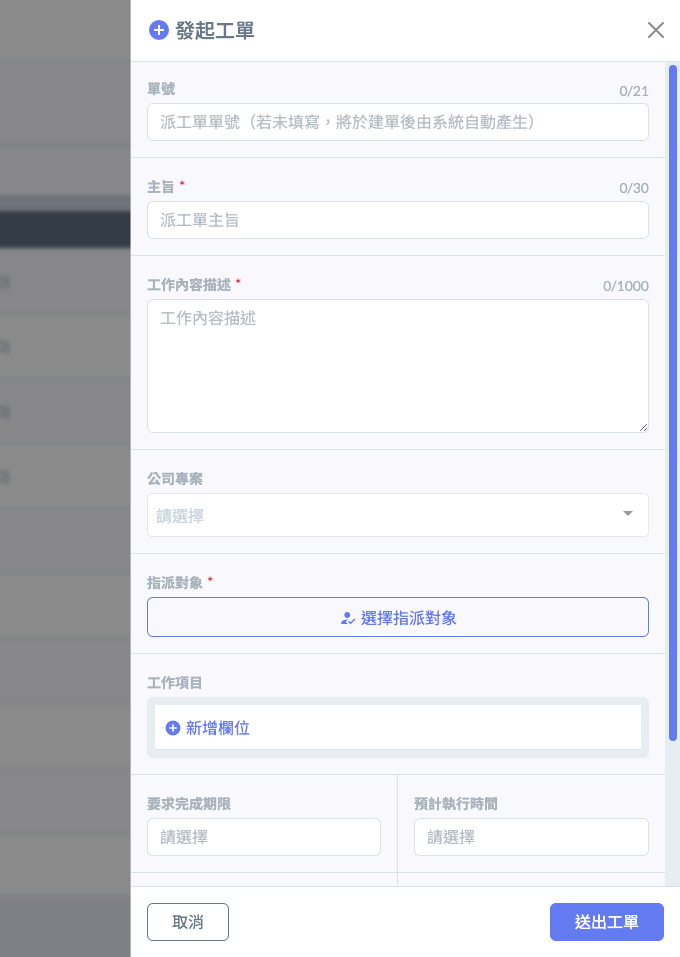
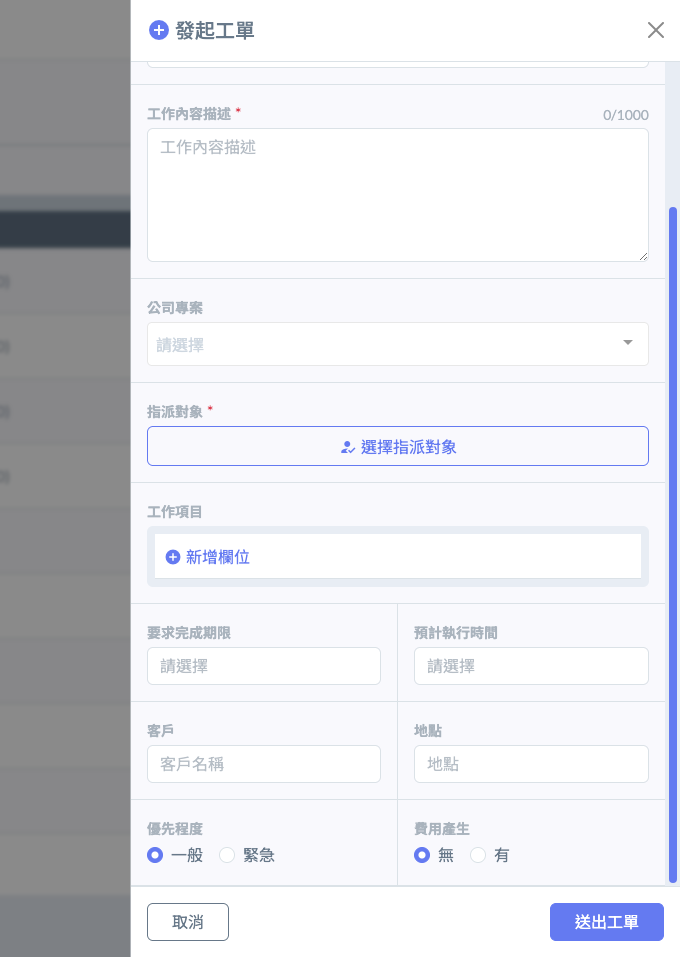
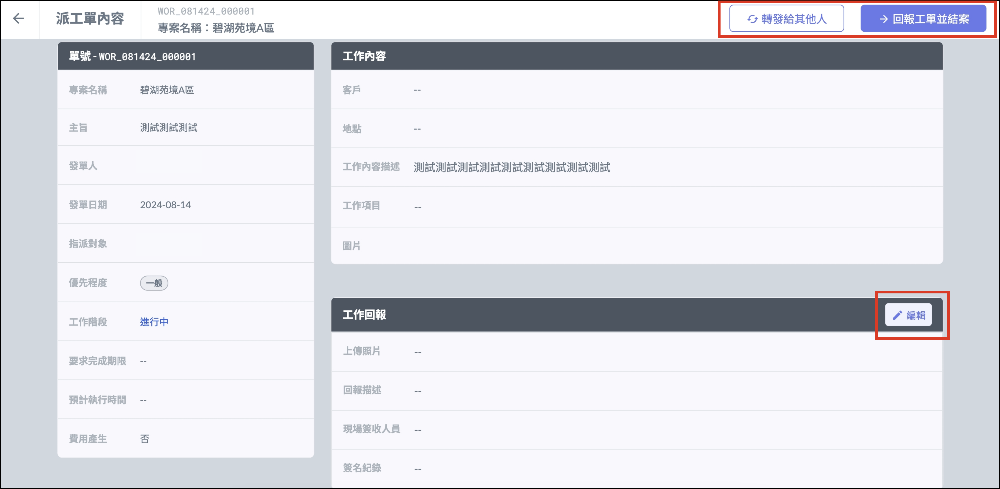
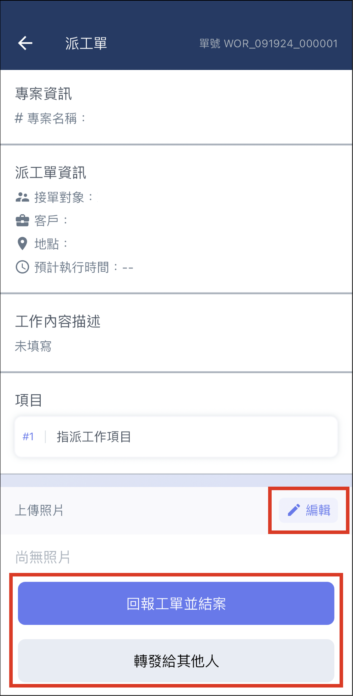

# 我的派工單

!!! info
    派工單是一個跨團隊組織的功能，任何人都可以發起派工單，不必有專案或企業版的授權。

派工單是專案管理中用於落實執行的核心單據，旨在針對特定的工程任務、維修項目或行政事務，由管理人員向具體執行人（個人或團隊）發出正式的書面指令。派工單將執行對象、任務時程、工作內容等核心要素標準化，確保每一項交辦事項皆能責任到人，並實現從初始發派到最終完工全過程的完整追蹤與紀錄。

***

派工單支援雙軌發起機制，除了可直接在模組內手動建立以處理即時任務外，更具備&#x8207;**「會議紀錄」**&#x529F;能無縫串聯的核心優勢。故派工單來源有二 (**派工單發起**/**會議紀錄發起**)：



依據派工單功能直接發起獨立的工單。詳細說明請參閱 ➙ [**發起派工單**](wo-de-pai-gong-dan/fa-qi-pai-gong-dan)



管理人員在記錄會議的主題、內容與議題時，針對後續產出的「待辦事項」，可直接一鍵發起派工單，系統將自動帶入會議議題作為工作內容，無需重複輸入資訊。

!!! tip
    除大幅提升了從決策到執行的行政效率，更能確保每一項會議決議皆能精準轉化為責任到人的正式指令，並讓執行人員隨時回溯會議脈絡，達成任務來源透明化與追蹤自動化的管理目標。




***

#### 欄位說明

為加速流程並減少認知差異，發起派工單時應遵循以下結構：



簡述該項任務的核心名稱，方便在清單頁面中快速辨識。

* _填寫範例：_ 【機電】B1F 泵浦異常檢修、2F 辦公室清潔派工。



詳細描述需執行的具體事項、行政要求或技術細節。

此欄位為執行人的操作依據，應盡可能清晰地載明「做什麼」以及「如何做」，以避免溝通落差。



由管理人員從人員選單中，選擇具體的執行負責人（個人或團隊）。

一旦選定，系統將立即發送通知給該對象，確保該項工作明確「責任到人」。



設定該任務必須結案的最後限期。



本欄位用於標示任務的輕重緩急，協助執行人合理安排工作順序：

* 一般 (Normal)： 適用於例行性工作、計畫內任務或無即時安全性影響之事項。
* 緊急 (Urgent)： 適用於突發性故障、具安全隱患或直接影響後續大項工進之任務。標記為緊急的單據將在執行人的待辦清單中以特殊醒目標示，要求負責人立即介入處理。



!!! info
    1. 若發起人有選擇<kbd>**公司專案**</kbd>，則該釋疑單會顯示在對應之專案紀錄中；若未建立專案，則顯示於個人紀錄中。
    2. 針對<kbd>**單號**</kbd>部份，若您有自訂的編號規則，可填；若空白，則該單號將由系統自動生成。

 

APP

1. 登入手機APP後，點選 「 我的待辦事項 」。
2. 點選上方 「 派工單 」 分類，即可查看派工單列表。

### APP

進入派工單內容，點選 「 編輯 」，依派工單需求填寫完畢後，即可點選下方 「 回報工單並結案 」 送出。若接單者判斷該工單應由其它人執行，則可點選下方 「 轉發給其他人 」。

