# 派工單回覆

### 網頁版 - 流程說明



#### 查看待處理之派工單

進入我的派工單頁面後，點選指派給我頁籤，即可快速查看所有待您執行及回覆之工作。

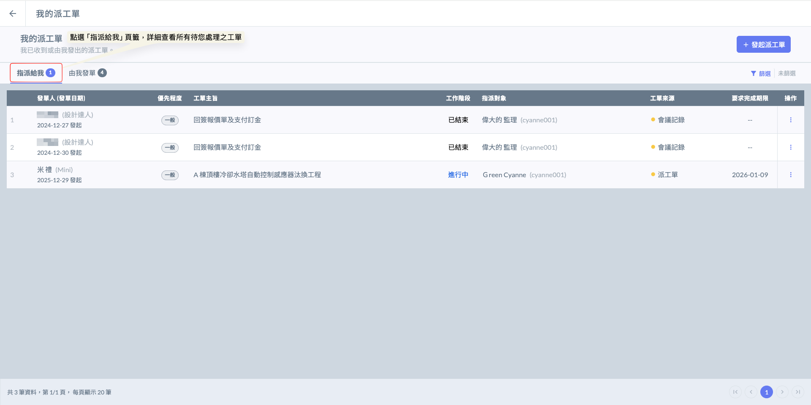



#### 選擇欲處理之工單

如圖二，點選指定之派工單，即可開啟該派工單，並查看其工作內容及相關資訊等等。&#x20;

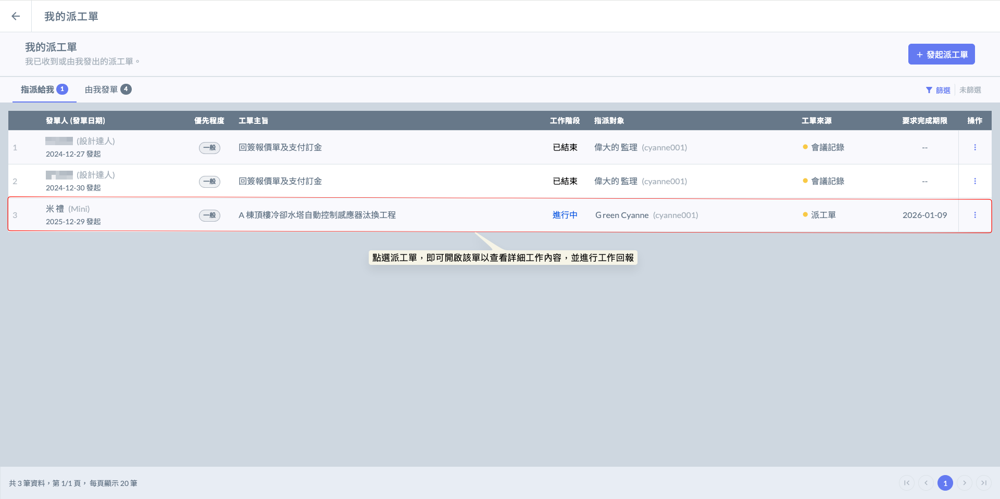



#### 查看工作內容

如圖三，開啟派工單後，會詳細顯示該工單之基本資料及工作內容，您可於下方填寫工作回報。

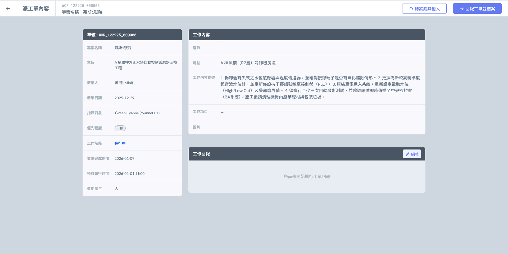



#### 派工單操作

接收派工單後，負責人可依據問題性質採取以下二種處理方式：



若收單人判斷該工項不在其權責範圍，或應由專案內其他專業工程師辦理，可使用「轉發」功能將單據移交。轉發後，處理權責將同步移轉至新負責人。



當執行負責人已確實完成單據所交辦之任務，並確認執行結果符合要求後，即可點選<kbd><mark style="color:purple;">**回報工單並結案**<mark style="color:purple;"></kbd>。在輸入執行說明並上傳完工資料後送出，該單據將立即轉為『已結案』狀態並歸檔；發起人亦會同步收到完工通知。



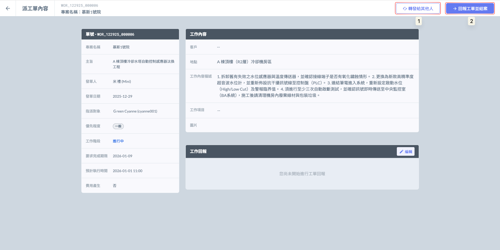

#### 1. 轉發給其他人

點選<kbd><mark style="color:purple;">**轉發給其他人**<mark style="color:purple;"></kbd>後，系統將開啟成員選單，您可以從**專案成員**或**我的聯絡人**清單中，選擇合適的人員並將該派工單轉派給他。

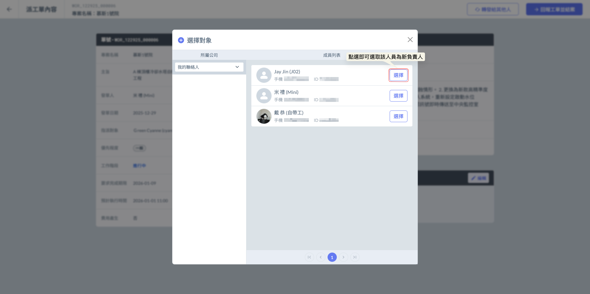

如圖二，確認受派人員無誤後，點選<kbd><mark style="color:purple;">**確定**<mark style="color:purple;"></kbd>即可完成轉派動作。

!!! warning
    請注意：一旦完成轉派，該單據的處理權責將移轉，您不再擁有該單之編輯權限。

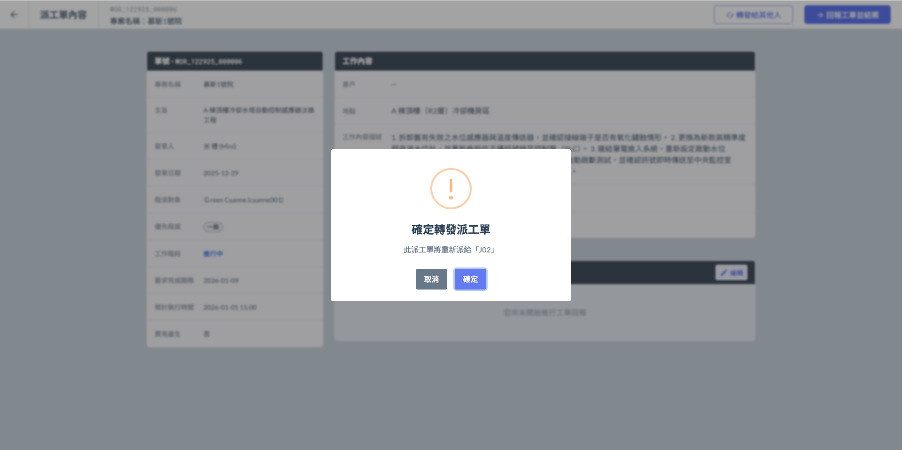

***

#### 2. 回報工作並結案 - 填寫工作回報

!!! danger
    請注意，在<kbd><mark style="color:purple;">**點選回報工單並結案**<mark style="color:purple;"></kbd>前，請先填寫您的工作回報。

如圖三所示，點選工作回報欄位右側的  圖示，即可開始詳實填寫執行結果。

回報內容涵蓋：現場施作照片、詳細回報描述、現場簽收人員，以及完工簽名紀錄等。

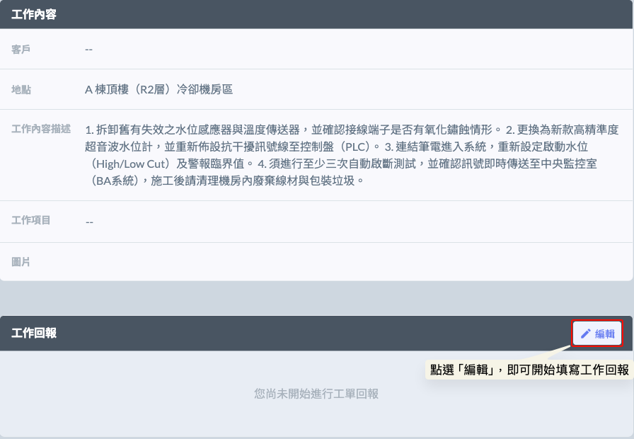 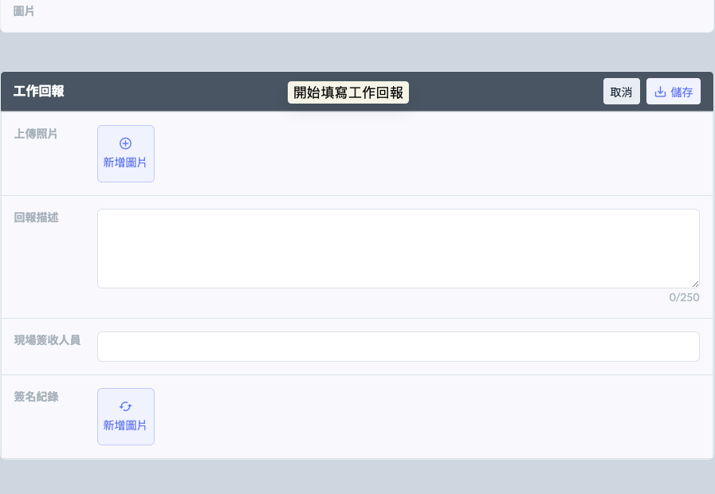

如圖五所示，將工作回報內容詳實填寫並經最終核對後，點選<kbd><mark style="color:purple;">**儲存**<mark style="color:purple;"></kbd>即可完成紀錄存檔。

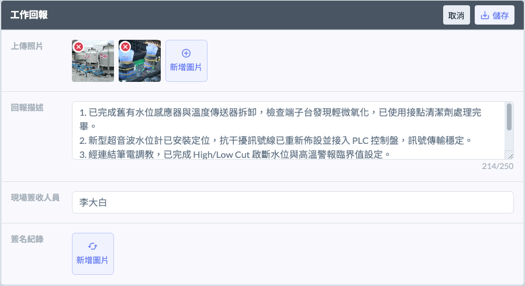 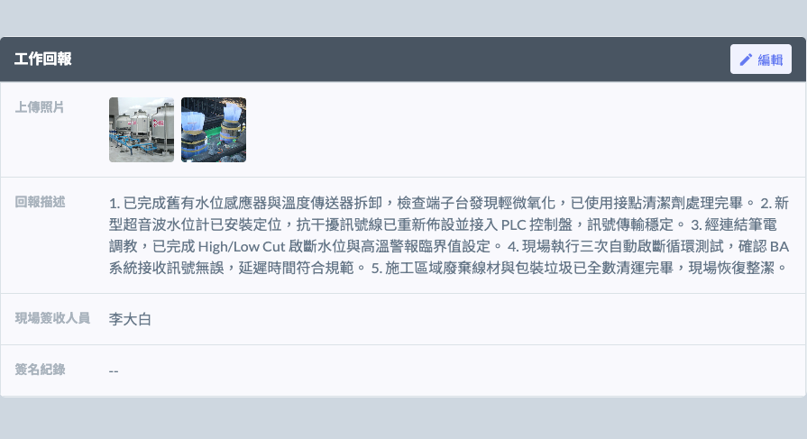

***

#### 3. 回報工作並結案

如圖七所示，點選<kbd><mark style="color:purple;">**回報工作並結案**<mark style="color:purple;"></kbd>後，系統將彈出確認視窗，請再次確認執行內容是否完整，並決定是否正式送出工單回報。

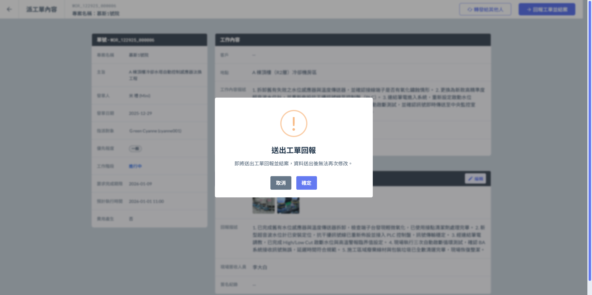

結案畫面如下：

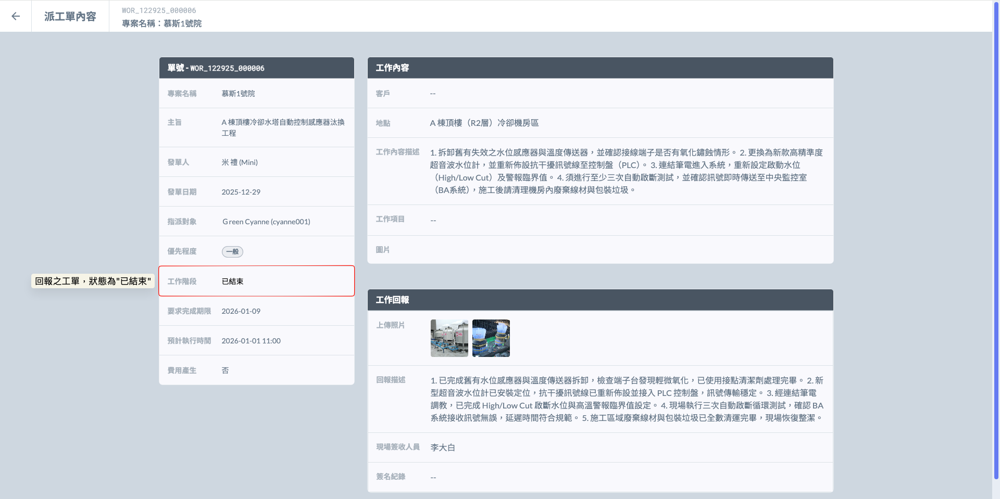


